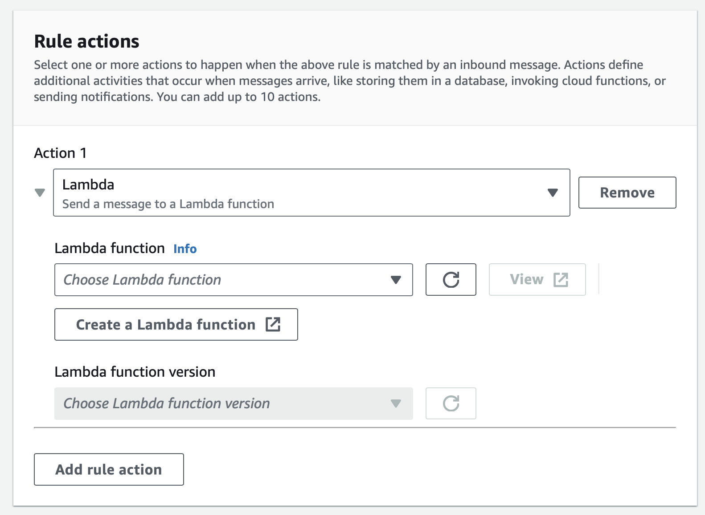

---
# User change
title: "Create a Rule"

weight: 4

layout: "learningpathall"
---
## Before you begin
Before you begin, prepare the weather station emulator and connect it to AWS IoT Core by completing [Create IoT applications with Windows on Arm and AWS IoT Core](/learning-paths/laptops-and-desktops/win_aws_iot). Note that this Learning Path also includes the rule created in [Use Amazon DynamoDB for your IoT applications running on Arm64](/learning-paths/laptops-and-desktops/win_aws_iot_dynamodb).

## Create the rule
Start by creating the rule: 

1. Open AWS IoT Core, and look for *Rules* under *Message routing*:


2. Click the *Create rule* button. This opens the *Create rule* view, in which you configure the rule:


3. Use the *Create rule* view to configure the rule. Firstly, under the rule name, type: **check_temperature**. Then, click the *Next* button. This takes you to the Configure SQL statement, where you use the following SQL query:

```sql
SELECT temperature FROM 'Emulators/Weather/SensorReadings'
```

This query ensures that only temperature readings are sent to the AWS Lambda function.

4. Click the *Next* button.

5. This opens the *Attach rule actions*, where under *Action 1*, select *Lambda*. This activates additional controls (see figure below):



6. Click the *Create a Lambda function* button. This opens another tab. Select *Author from scratch*, type **SendNotification** for the function name, select *Node.js 20.x* for the runtime, and *arm64* for the architecture:


7. Scroll down, and under the *Execution role*, select *Create a new role from AWS policy templates*. This activates additional controls, where you type **sns-email-role** for the *Role name*. Then, click the drop-down list *Policy templates*, and select *Amazon SNS publish policy*:


8. Click the *Create function* button. This takes you to the AWS Lambda Console, which looks as shown below:


9. Keep the AWS Lambda Console open in a separate tab and go back to the *Create rule* wizard. Select *SendNotification* from the Lambda function dropdown, and ensure that the Lambda function version points to $LATEST:


10. Click the *Next* button, and then the *Create* button.

11. Go back to AWS Lambda Console and refresh the page. You will now see that your function accepts the AWS IoT trigger:


This means that the AWS Lambda function you have just created has an input trigger set to AWS IoT. Specifically, the AWS Lambda function is invoked whenever a new message is sent to the 'Emulators/Weather/SensorReadings' topic.

You are now ready to implement and test the Lambda function.
