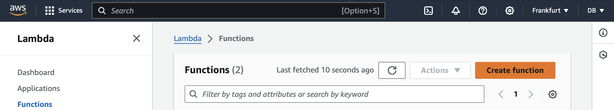
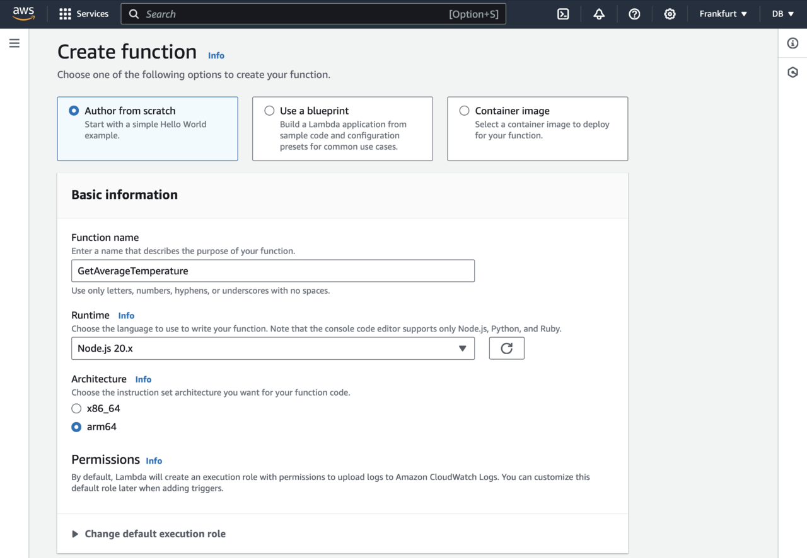
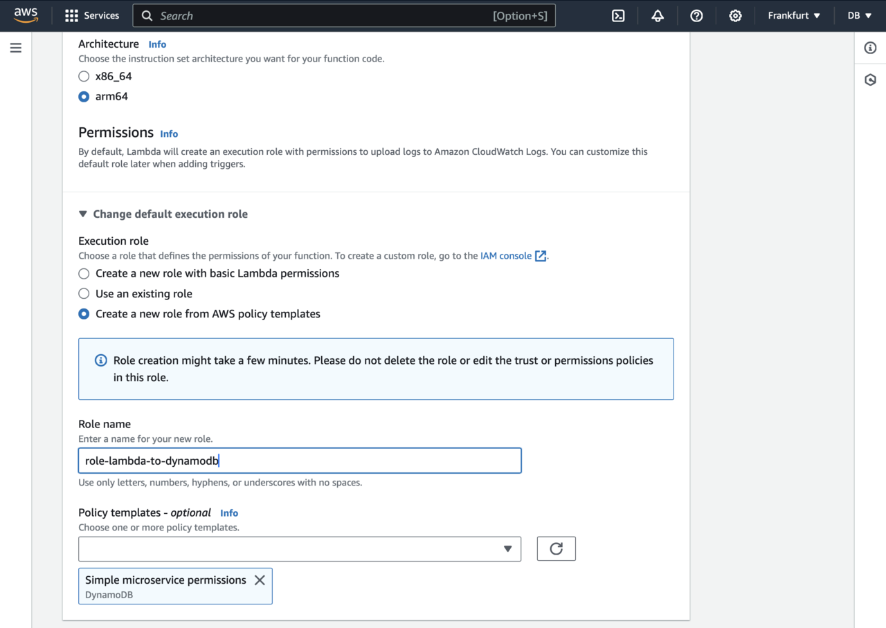
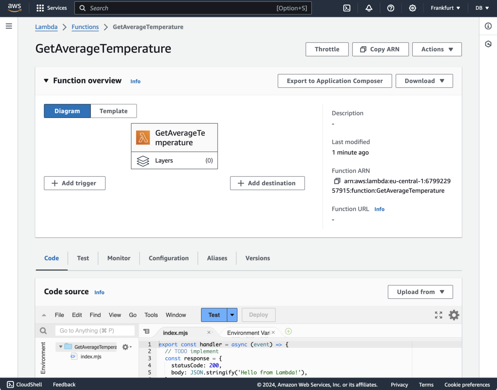

---
# User change
title: "Create the AWS Lambda Function"

weight: 3

layout: "learningpathall"
---
## Objective
You will now implement the AWS Lambda function to scan the records from the DynamoDB. We have assumed that the records have already been written to the table as demonstrated in [Use Amazon DynamoDB for your IoT applications running on Arm64](/learning-paths/laptops-and-desktops/win_aws_iot_dynamodb/).

## Create and configure an AWS Lambda function
Go the AWS Lambda console. Then, create the function as shown below:
1. Click the *Create function* button:

2. This opens a *Create function* wizard, in which you:
* Select **Author from scratch**.
* Type **GetAverageTemperature** for the Function name.
* Select **Node.js 20.x** as the Runtime.
* Select **arm64** under Architecture.

At this point your wizard should look as per the image below:

Next, in the *Create function* wizard expand *Change default execution role*, and proceed as follows:
1. Select **Create a new role from AWS policy templates**.
2. Type **role-lambda-to-dynamodb** under the Role name.
3. Under *Policy templates - optional* select **Simple microservice permissions**.

This ensures that your AWS Lambda function has all the necessary permissions to access the items in the DynamoDB table.

Finally, scroll down and click the **Create function** button. This will take you to the GetAverageTemperature function dashboard: 

In the next step, you will use this dashboard to modify the function code.
