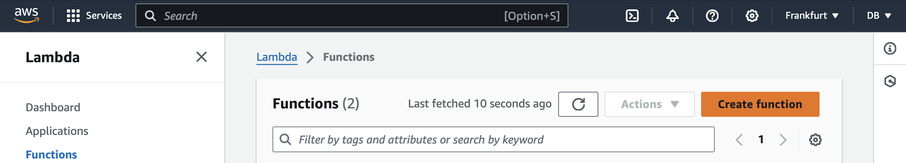
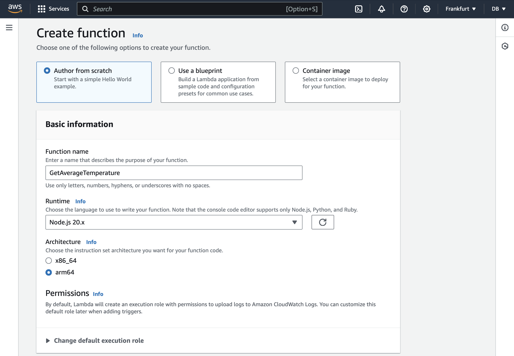
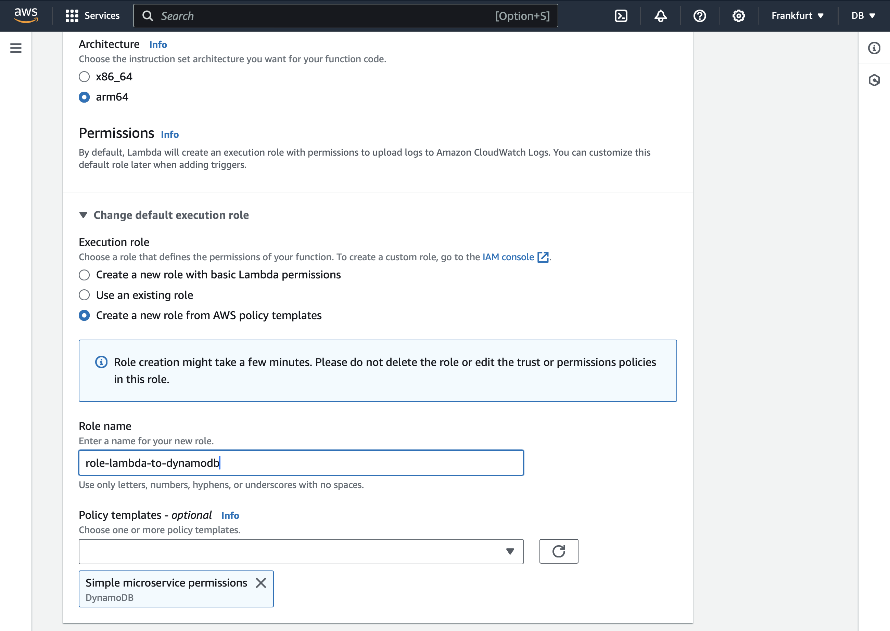
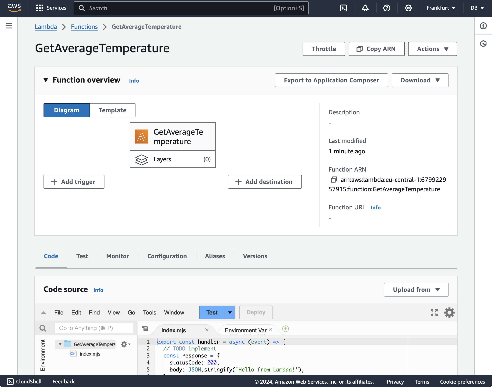
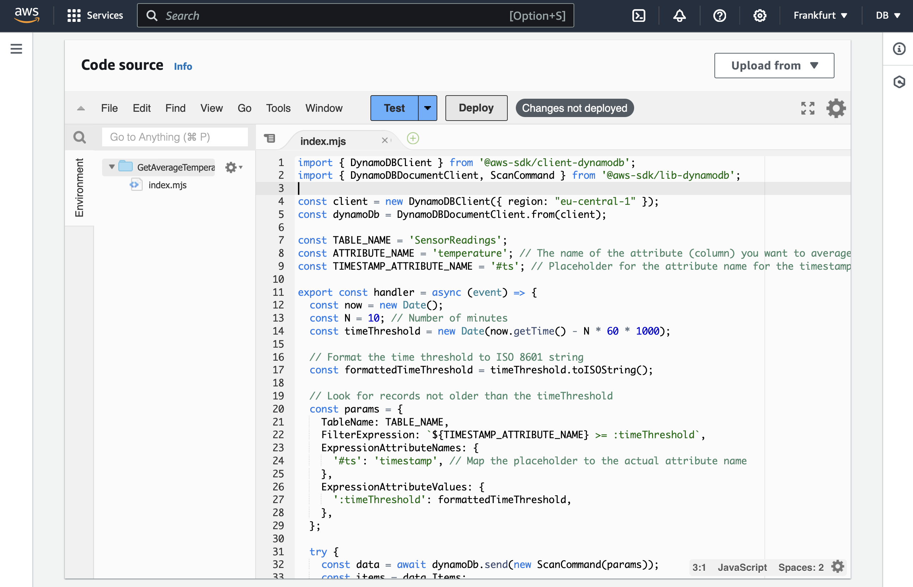
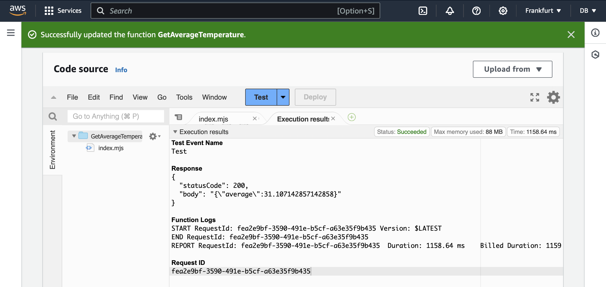

---
# User change
title: "Implement Lambda Function"

weight: 4

layout: "learningpathall"
---
## Objective
You will now implement the Lambda function to scan records from the DynamoDB. We assume the records are already written to the table as demonstrated in this [learning path](/learning-paths/laptops-and-desktops/win_aws_iot_dynamodb/).

## Create and configure a Lambda function
Go the AWS Lambda console. Then, create the function as follows:
1. Click the *Create function* button:



2. This opens a *Create function* wizard, in which you:
* Select **Author from scratch**
* Type **GetAverageTemperature** for the Function name
* Select **Node.js 20.x** as the runtime
* Select **arm64** under Architecture

At this point your wizard should look as follows:



Afterward, in the *Create function* wizard expand *Change default execution role*, and proceed as follows:
1. Select **Create a new role from AWS policy templates**.
2. Type **role-lambda-to-dynamodb** under the Role name.
3. Under the *Policy templates - optional* select **Simple microservice permissions**.



This, ensures your Lambda function has necessary permissions to access the items in the DynamoDB table.

Finally, scroll down, and click the **Create function** button. This will take you to the GetAverageTemperature function dashboard: 



In the next step, you will use this dashboard to modify the function code.

# Implementation
To implement the Lambda function scroll down to the Code source section and paste the following code under index.mjs. The *.mjs* extension in AWS Lambda indicates that the file is an ECMAScript (ES) module.

```JavaScript
import { DynamoDBClient } from '@aws-sdk/client-dynamodb';
import { DynamoDBDocumentClient, ScanCommand } from '@aws-sdk/lib-dynamodb';

const client = new DynamoDBClient({ region: "eu-central-1" });
const dynamoDb = DynamoDBDocumentClient.from(client);

const TABLE_NAME = 'SensorReadings';
const ATTRIBUTE_NAME = 'temperature'; // The name of the attribute (column) you want to average
const TIMESTAMP_ATTRIBUTE_NAME = '#ts'; // Placeholder for the attribute name for the timestamp

export const handler = async (event) => {
  const now = new Date();
  const N = 10; // Number of minutes
  const timeThreshold = new Date(now.getTime() - N * 60 * 1000);

  // Format the time threshold to ISO 8601 string
  const formattedTimeThreshold = timeThreshold.toISOString();
  
  // Look for records not older than the timeThreshold
  const params = {
    TableName: TABLE_NAME,
    FilterExpression: `${TIMESTAMP_ATTRIBUTE_NAME} >= :timeThreshold`,
    ExpressionAttributeNames: {
      '#ts': 'timestamp', // Map the placeholder to the actual attribute name
    },
    ExpressionAttributeValues: {
      ':timeThreshold': formattedTimeThreshold,
    },
  };

  try {
    const data = await dynamoDb.send(new ScanCommand(params));
    const items = data.Items;

    if (!items || items.length === 0) {
      return {
        statusCode: 200,
        body: JSON.stringify({ average: 0 }),
      };
    }
    
    const numericalValues = items.map(item => parseFloat(item[ATTRIBUTE_NAME])).filter(value => !isNaN(value));

    if (numericalValues.length === 0) {
      return {
        statusCode: 200,
        body: JSON.stringify({ average: 0 }),
      };
    }

    const sum = numericalValues.reduce((acc, value) => acc + value, 0);
    const average = sum / numericalValues.length;

    return {
      statusCode: 200,
      body: JSON.stringify({ average }),
    };

  } catch (error) {
    console.error('Error reading from DynamoDB', error);
    return {
      statusCode: 500,
      body: JSON.stringify({ error: 'Could not read from DynamoDB' }),
    };
  }
};
```

In the code above, you first import the AWS SDK for JavaScript v3. Specifically, the following code imports the necessary classes from the AWS SDK for working with DynamoDB: 
* DynamoDBClient is the client for DynamoDB, part of the AWS SDK for JavaScript v3.
* DynamoDBDocumentClient - provides a higher-level API for working with DynamoDB items as native JavaScript objects.
* ScanCommand is used to perform a scan operation on a DynamoDB table.

```JavaScript
import { DynamoDBClient } from '@aws-sdk/client-dynamodb';
import { DynamoDBDocumentClient, ScanCommand } from '@aws-sdk/lib-dynamodb';
```

Then, an instance of DynamoDBClient is created, specifying the AWS region (eu-central-1 in this case):

```JavaScript
const client = new DynamoDBClient({ region: "eu-central-1" }); // Update to your region
const dynamoDb = DynamoDBDocumentClient.from(client);
```

The client initializes a new DynamoDB client for the specified region, while dynamoDb wraps the DynamoDB client in a document client for easier interaction with DynamoDB items.

Next, you have three constants 

```JavaScript
const TABLE_NAME = 'SensorReadings';
const ATTRIBUTE_NAME = 'temperature'; // The name of the attribute (column) you want to average
const TIMESTAMP_ATTRIBUTE_NAME = '#ts'; // Placeholder for the attribute name for the timestamp
```

TABLE_NAME stores the name of the DynamoDB table from which to scan records. ATTRIBUTE_NAME stores the name of the attribute (column in a table) that contains the numerical values to average (here that is set to temperature). Finally, TIMESTAMP_ATTRIBUTE_NAME is a placeholder for the attribute name for the timestamp. This is used to avoid conflicts with reserved keywords in DynamoDB.

Then there is a declaration of the handler function, which is the entry point for the Lambda function:

```JavaScript
export const handler = async (event) => {
  const now = new Date();
  const N = 10; // Number of minutes
  const timeThreshold = new Date(now.getTime() - N * 60 * 1000);

  // Format the time threshold to ISO 8601 string
  const formattedTimeThreshold = timeThreshold.toISOString();    

  // Subsequent declarations
}
```

The handler receives an event object, which in this case is ignored. Then, the handler declares four constants (variables, whose values cannot be reaasigned):
* **now** - gets the current date and time.
* **N** - the number of minutes to look back from the current time.
* **timeThreshold** - calculates the time threshold by subtracting N minutes from the current time.
* **formattedTimeThreshold** - formats the time threshold to an ISO 8601 string.

When dealing with timestamps and comparing dates across different systems, such as IoT devices and servers, it is crucial to handle time zones correctly to ensure accurate comparisons and calculations. IoT devices may operate in various time zones, which can differ from the time zone of the server running the Lambda function. To manage this, we use the ISO 8601 format for timestamps. 

The ISO 8601 format is a standardized way to represent dates and times. It includes the date, time, and time zone information, ensuring consistency across different systems. The format looks like this: YYYY-MM-DDTHH:mm:ss.sssZ, where Z indicates the UTC (Coordinated Universal Time) time zone.

By formatting the time threshold to an ISO 8601 string, we ensure that both the IoT device’s timestamps and the server’s time threshold are in a consistent format, including time zone information.Comparing timestamps in a standardized format prevents issues that arise from time zone differences, ensuring that the time-based filtering logic works correctly.

Afterwards, we can configure the DynamoDB scan parameters:

```JavaScript
const params = {
  TableName: TABLE_NAME,
  FilterExpression: `${TIMESTAMP_ATTRIBUTE_NAME} >= :timeThreshold`,
  ExpressionAttributeNames: {
    '#ts': 'timestamp', // Map the placeholder to the actual attribute name
  },
  ExpressionAttributeValues: {
    ':timeThreshold': formattedTimeThreshold,
  },
};
```

Here, the FilterExpression is used to filter the items to only those with a timestamp greater than or equal to the time threshold. Then, the ExpressionAttributeNames maps the placeholder to the actual attribute name. Finally, ExpressionAttributeValues defines the value for the placeholder.

Afterward, the Lambda function executes the scan command against the table with the specified parameters:

```JavaScript
try {
  const data = await dynamoDb.send(new ScanCommand(params));
  const items = data.Items;  
  
  // Items processing

} catch (error) {
  console.error('Error reading from DynamoDB', error);
  return {
    statusCode: 500,
    body: JSON.stringify({ error: 'Could not read from DynamoDB' }),
  };
}
```

After executing the scan command we get the list of items, which are in the form of JSON collection. We process them as follows:
```JavaScript
if (!items || items.length === 0) {
    return {
      statusCode: 200,
      body: JSON.stringify({ average: 0 }),
    };
}
  
const numericalValues = items.map(item => parseFloat(item[ATTRIBUTE_NAME])).filter(value => !isNaN(value));

if (numericalValues.length === 0) {
    return {
        statusCode: 200,
        body: JSON.stringify({ average: 0 }),
    };
}

const sum = numericalValues.reduce((acc, value) => acc + value, 0);
const average = sum / numericalValues.length;

return {
    statusCode: 200,
    body: JSON.stringify({ average }),
};
```

If no items are found we return 0 as the average value. Otherwise, we convert the attribute values to numbers and filters out any non-numeric values. Afterward, we calculate the sum and average of the numerical values. Finally, this average value is returned to the caller.

# Testing the function
To test the function launch the IoT emulator to write some data to the DynamoDB table. Refer to this [Learning Path](/learning-paths/laptops-and-desktops/win_aws_iot_dynamodb).

Then, in the GetAverageTemperature function dashboard click the Deploy button:



Afterward, click the **Test** button. This will open the *Configure test event* window, in which you type **Test** in the Event name and click the **Save** button. This will take you back to the GetAverageTemperature function dashboard, where you click the **Test** button again. You will see the execution status, including the average value of the temperature:



# Summary
In this learning path, we developed an AWS Lambda function that processes data stored in a DynamoDB table. We utilized the AWS SDK for JavaScript v3 to interact with DynamoDB. Specifically, to create a DynamoDB query, we constructed a DynamoDB ScanCommand with a FilterExpression to retrieve records from the last N minutes.

We learned how to handle date and time by implementing date and time calculations using native JavaScript to ensure accurate time threshold calculations. Specifically, we used the toISOString() method to format the time threshold as an ISO 8601 string, ensuring consistent and accurate time comparisons across different time zones.

We also processed the items retrieved from DynamoDB. First, we converted numerical attribute values (stored as strings) to numbers for accurate calculations. Then, we calculated the average of the specified numerical attribute (in this case, temperature).

We implemented error handling to manage potential issues during DynamoDB operations and returned appropriate HTTP responses, including the calculated average or error messages.

The goal of this path was to highlight the usefulness of AWS Lambda and DynamoDB for serverless applications, particularly IoT solutions. Serverless architecture eliminates the need for server provisioning and management.

By following this approach, you can create a robust, scalable, and efficient solution for processing and analyzing IoT data stored in DynamoDB, leveraging the power of AWS Lambda and serverless computing.