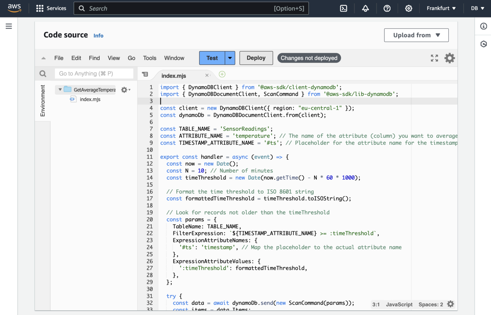
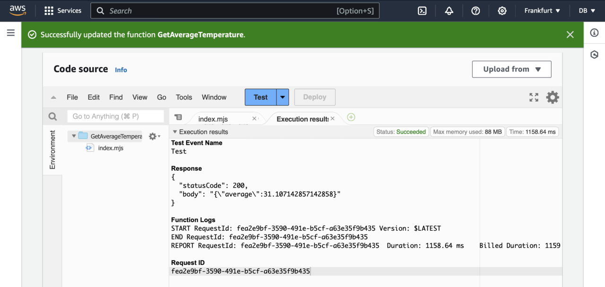

---
# User change
title: "Test Lambda Function"

weight: 5

layout: "learningpathall"
---

# Testing the function
To test the function, launch the IoT emulator to write some data to the DynamoDB table. Refer to this [Learning Path for more information](/learning-paths/laptops-and-desktops/win_aws_iot_dynamodb).

In the `GetAverageTemperature` function dashboard click the **Deploy** button:

You can then click the **Test** button. This will open the *Configure test event* window, in which you type **Test** in the Event name and click the **Save** button. This will take you back to the `GetAverageTemperature` function dashboard, where you click the **Test** button again. You will see the execution status, including the average temperature value as shown below:

# Summary
In this learning path you have implemented an AWS Lambda function that processes data stored in a DynamoDB table. You utilized AWS SDK for JavaScript v3 to interact with DynamoDB. Specifically, to create a DynamoDB Query, you constructed a DynamoDB Scan Command with a FilterExpression to retrieve records from the last N minutes. 

You learned how to handle date and time by implementing date and time calculations using native JavaScript to ensure accurate time threshold calculations. 

You learned how to process the items retrieved from the DynamoDB. First, you converted numerical attribute values (stored as strings) to numbers for accurate calculations. Then, you calculated the average of the specified numerical attribute (in this case it was temperature).

You implemented error handling to manage potential issues during DynamoDB operations and returned appropriate HTTP responses, including the calculated average or error messages.

The goal of this learning path was to highlight the usefulness of AWS Lambda and DynamoDB for serverless applications, particularly IoT solutions. Serverless architecture eliminates the need for server provisioning and management. By using this approach, you can create a robust, scalable, and efficient solution for processing and analyzing IoT data stored in DynamoDB, leveraging the power of AWS Lambda and serverless computing.
