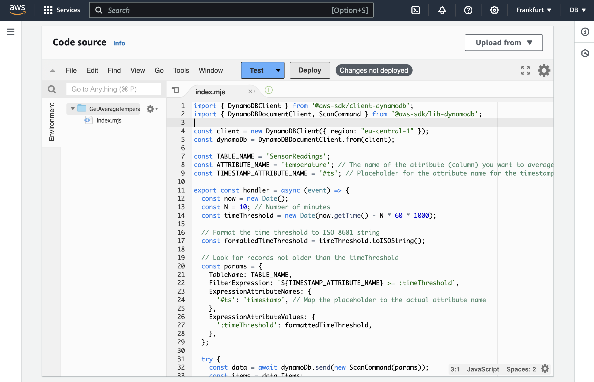

---
# User change
title: "Test Lambda Function"

weight: 6

layout: "learningpathall"
---

# Testing the function
To test the function launch the IoT emulator to write some data to the DynamoDB table. Refer to this [Learning Path](/learning-paths/laptops-and-desktops/win_aws_iot_dynamodb).

Then, in the GetAverageTemperature function dashboard click the Deploy button:

Afterward, click the **Test** button. This will open the *Configure test event* window, in which you type **Test** in the Event name and click the **Save** button. This will take you back to the GetAverageTemperature function dashboard, where you click the **Test** button again. You will see the execution status, including the average value of the temperature:

# Summary
In this learning path we developed an AWS Lambda function that processes data stored in a DynamoDB table. We utilized AWS SDK for JavaScript v3 to interact with DynamoDB. Specifically, to create a DynamoDB Query we constructed a DynamoDB ScanCommand with a FilterExpression to retrieve records from the last N minutes. 

We learned how to handle date and time by implementing date and time calculations using native JavaScript to ensure accurate time threshold calculations. Specifically, we used the toISOString() method to format the time threshold as an ISO 8601 string, ensuring consistent and accurate time comparisons across different time zones.

Also, we processed the items retrieved from the DynamoDB. First, we converted numerical attribute values (stored as strings) to numbers for accurate calculations. Then, we calculated the average of the specified numerical attribute (here that was temperature).

We implemented error handling to manage potential issues during DynamoDB operations, and returned appropriate HTTP responses, including the calculated average or error messages.

The goal of this path was to highlight the usefulness of AWS Lambda and DynamoDB for serverless applications, particularly IoT solutions. Serverless architecture eliminates the need for server provisioning and management.

By following this approach, you can create a robust, scalable, and efficient solution for processing and analyzing IoT data stored in DynamoDB, leveraging the power of AWS Lambda and serverless computing.