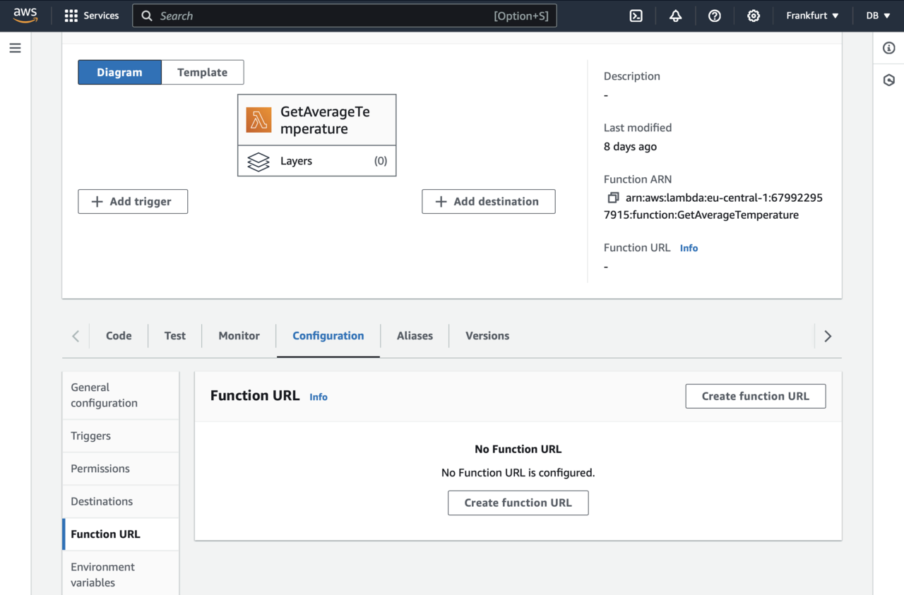
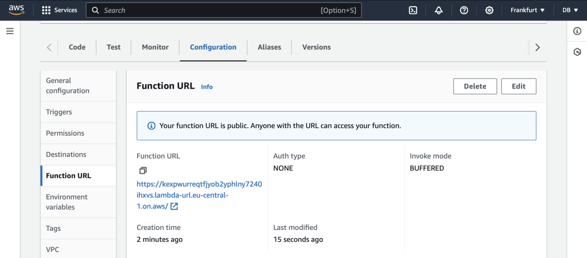
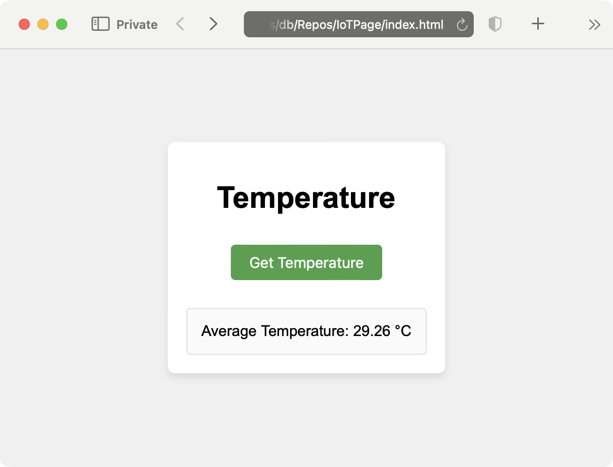

---
# User change
title: "Add AWS Lambda Endpoint"

weight: 4

layout: "learningpathall"
---

### AWS Lambda

You will now use the AWS Lambda console to retrieve the AWS Lambda endpoint for the static website. Before you begin make sure to prepare the `GetAverageTemperature` AWS Lambda function as explained in this [Learning Path](/learning-paths/laptops-and-desktops/win_aws_iot_lambda_dynamodb/). Then proceed as follows:
1. Go to the AWS Lambda console, and click the `GetAverageTemperature` Lambda function.
2. In the Lambda function dashboard, click the **Configuration** tab and then the **Function URL** as shown below:



3. Under the Function URL, click the **Create Function URL** button.
4. In the window that appears select NONE, scroll down to Additional Settings, and check **Configure cross-origin resource sharing (CORS)**.
5. Click the **Save** button

The function URL will appear as follows:



Copy the link, and use it to replace the YOUR_API_GATEWAY_ENDPOINT_URL placeholder in the **index.js** file as follows:

```JavaScript
document.getElementById('fetchTemperatureButton').addEventListener('click', function() {
    fetch('YOUR_API_GATEWAY_ENDPOINT_URL') 
        .then(response => response.json())
        .then(data => {
            const temperature = data.average.toFixed(2);
            document.getElementById('temperatureDisplay').innerText = `Average Temperature: ${temperature} °C`;
        })
        .catch(error => {
            console.error('Error fetching temperature:', error);
            document.getElementById('temperatureDisplay').innerText = 'Error fetching temperature';
        });
});
```

Save the file, and open **index.html**. Then, click the **Get temperature button** and the average temperature will appear as shown below:



