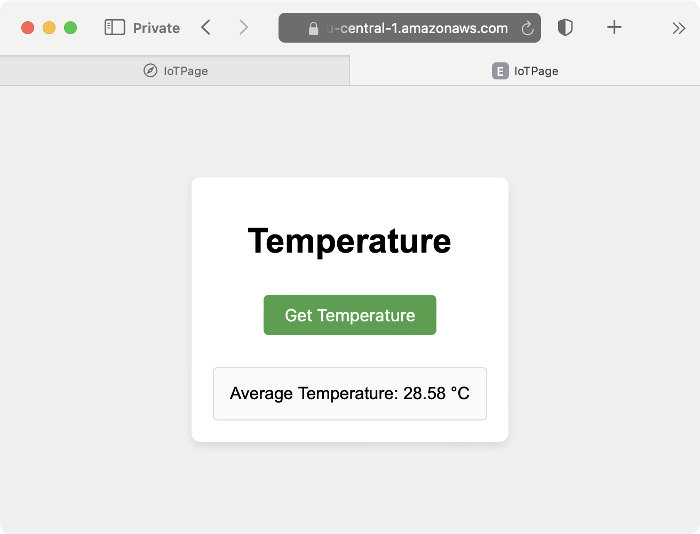

---
# User change
title: "Deploy website to Amazon S3"

weight: 5

layout: "learningpathall"
---
### Deploy to Amazon S3

In this section you will deploy the website to Amazon S3 using the Amazon Command Line interface (AWS CLI) version 2. If you don't already have it, start by [installing AWS CLI](/install-guides/aws-cli/).
### AWS CLI
To configure the AWS CLI you first need to create an [AWS CLI user](https://docs.aws.amazon.com/IAM/latest/UserGuide/id_users_create.html#id_users_create_console). Then, you need to generate the access keys by following the [AWS CLI authentication tutorial](https://docs.aws.amazon.com/cli/v1/userguide/cli-authentication-user.html).

Once you have the access key, go to the Command Prompt and type the following:

```console
aws configure
```

The command will prompt for the following:
1. AWS Access Key ID [None]: **paste in your Access Key ID**
2. AWS Secret Access Key [None]: **paste in your Access Key**
3. Default region name [None]: **type your region**
4. Default output format [None]: **press enter**

Ensure that AWS CLI can communicate with AWS. To do so, type the following command (replace eu-central-1 with the region code you are using):
```
console 
aws lambda list-functions --region eu-central-1 --output table
```

The command will display the AWS Lambda functions in a table.

### S3 bucket
You are now ready to deploy the website to AWS S3. To do this, you will first create the S3 bucket. Then, you will upload the website files, and finally you will configure the S3 bucket for static website hosting.

Proceed as follows:
1. Create the bucket by typing the placeholder with the unique bucket name (remember to replace <unique-bucket-name>), and the <region> with the AWS region code you're using, as shown below:
``` 
console
aws s3api create-bucket --bucket <unique-bucket-name> --region <region> --create-bucket-configuration LocationConstraint=<region> --object-ownership BucketOwnerPreferred
```

2. Upload the following files:
```console
aws s3 cp index.html s3://<unique-bucket-name>/
aws s3 cp styles.css s3://<unique-bucket-name>/
aws s3 cp index.js s3://<unique-bucket-name>/
```

3. Configure the bucket policy to enable public read of the files:
```console
cat > policy.json << EOL                                                      
{
    "Version": "2012-10-17",
    "Statement": [
        {
            "Sid": "PublicReadGetObject",
            "Effect": "Allow",
            "Principal": "*",
            "Action": "s3:GetObject",
            "Resource": "arn:aws:s3:::<unique-bucket-name>/*"
        }
    ]
}
EOL
```

4. Remove the public access block on the bucket:
```
console
aws s3api delete-public-access-block --bucket db-iot-bucket
```

5. Apply the policy as follows:
```console
ws s3api put-bucket-policy --bucket <unique-bucket-name> --policy file://policy.json
```

6. Enable static website hosting by:
```console
aws s3 website s3://<unique-bucket-name>/ --index-document index.html
```

Finally, access the website by typing **http://<unique-bucket-name>.s3-website-<region>.amazonaws.com**, where <unique-bucket-name> is the name of your bucket and <region> stands for the region you're using (here that is eu-central-1):



## Summary
In this learning path you have learned how to create a simple static website that fetches and displays temperature data from an AWS Lambda function. The website consists of an HTML file (**index.html**), a CSS file (**styles.css**), and a JavaScript file (**index.js**). The JavaScript code within the website sends an HTTP request to an AWS Lambda function, which processes the request and returns the temperature data in a JSON format. This data is then displayed on the webpage.

After developing the website, you deployed it to Amazon S3 for static website hosting. You created an S3 bucket, disabled the default block public access settings, and uploaded the website files to the bucket. You then applied a bucket policy to allow public read access to the objects, and configured the bucket to serve as a static website. Finally, you accessed the website using the S3 static website endpoint, successfully integrating the web application with AWS Lambda and deploying it to the cloud.
