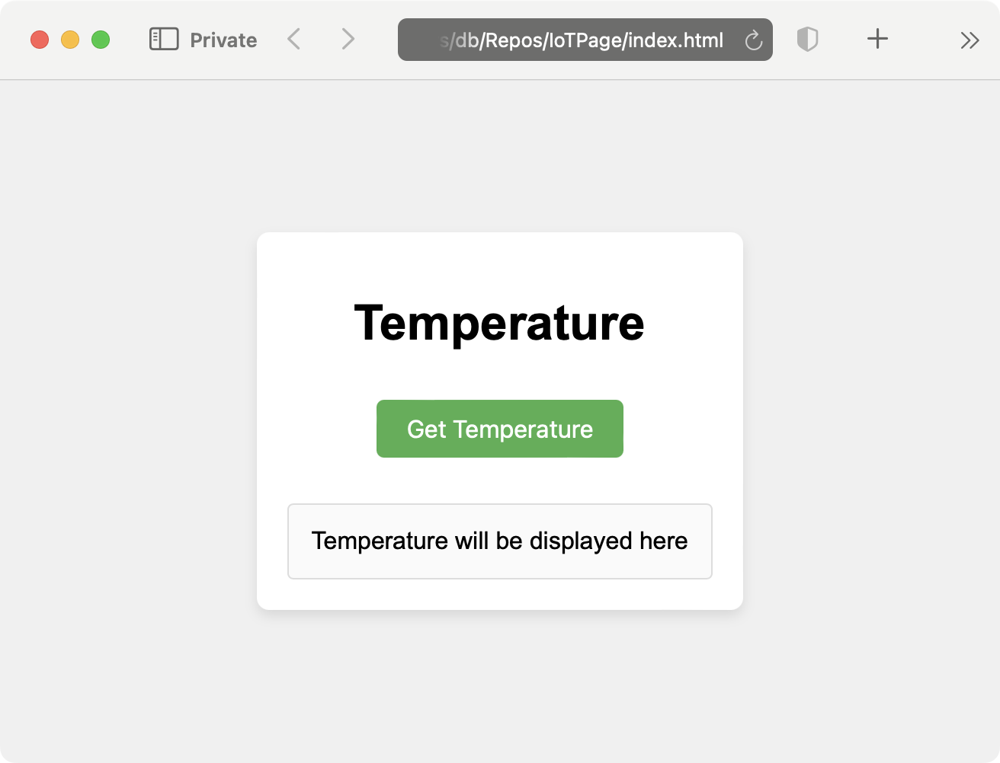

---
# User change
title: "Static website"

weight: 3

layout: "learningpathall"
---

### Create a static website

Start by creating the static website. To do this, create a new folder, for example, named **IoTPage**. Within the **IoTPage** folder, create three further (and essential) files:
* index.html - contains the structure and content of your webpage
* styles.css - defines the styling and layout
* index.js - handles the interactive functionalities, such as fetching data from AWS Lambda and displaying it on your site

These files will serve as the backbone of your static website. 

Open **index.html** and modify it as follows:

```html
<!DOCTYPE html>
<html lang="en">
<head>
    <meta charset="UTF-8">
    <meta name="viewport" content="width=device-width, initial-scale=1.0">
    <title>IoTPage</title>
    <link rel="stylesheet" href="styles.css">
</head>
<body>
    <div class="container">
        <h1>Temperature</h1>
        <button id="fetchTemperatureButton">Get Temperature</button>
        <div id="temperatureDisplay" class="display-box">Temperature will be displayed here</div>
    </div>
    <script src="index.js"></script>
</body>
</html>
```

The above declarations link to an external CSS file (styles.css) which styles the webpage. The body of the website contains a heading called “Temperature”, a “Get Temperature” button which, when clicked, will fetch the temperature using the AWS Lambda function, and a display box where the fetched temperature will be shown.

Finally, the declarations link to an external JavaScript file (index.js) which will handle the button click and fetch the temperature data.

Next, open the **styles.css** file and modify it as follows:
```css
body {
    font-family: Arial, sans-serif;
    display: flex;
    justify-content: center;
    align-items: center;
    height: 100vh;
    background-color: #f0f0f0;
    margin: 0;
}

.container {
    text-align: center;
    background: white;
    padding: 20px;
    border-radius: 8px;
    box-shadow: 0 4px 8px rgba(0,0,0,0.1);
}

button {
    background-color: #4CAF50;
    color: white;
    border: none;
    padding: 10px 20px;
    text-align: center;
    text-decoration: none;
    display: inline-block;
    font-size: 16px;
    margin: 10px 0;
    cursor: pointer;
    border-radius: 5px;
}

button:hover {
    background-color: #45a049;
}

.display-box {
    margin-top: 20px;
    padding: 15px;
    border: 1px solid #ddd;
    border-radius: 4px;
    background-color: #fafafa;
}
```

The first part of the declaration relates to the body of the document. It sets the font to Arial or a sans-serif alternative. You use flexbox to center content both vertically and horizontally. The height is set to 100% of the viewport height. Also, the declarations will apply a light gray background color, and remove the default margin.

Then, there is a declaration of the **.container** class. It does the following:
* centers the text within the container.
* sets a white background.
* adds padding inside the container.
* rounds the corners with a border radius.
* adds a subtle shadow for a 3D effect.

Next, you have a declaration of the **button** style, which does the following:
* sets a green background color.
* changes the text color to white.
* removes the default border.
* adds padding for spacing inside the button.
* centers the text and removes text decoration.
* ensures buttons are displayed as inline blocks.
* sets a font size.
* adds a margin for spacing around the button.
* changes the cursor to a pointer on hover.
* rounds the button corners.

A CSS file also styles the button element when it's hovered over by darkening the green background color.

Finally, you have the **.display-box** class, which will do the following:
* adds a top margin for spacing.
* adds padding inside the display box.
* sets a light gray border.
* rounds the corners.
* sets a very light gray background color.

This CSS file provides a clean, centered, and modern look for the webpage with distinct styling for buttons and display boxes, enhancing the user experience.

After declaring the CSS you will implement the **index.js** file as follows:
```JavaScript
document.getElementById('fetchTemperatureButton').addEventListener('click', function() {
    fetch('YOUR_API_GATEWAY_ENDPOINT_URL')
        .then(response => response.json())
        .then(data => {
            const temperature = data.average.toFixed(2);
            document.getElementById('temperatureDisplay').innerText = `Average Temperature: ${temperature} °C`;
        })
        .catch(error => {
            console.error('Error fetching temperature:', error);
            document.getElementById('temperatureDisplay').innerText = 'Error fetching temperature';
        });
});
```

After saving all the files, open the **index.html** file in a web browser. It should render as follows:



The website is now ready. However, to fetch temperatures, you will need to add the Lambda endpoint. You will configure this in the next section.
