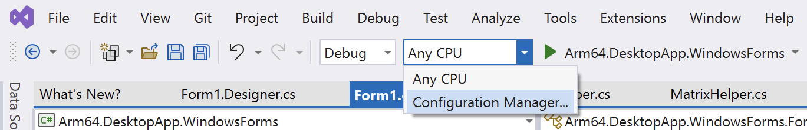
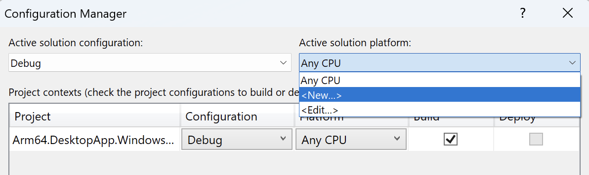
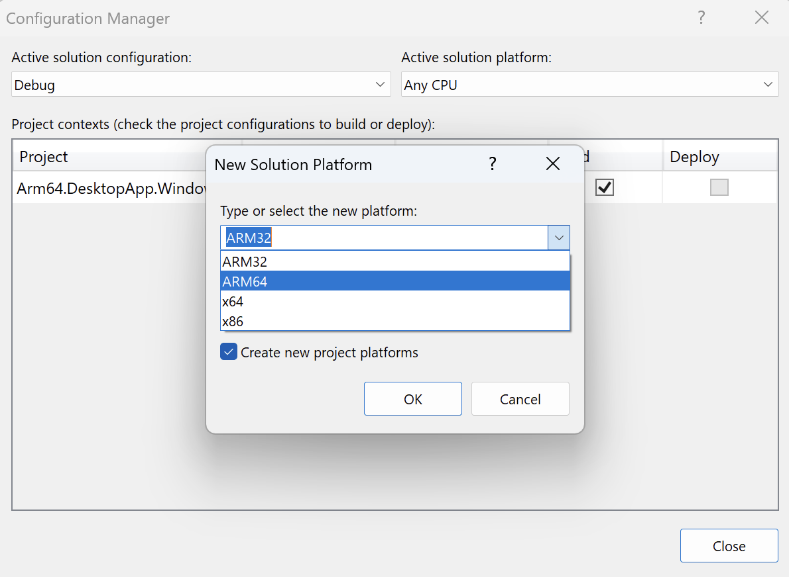
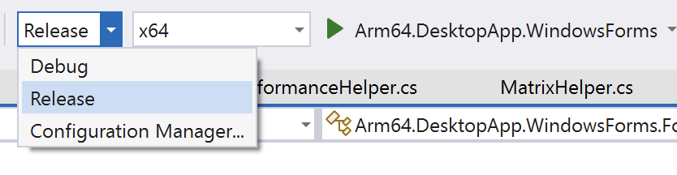
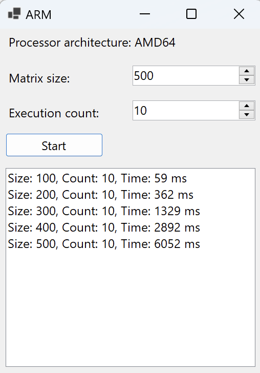
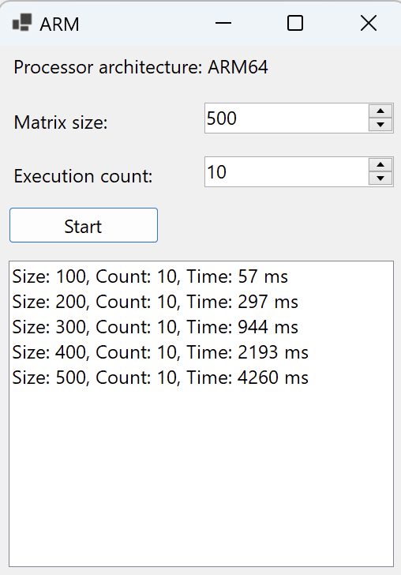

## Objective
In this section, you will change the build configuration of the application and then launch it using various settings to compare the matrix multiplication computation times.

## Creating new build configurations
To change the build configuration, click the target platform dropdown (by default, it displays 'Any CPU') and select 'Configuration Manager...':

<<<<<<< HEAD

In the Configuration Manager, select '<New ...>' from the Active solution platform dropdown:

This will open the 'New Solution Platform' window, where you should select ARM64 from the 'Type or select the new platform' dropdown:

=======

In the Configuration Manager, select '<New ...>' from the Active solution platform dropdown:

This will open the 'New Solution Platform' window, where you should select ARM64 from the 'Type or select the new platform' dropdown:

>>>>>>> 5f2151168 (Changed model to Tiny Rock–Paper–Scissors CNN)

Then, click the OK button. Similarly, create the x64 solution platform

## Comparing the performance
You will now compare the computation performance on x64 and Arm64 platforms. First, start the application in Release mode and architecture set to x64:

<<<<<<< HEAD

Once the application has started, run calculations for the following matrix sizes: 100, 200, 300, 400, and 500. You should see results similar to those in the following figure.

Next, launch the application for the Arm64 platform. Run the matrix multiplication for the same matrix sizes as above and observe the computation times:

=======

Once the application has started, run calculations for the following matrix sizes: 100, 200, 300, 400, and 500. You should see results similar to those in the following figure.

Next, launch the application for the Arm64 platform. Run the matrix multiplication for the same matrix sizes as above and observe the computation times:

>>>>>>> 5f2151168 (Changed model to Tiny Rock–Paper–Scissors CNN)

By comparing the execution times, we observe that, on average, Arm64 provides almost a 30% performance improvement over x64.

## Summary
In this learning path, you have learned how to develop and optimize a desktop application using Windows Forms in .NET on Arm64, particularly for matrix multiplication operations. 

You started with an overview of Windows Forms, a GUI class library in .NET, and its role in developing desktop applications. Then, you created a new Windows Forms project in Visual Studio, including setting up the project environment and selecting the appropriate .NET Framework version. You created both the user interface for this application and implemented the application logic.

The application was configured and run in different modes (x64 and Arm64) to compare the performance in matrix multiplication tasks. This comparison is essential to understand the efficiency and speed of execution in different architectural settings. The Arm64 platform showed a significant improvement in computation times compared to the x64 platform, highlighting the effectiveness of the application's design and optimization.
