---
# User change
title: "Build a native windows application using .NET 6 framework for Windows on Arm"

weight: 2

layout: "learningpathall"
---

## Before you begin

Any Windows on Arm computer which has the required tools installed can be used for this Learning Path.

Follow the links to install the required tools. 

* [Visual Studio 2022 or higher](/install-guides/vs-woa) 

Install the .NET desktop development workload component with Visual Studio. You can do this either during the initial installation or modify your existing installation. 

To modify your existing installation of Visual Studio:

1. Open the Windows Start Menu. Search for Visual Studio Installer and launch it.

2. Select `Modify`.

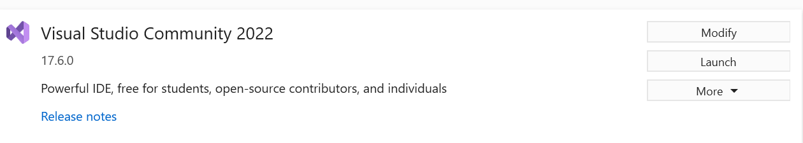

3. On the Workloads tab, click on the `.NET desktop development` checkbox and then select `Modify`.

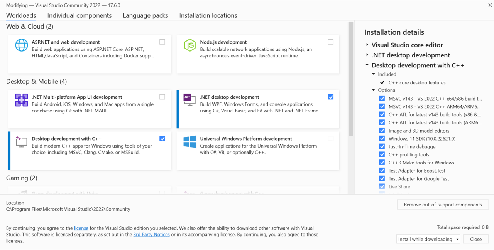

After the installation completes, close the installer.

## Compile a WPF application natively on Windows on Arm with .NET 6 framework

This Learning Path uses a sample Windows Presentation Foundation (WPF) application that solves a well-known algorithmic problem: the [Traveling Salesman Problem](https://simple.wikipedia.org/wiki/Travelling_salesman_problem).

This sample application is chosen because it is CPU intensive, and makes use of graphics to test the capabilities of WPF in .NET 6.

The [sample application source code](https://github.com/GVerelst/TravelingSalesman) is configured to build and compile using .NET 5. In this Learning Path, you will port the application to .NET 6 which includes support for WPF on Arm. 

To compile and run this WPF application using .NET 6 on a Windows on Arm device, follow the steps outlined below:

1. Open `Visual Studio` on your Windows on Arm computer.

2. Select `Clone a repository` from the Get Started options in Visual Studio as shown in the image below:

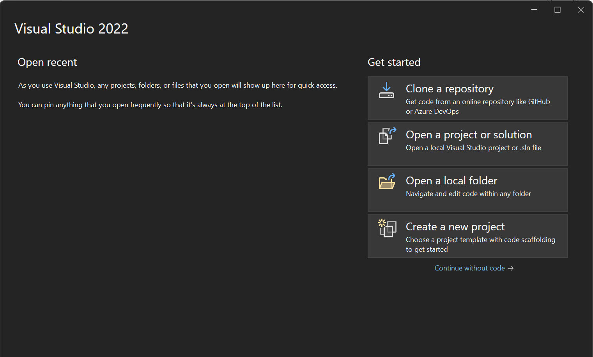

3. In the `Repository location` field enter `https://github.com/GVerelst/TravelingSalesman`

4. Enter an appropriate `Path` where you would like to clone the repository on your machine. In this example, it is `C:\TravelingSalesman`. Then select `Clone`.

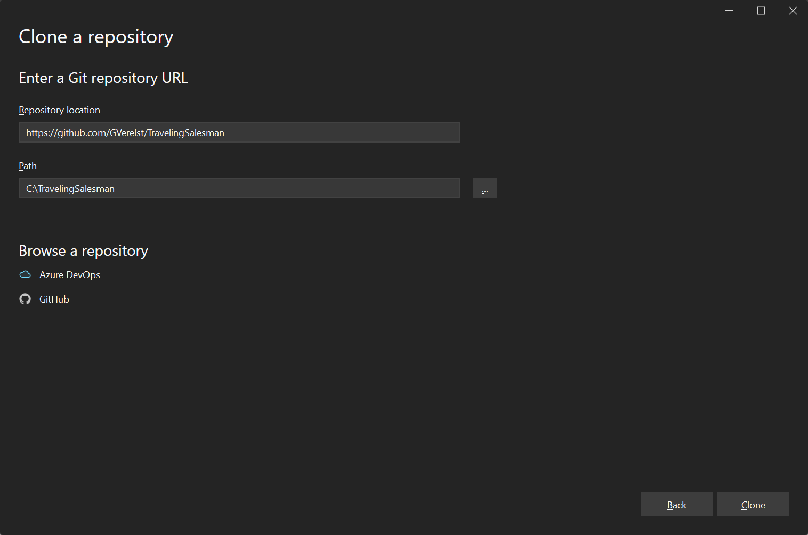

5. After the repository is cloned, 3 projects are displayed in the `Solution Explorer` pane. 

6. Right click on the `TSP.WPF` project and select `Properties`. 

7. In the `General` section, change the `Target framework` from `.NET 5.0` to `.NET 6.0` as shown in the image:

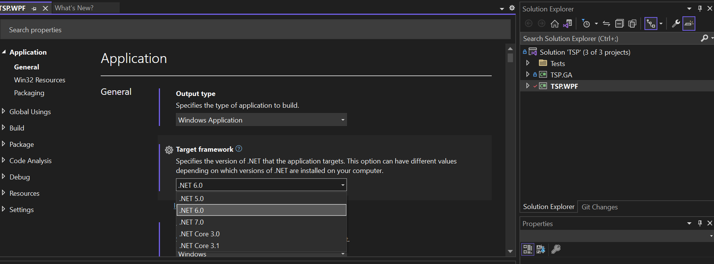

8. Save the changes to the project (Ctrl+S)

9. In Solution Explorer, right-click the `TSP.WPF` project and select `Publish`. The Publish dialog appears.  

10. Under Target, click Folder then click Next, as shown in the following image:

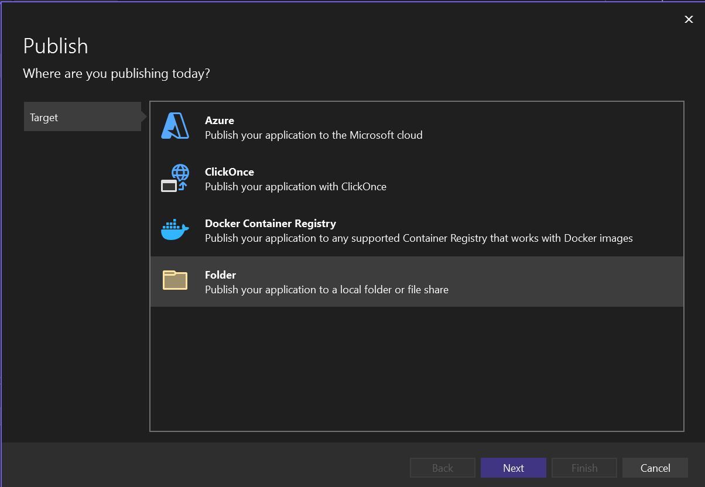

11. Under Specific target, click Folder then click Next, as shown in the following image:

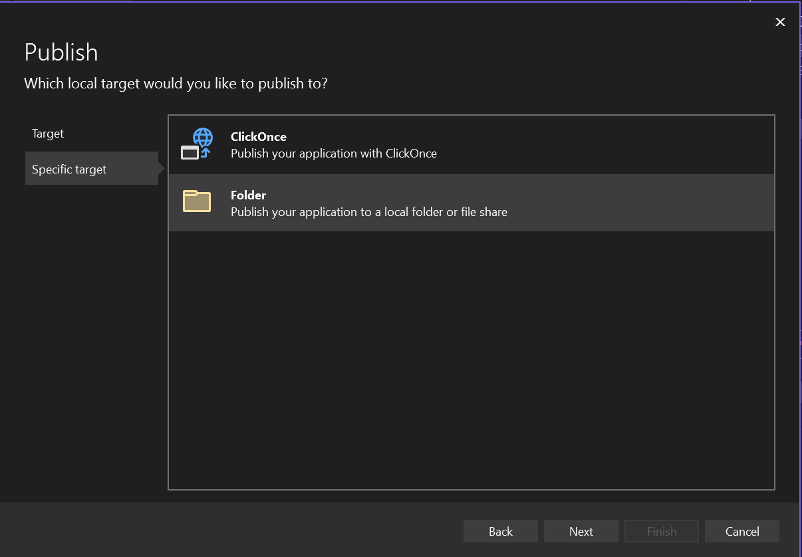

12. Select a location to store the generated binaries. You can leave the default folder selection as is and select `Finish`.

13. The initial publish profile is created. Select `Close`. 

14. Click on `Show all settings` to display the Profile settings dialog. 

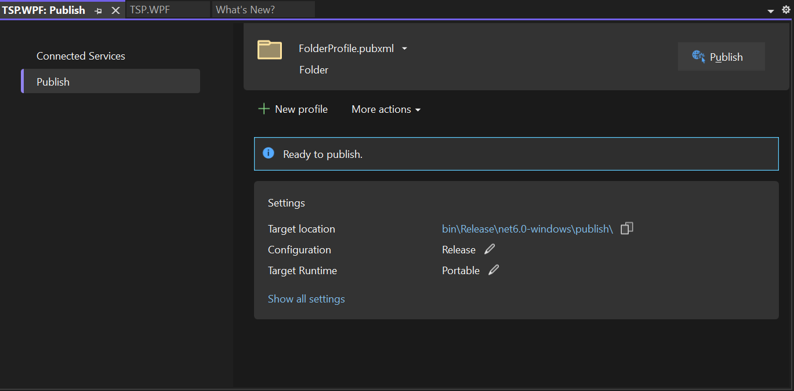

15. Change the `Target runtime` from `Portable` to `win-arm64` and click `Save`.

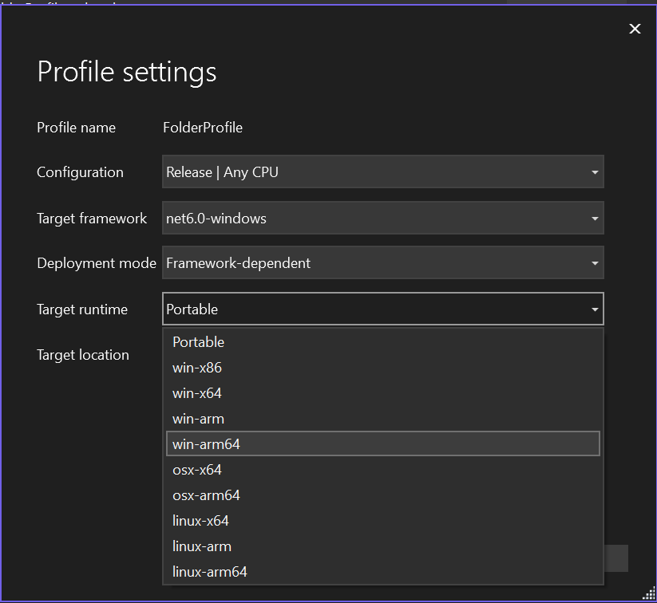

16. Click Publish. Visual Studio compiles a version of the project that is native executable on Arm devices as shown in the image below:

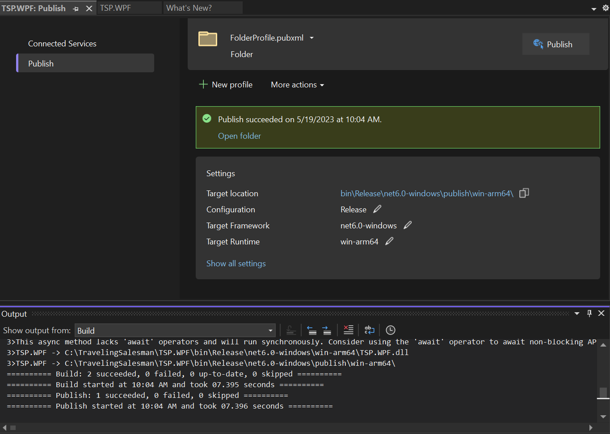

17. You should see a message that Publish succeeded. Click on `Open Folder` to view the generated binaries including the `TSP.WPF` application.

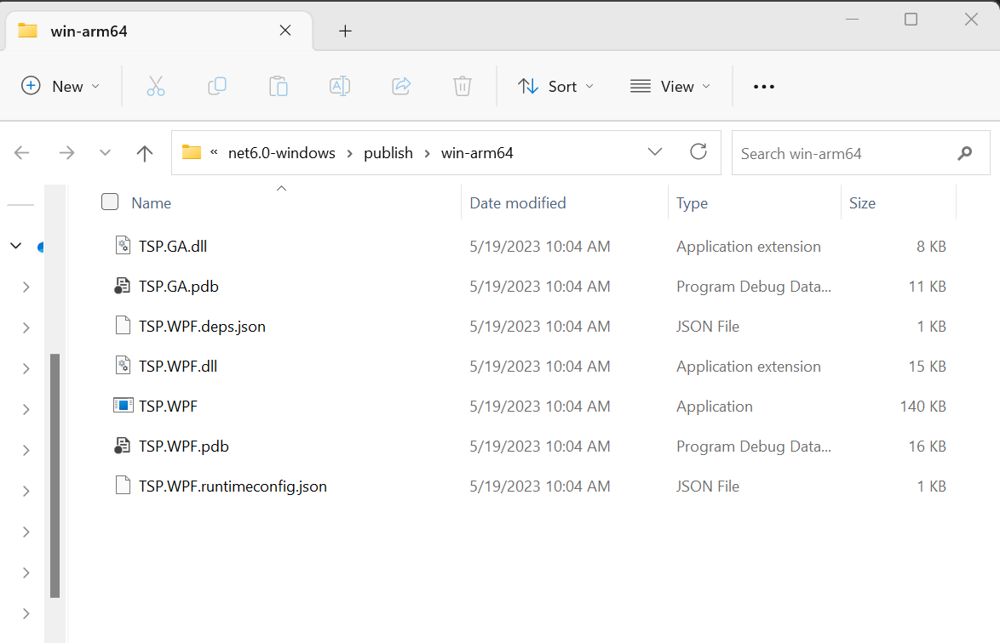

## Run the WPF application on your Windows on Arm device

Now that you have built the sample application for Windows on Arm, you are ready to run the executable.

Double-click `TSP.WPF` to run the application. The application starts as shown:

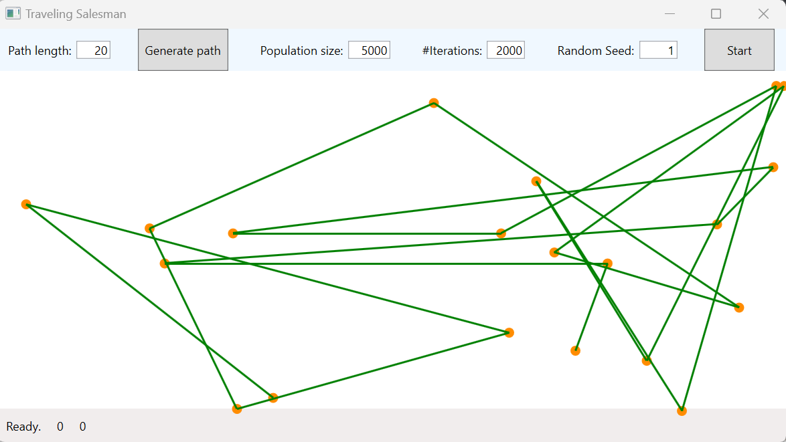

You can change the inputs on the application as needed. Click `Generate Path` followed by `Start` to see the application run.

You have successfully run a WPF application built with the .NET 6 framework on a Windows on Arm device.
