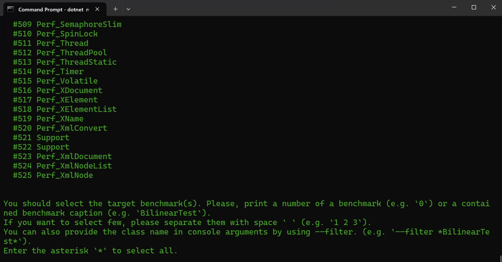
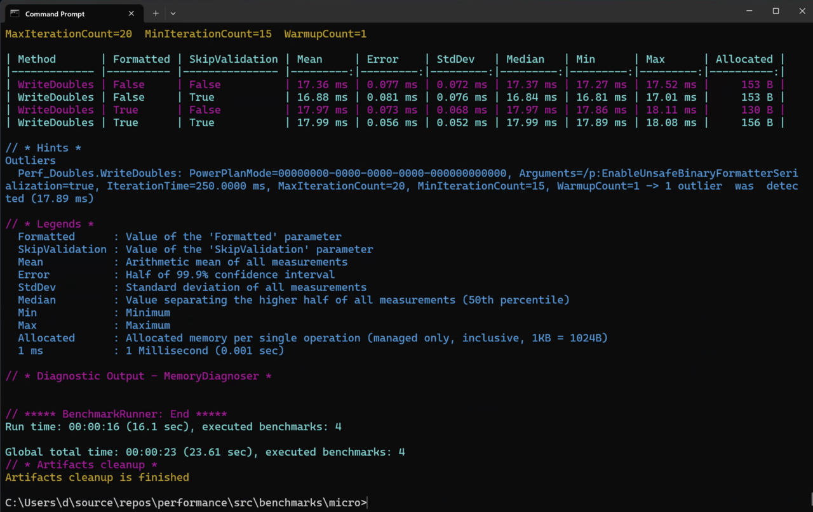

---
# User change
title: "Measuring performance of the .NET apps"

weight: 2

layout: "learningpathall"
---

## Introduction
When you think about .NET, you typically consider Windows applications. However, .NET is a cross-platform development framework so you can use it on Windows, Linux, and macOS. Therefore, Arm64 combined with this cross-platform capability enables you to rapidly implement efficient apps for a variety of scenarios.

In this learning path, we show you how to set up your development environment for .NET as well as how much performance boost you get by using Arm64.

## Before you begin
Before going any further, let's make sure the .NET was correctly installed. To do this, open the command prompt, and type:

```console
dotnet --info
```

The output will look as follows:

```output
.NET SDK:
 Version:           8.0.100
 Commit:            57efcf1350
 Workload version:  8.0.100-manifests.6c33ef20

Runtime Environment:
 OS Name:     Windows
 OS Version:  10.0.22621
 OS Platform: Windows
 RID:         win-arm64
 Base Path:   C:\Program Files\dotnet\sdk\8.0.100\

.NET workloads installed:
 Workload version: 8.0.100-manifests.6c33ef20
There are no installed workloads to display.

Host:
  Version:      8.0.0
  Architecture: arm64
  Commit:       5535e31a71

.NET SDKs installed:
  8.0.100 [C:\Program Files\dotnet\sdk]

.NET runtimes installed:
  Microsoft.AspNetCore.App 8.0.0 [C:\Program Files\dotnet\shared\Microsoft.AspNetCore.App]
  Microsoft.NETCore.App 8.0.0 [C:\Program Files\dotnet\shared\Microsoft.NETCore.App]
  Microsoft.WindowsDesktop.App 8.0.0 [C:\Program Files\dotnet\shared\Microsoft.WindowsDesktop.App]

Other architectures found:
  x64   [C:\Program Files\dotnet\x64]
    registered at [HKLM\SOFTWARE\dotnet\Setup\InstalledVersions\x64\InstallLocation]
  x86   [C:\Program Files (x86)\dotnet]
    registered at [HKLM\SOFTWARE\dotnet\Setup\InstalledVersions\x86\InstallLocation]

Environment variables:
  Not set

global.json file:
  Not found

Learn more:
  https://aka.ms/dotnet/info

Download .NET:
  https://aka.ms/dotnet/download
```

By default, the `dotnet` command uses the Arm64 architecture when running on an Arm64 device. However, it also recognizes that the x64 architecture is available in the **Other architectures** found list. You can use the output of the `dotnet --info` command to retrieve the list of installed .NET runtimes. In this output, we have three runtimes: Microsoft.AspNetCore.App, Microsoft.NETCore.App 8.0.0, and Microsoft.WindowsDesktop.App 8.0.0.

{} The list of .NET SDKs and runtimes can differ. For example, if you have previously installed other .NET SDKs.{}

## Benchmarking .NET applications
The .NET team provides a set of [benchmark tests](https://github.com/dotnet/performance) you can use to evaluate the performance of various .NET versions on different architectures. These benchmarks depend on the [BenchmarkDotNet](https://github.com/dotnet/BenchmarkDotNet) library, which provides a framework to simplify measurements of code execution time.

You can add these measurements to your code using C# attributes. The library evaluates execution time and reports both mean computation time and standard deviation. In addition, the library can generate plots to help you assess code performance.

You will now use the benchmark tests. Proceed as follows:

1. Clone the dotnet performance git repository:

```
git clone https://github.com/dotnet/performance.git
```

2. Change the working directory to performance\src\benchmarks\micro. Then, enter the following command:

```
dotnet run -c Release -f net8.0
```

The command will build and run the performance benchmarks. The output will look as follows:



The output lists all available benchmarks. You can type * to run all benchmarks or type a number to select individual performance tests. In this example, let's type **483** to execute the Perf_Doubles benchmark. After a while you will see a summary of the performance test. A portion of this output is shown in the figure below:



By default, the table summarizes the performance test results. You can see each performance test's execution time and statistics (mean, median, minimum, maximum, and standard deviation) which gives you a comprehensive overview of code performance.
