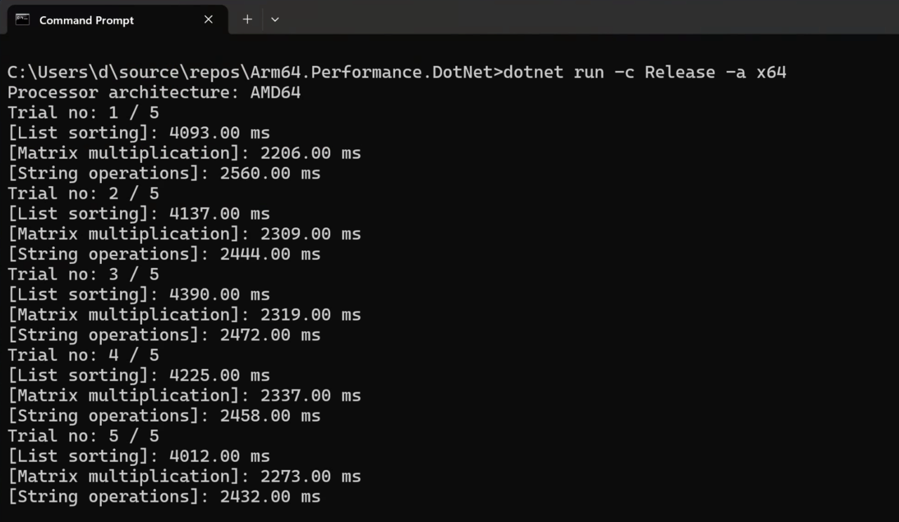
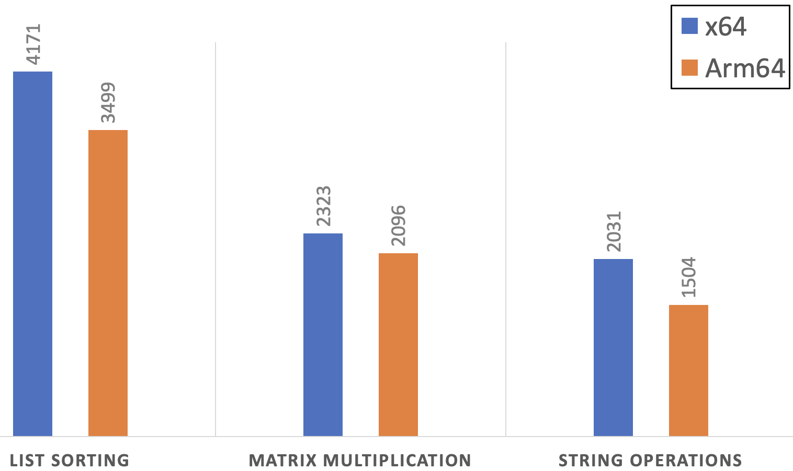

---
# User change
title: "Custom benchmarks"

weight: 3

layout: "learningpathall"
---

### Objective
In this section you will learn how to implement and use custom benchmarks using the **System.Diagnostics.Stopwatch** class. This is useful if you want to measure the performance of your custom code.

### Application
Start by cloning the sample [application](https://github.com/dawidborycki/Arm64.Performance.DotNet/):

```
git clone https://github.com/dawidborycki/Arm64.Performance.DotNet.git
```

The application was created using **dotnet new console -o Arm64.Performance.DotNet**. Then, I added the following elements:

1. PerformanceHelper static class which provides reusable methods for measuring the code execution time.
2. PerformanceTests static class which includes the actual code for performance measurements. In this tutorial we will measure the performance of the matrix multiplication (PerformanceTests.SquareMatrixMultiplication), operations on strings like split, replace, substring (PerformanceTests.StringOperations), and list sorting (PerformanceTests.ListSorting).
3. Program.cs file which implements the entry point of the application. In this file you have one constant, `trialCount`, which you can use to specify how often the performance test sets execute. By default, the trialCount is set to 5. Then, the application will run ListSorting 500 times,  SquareMatrixMultiplication 10 times and StringOperations 500,000 times. This achieves comparable execution times for the test batches. A single matrix multiplication is slower than a single-string operation so there must be more executions of the latter.

### Running the application
To run the application, navigate to the Arm64.Performance.DotNet folder (which you cloned above), and then type:

```
dotnet run -c Release
```

Wait a few moments for the application to execute all the benchmarks and you will then see the results of the following form:


You will now compare execution times to x64 architecture (emulator on arm64) by typing:

```
dotnet run -c Release -a x64
```

The above command will lead to significantly longer execution times than before:



The operations all take more time on the emulated x64 than when you execute them natively on Arm64. On average, native execution provides about a 19% performance improvement for list sorting, 11% for matrix multiplication, and 35% for string operations.

The following chart summarizes the mean execution times for x64 and Arm64's natively executed code.



### Summary
In this learning path you have learned how to benchmark .NET applications using both the default and custom benchmarks. By benchmarking the custom code, we demonstrated the performance boost when you natively execute the .NET code on an Arm64-powered device. 
