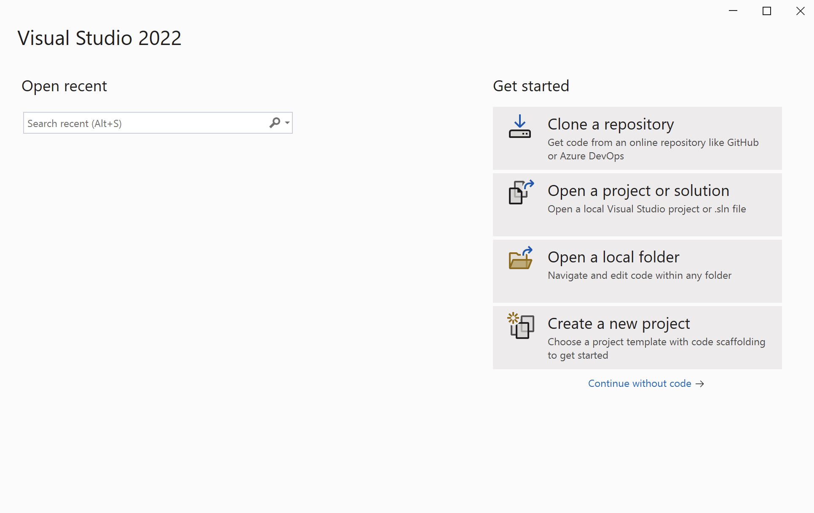
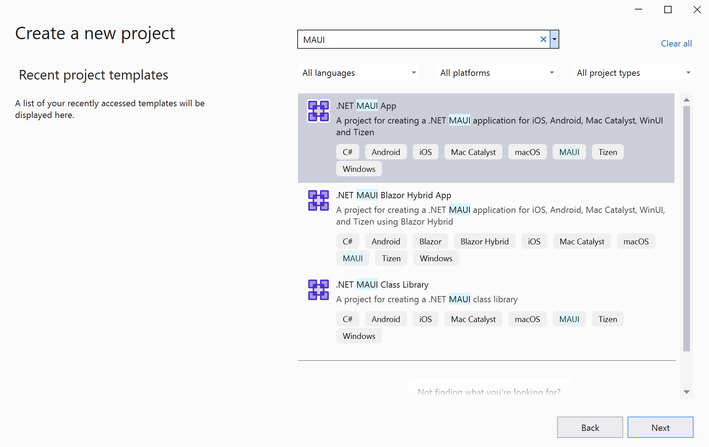
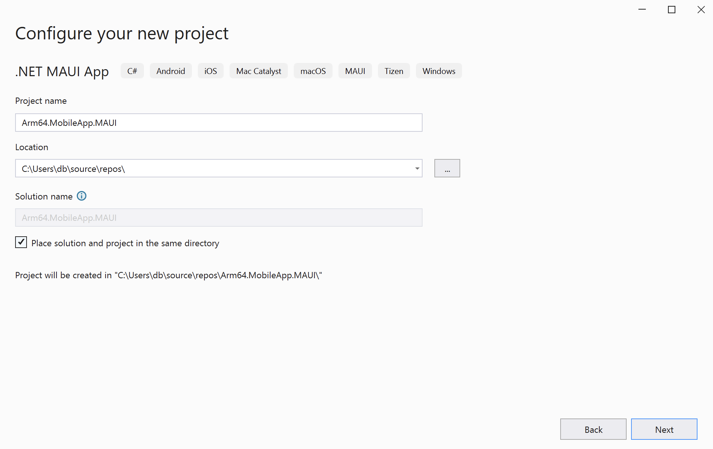
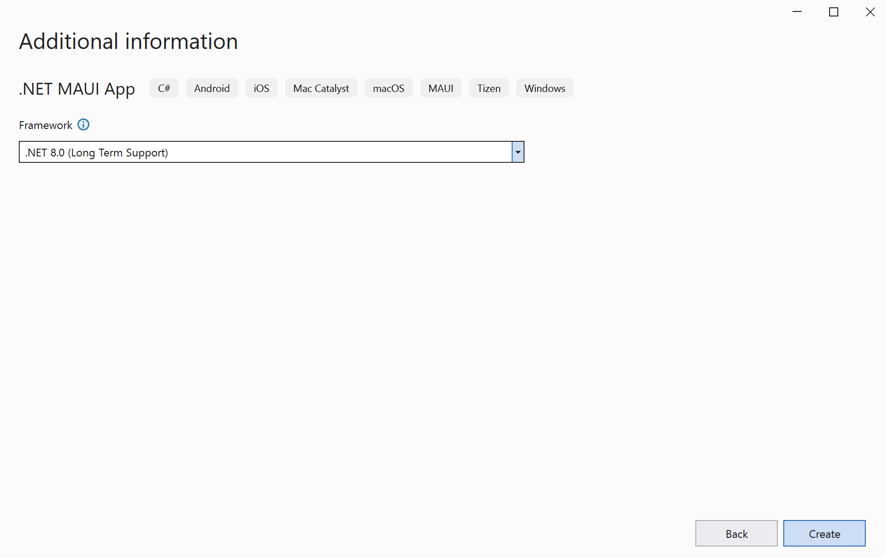
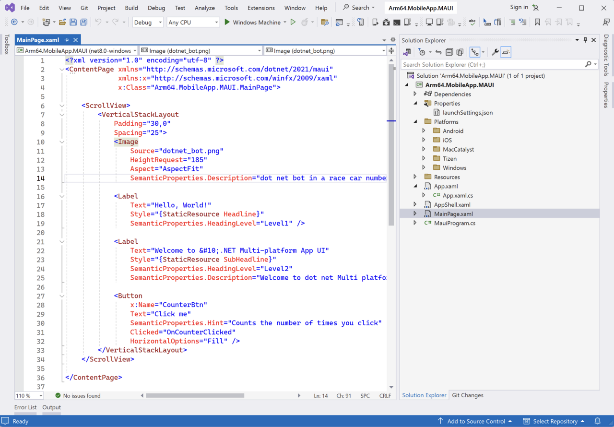
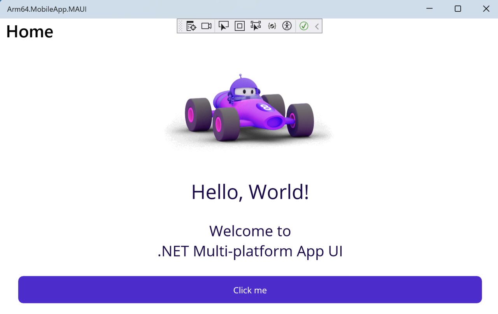

---
# User change
title: "Create a .NET MAUI Project"

weight: 2

layout: "learningpathall"
---

## Introduction
.NET Multi-platform App UI (.NET MAUI) is a framework introduced by Microsoft to enable developers to create cross-platform applications for mobile and desktop operating systems using a single codebase. This framework extends the capabilities of Xamarin.Forms, providing a more unified and scalable approach to developing applications that can run on Android, iOS, macOS, and Windows. For further information on Xamarin.Forms, check out this learning path on [Developing cross-platform applications with Xamarin.Forms](/learning-paths/laptops-and-desktops/win_xamarin_forms/).

With .NET MAUI, developers can leverage the full power of .NET to build interactive and performance-oriented applications. It supports modern development patterns and practices, including MVVM (Model-View-ViewModel), dependency injection, and async programming. The framework integrates seamlessly with Visual Studio, offering a rich development environment with tools for debugging, UI design, and deployment.

Similar to Windows Presentation Foundation (WPF) and Xamarin.Forms, .NET MAUI utilizes a mix of declarative UI (using XAML) and imperative code, allowing for flexible and expressive UI construction. Moreover, .NET MAUI incorporates platform-specific capabilities and access to native APIs, ensuring that applications can fully utilize the features of the underlying operating system.

In this learning path, you will explore how to create a .NET MAUI application and discover how .NET MAUI application performance is enhanced on Arm64 devices, particularly through the computationally intensive task of performing the multiply-add operation on two vectors. This operation, commonly used in many artificial neural network architectures, serves as an excellent example of Arm64's capabilities in handling performance-demanding tasks. 

You can find the [complete project code on GitHub](https://github.com/dawidborycki/Arm64.MobileApp.MAUI.git).

## Before you begin
Before you begin the implementation, install Visual Studio 2022 with the following workloads:
1. .NET Multi-platform App UI development
2. Universal Windows Platform development

## Create the project
Open Visual Studio and click 'Create a new project'. 

In the next window, search for the '.NET MAUI App' template. 

This will open the 'Configure your new project' view, in which you should configure the project as follows (refer to the figure below):

1. Project name: **Arm64.MobileApp.MAUI**
2. Location: Select the project location on your drive (example: **C:\Users\db\source\repos**)
3. Check the option **Place solution and project in the same directory**
4. Click the **Next** button

In the next window, select **.NET 8.0 (Long Term Support)** and click the **Create** button:

The project creation process may take a few moments. During this process, you might be prompted to enable Developer Mode for Windows. If so, follow the instructions shown to enable Developer Mode:

Then, accept any other license terms that appear, including the Android SDK - License Agreement. 

Your project should be now ready. Next, open the Solution Explorer (View -> Solution Explorer) to view the created projects:

## Understanding the project structure
The .NET MAUI project template is structured to enable the development of cross-platform applications using a single codebase, targeting Android, iOS, macOS, and Windows. Therefore, the project we have just created contains the following elements:
1. **MauiProgram.cs** - contains the entry point for .NET MAUI application. It's where you configure and set up the app, including services, dependencies, and the main app configuration. It typically contains the CreateMauiApp method, which builds and returns an instance of MauiApp class.
2. **App.xaml** and **App.xaml.cs** - these files define the application-level resources and the App class, which is derived from Application. This class serves as the central point for managing the app's lifecycle and its main interface.
3. **Platforms Folder** - this folder contains platform-specific code and resources. It is organized into subfolders for each target platform. Here we have: Android, iOS, MacCatalyst, Tizen, and Windows. These folders can contain platform-specific initialization code, icons, splash screens, and other resources. For example, the Android subfolder contains the MainActivity.cs file, which represents the main activity class that runs when the application starts on an Android device.
4. **MainPage.xaml** and **MainPage.xaml.cs** - these files declare the main page of the app, which serves as the starting UI. The XAML file contains the declarative UI markup, while the .cs file contains the code-behind, handling events and binding data to the UI.
5. **Resources** folder - this contains the application's resources, such as fonts, images, and styles. It is divided into several subfolders, such as Fonts, Images, Splash and Styles.
6. **AppShell.xaml** - this file serves as a fundamental component for defining the navigation structure and the overall architecture of the app's UI. It is a new concept introduced with MAUI, building upon and enhancing the navigation capabilities previously available in Xamarin.Forms. AppShell provides a simplified way to create complex, hierarchical navigation in your app with an emphasis on improving the user experience across all platforms.

You can now run the created application. To do so, click _Debug/Start Debugging_. The running application will look like the figure below:

