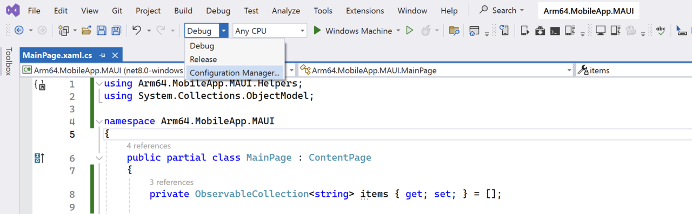
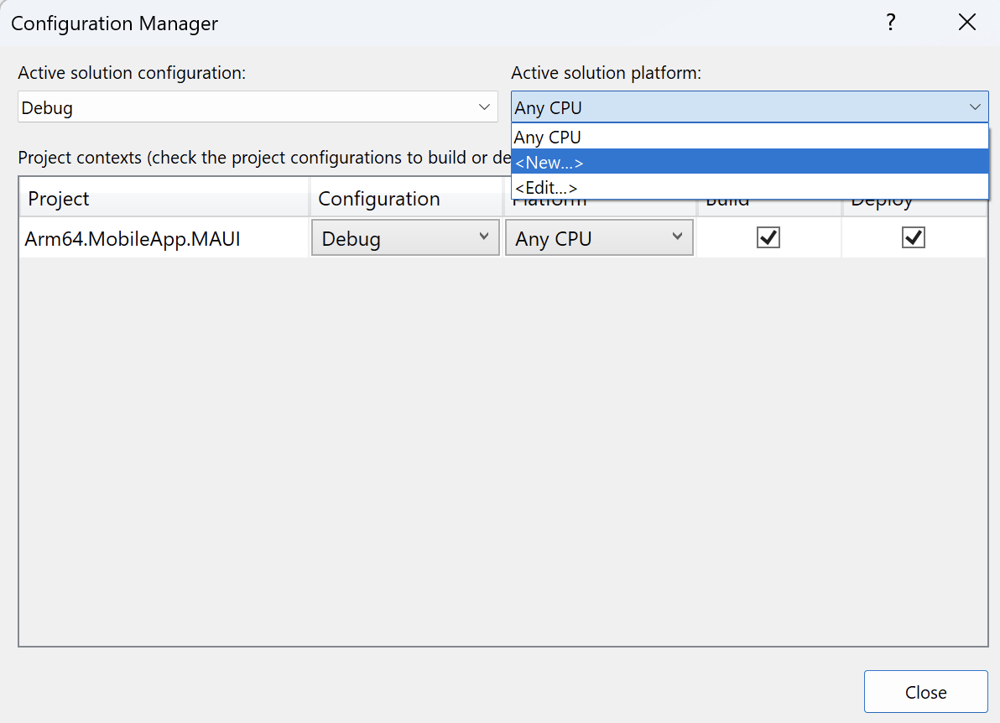
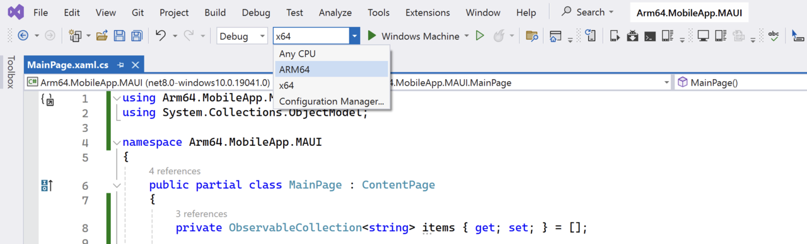
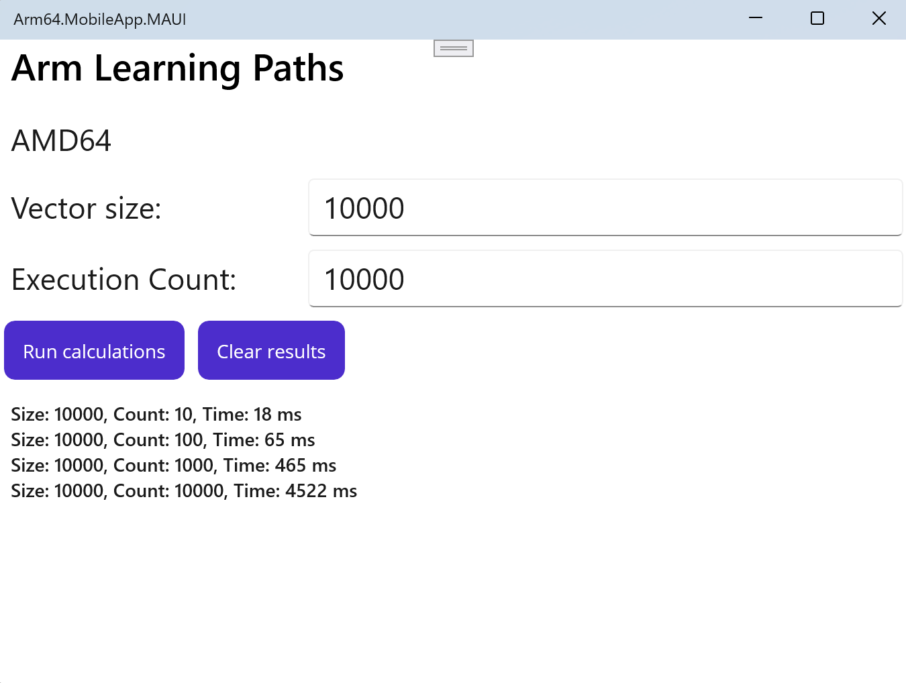

---
# User change
title: "Implement the application"

weight: 3

layout: "learningpathall"
---

## Objective
In this section, you will modify your newly created project by adding code for multiply-add operations, helper classes to measure execution time, and a list view to display the processing results.

## Helper classes
We begin by implementing two helper classes:
1. **PerformanceHelper** - this class is designed to measure the code execution time.
2. **VectorHelper** - this class will implement the AdditionOfProduct method, which calculates the expression **a*b+c**, where **a**, **b**, and **c** are pseudo-randomly generated vectors of double precision.

To create those classes proceed as follows:
1. In the Solution Explorer, right-click the **Arm64.MobileApp.MAUI** project and choose Add -> New Folder. Name the folder Helpers.
2. Right-click the Helpers folder, and select Add -> Class.... This action opens the _Add New Item_ window.
3. In the _Add New Item_ window, enter **PerformanceHelper.cs** in the Name text box, and click the Add button.
4. Insert the following statements into the **PerformanceHelper.cs** file:

```cs
using System.Diagnostics;

namespace Arm64.MobileApp.MAUI.Helpers
{
    public static class PerformanceHelper
    {
        private static readonly Stopwatch stopwatch = new();

        public static double MeasurePerformance(Action method, int executionCount)
        {
            stopwatch.Restart();

            for (int i = 0; i < executionCount; i++)
            {
                method();
            }

            stopwatch.Stop();

            return stopwatch.ElapsedMilliseconds;
        }
    }
}
```
5. Similarly, create the VectorHelper.cs file and modify it as follows::
```cs
namespace Arm64.MobileApp.MAUI.Helpers
{
    public static class VectorHelper
    {
        private static readonly Random random = new();

        private static double[] GenerateRandomVector(int size, double minValue = 0, double maxValue = 1)
        {            
            return Enumerable.Range(0, size)
                             .Select(_ => random.NextDouble() * (maxValue - minValue) + minValue)
                             .ToArray();
        }

        public static double[] AdditionOfProduct(int size, double minValue = 0, double maxValue = 1)
        {
            var a = GenerateRandomVector(size, minValue, maxValue);
            var b = GenerateRandomVector(size, minValue, maxValue);
            var c = GenerateRandomVector(size, minValue, maxValue);

            var result = new double[size];

            for (int i = 0; i < size; i++)
            {
                result[i] = a[i] * b[i] + c[i];
            }

            return result;
        }        
    }
}
```

## User interface
We can now modify the user interface. Start by opening the AppShell.xaml file. Then, change the title attribute of the ShellContent to "Arm Learning Paths":

```XML
<ShellContent
    Title="Arm Learning Paths"
    ContentTemplate="{DataTemplate local:MainPage}"
    Route="MainPage" />
```

Next, we'll modify the main view of the application. To do this, open MainPage.xaml and replace its original content with the following:

```XML
<?xml version="1.0" encoding="utf-8" ?>
<ContentPage xmlns="http://schemas.microsoft.com/dotnet/2021/maui"
             xmlns:x="http://schemas.microsoft.com/winfx/2009/xaml"
             x:Class="Arm64.MobileApp.MAUI.MainPage">

    <ContentPage.Resources>
        <Style TargetType="Label">
            <Setter Property="FontSize"
                    Value="Medium" />
            <Setter Property="Margin"
                    Value="10" />
        </Style>

        <Style TargetType="Entry">
            <Setter Property="FontSize"
                    Value="Medium" />
            <Setter Property="Margin"
                    Value="5" />
        </Style>

    </ContentPage.Resources>

    <Grid>
        <Grid.RowDefinitions>
            <RowDefinition Height="Auto" />
            <RowDefinition Height="Auto" />
            <RowDefinition Height="Auto" />
            <RowDefinition Height="Auto" />
            <RowDefinition Height="*" />
        </Grid.RowDefinitions>

        <Grid.ColumnDefinitions>
            <ColumnDefinition Width="*" />
            <ColumnDefinition Width="2*" />
        </Grid.ColumnDefinitions>

        <!-- Label for Displaying Processor Architecture -->
        <Label x:Name="LabelProcessorArchitecture"
               Text="Processor Architecture: x64"
               Grid.ColumnSpan="2" />

        <!-- Label and Entry for Vector Size -->
        <Label Text="Vector size:"
               Grid.Row="1" />
        <Entry x:Name="EntryVectorSize"
               Grid.Row="1"
               Grid.Column="1"
               Text="10000" />

        <!-- Label and Entry for Execution Count -->
        <Label Text="Execution Count:"
               Grid.Row="2" />

        <Entry x:Name="EntryExecutionCount"
               Grid.Row="2"
               Grid.Column="1"
               Text="1000" />

        <!--Buttons-->
        <HorizontalStackLayout Grid.Row="3"
                               Grid.ColumnSpan="2"
                               Spacing="10"
                               Margin="5">

            <Button x:Name="ButtonRunCalculations"
                    Text="Run calculations"
                    Clicked="ButtonRunCalculations_Clicked" />

            <Button x:Name="ButtonClearResults"
                    Text="Clear results"
                    Clicked="ButtonClearResults_Clicked" />

        </HorizontalStackLayout>

        <!-- List View for Displaying Execution Times -->
        <ListView x:Name="ListViewResults"
                  Grid.Row="4"
                  Grid.ColumnSpan="2"
                  Margin="10" />

    </Grid>
</ContentPage>
```

This declaration will create a tabular layout using the Grid control, with the table comprising 5 rows and 2 columns. The first row will contain a label displaying the processor architecture. In the second row, there will be a label and a text box enabling the user to enter the size of the vectors. The third row will include a label and a text box for specifying the number of executions. Below this, two buttons will allow the user to run the calculations and clear the list view containing the results, which appears below the buttons.

## Application logic
Now, we will implement the application logic. To do this, open the MainPage.xaml.cs file and modify it as follows:

```cs
using Arm64.MobileApp.MAUI.Helpers;
using System.Collections.ObjectModel;

namespace Arm64.MobileApp.MAUI
{
    public partial class MainPage : ContentPage
    {
        private ObservableCollection<string> items { get; set; } = [];

        public MainPage()
        {
            InitializeComponent();

            // Update ProcessorArchitecture Label
            LabelProcessorArchitecture.Text =
                $"{Environment.GetEnvironmentVariable("PROCESSOR_ARCHITECTURE")}";

            ListViewResults.ItemsSource = items;
        }

        private void ButtonRunCalculations_Clicked(object sender, EventArgs e)
        {
            int size = Convert.ToInt32(EntryVectorSize.Text);
            int executionCount = Convert.ToInt32(EntryExecutionCount.Text);

            var executionTime = PerformanceHelper.MeasurePerformance(
                () => VectorHelper.AdditionOfProduct(size),
                executionCount);

            items.Add($"Size: {size}, Count: {executionCount}, " + $"Time: {executionTime} ms");
        }

        private void ButtonClearResults_Clicked(object sender, EventArgs e)
        {
            items.Clear();
        }
    }
}
```
 
The logic implemented above functions as follows. When the application is running and the user clicks the Run calculations button, the application reads the values from the Entry controls (`EntryVectorSize` and `EntryExecutionCount`). These values determine the vector size and the execution count. With these parameters, the application invokes the MeasurePerformance static method of the **PerformanceHelper** class to measure the time required for performing vector operations, given the specified vector size and execution count. The computed time is then displayed in the ListView. At any point, the user can clear the ListView contents by clicking the Clear button.

## Building and running the application
You will now build and run the application for x64 and Arm64 configurations. Proceed as follows:

1. Start by creating the Arm64 configuration. To do this, click the Debug drop-down, and select Configuration Manager... as shown in the figure below:



2. In the Configuration Manager, select <New...> from the Active solution platform drop-down:



3. In the New Solution Platform dialog, select ARM64, and click the OK button
4. Similarly, create the x64 solution platform
5. In the Solution Explorer, left-click on the Arm64.MobileApp.MAUI project. This action will open the .csproj file in the editor. Add the following line below the second <TargetFrameworks> tag:
```XML
<RuntimeIdentifiers>win-x64</RuntimeIdentifiers>
```
6. Next, select ARM64 from the solution platform drop-down, and then click the Windows Machine button:



7. The application will start after a while. Run vector calculations for various execution counts: 10, 100, 1000, and 10000
8. Repeat the same for x64. Your results from the two runs should look similar to the following figures:




By comparing the execution times, we observe that Arm64 enables about a 30% performance improvement.

## Summary
In this learning path, we created a .NET MAUI application. The primary objective was to assess and compare the performance of vector calculations across different execution counts and x64 and Arm64 configurations. To facilitate this, we introduced two helper classes: **PerformanceHelper** for timing the code execution and **VectorHelper** to perform the actual multiply-add operations on pseudo-randomly generated vectors.

Following the setup of the application to run under both x64 and Arm64 architectures, we modified the project's configuration settings and the .csproj file to include the necessary runtime identifiers. This preparation ensured that our application could be executed on platforms supporting these architectures, enabling performance comparisons.

By conducting runs for various execution counts, we gathered data on the computation times under each configuration. The outcome demonstrated that the application, when running on an Arm64 architecture, exhibited a significant performance improvement, approximately 30% faster compared to the x64 configuration. This benchmark highlights the efficiency and potential of optimizing applications for specific hardware architectures, underscoring the Arm64 architecture's capability to enhance computational tasks in .NET MAUI applications.
