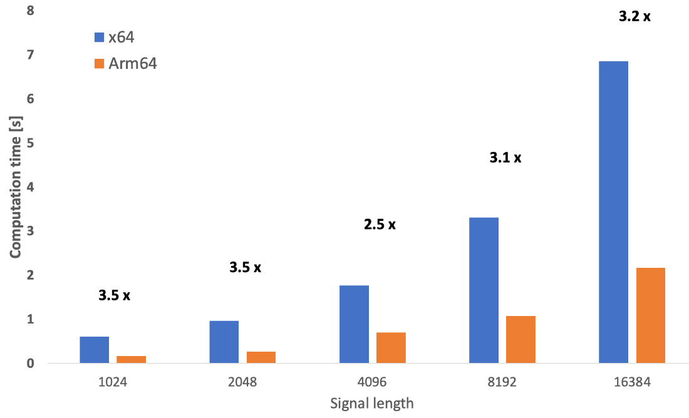

---
# User change
title: "Build the application"

weight: 3

layout: "learningpathall"
---

## Objective
In this section, you will use the NumPy package you installed previously to create a sample application. The application will use NumPy to perform fast Fourier transforms (FFTs) of the synthesized sine waves corrupted by the noise. The application will run the FFTs several times for the variable lengths of the input waves. The application will measure the code execution time and we can then analyze the performance boost of the Python interpreter and NumPy package on Arm64. 

You can find the [complete code on GitHub](https://github.com/dawidborycki/PythonOnWoA).

## Creating the application
Start by creating a new file, `sample.py`:

Then, import the NumPy and time packages:

```python
import numpy as np
import time
```

The first package is for numerical computations and the second is for measuring the computation time.

Next, define a function that calculates a signal's fast Fourier transform (FFT). Here, the signal is composed of a single-frequency sine wave with some random noise:

```python
def perform_sin_fft(signal_length, frequency, trial_count):    
    start = time.time()
    
    for i in np.arange(1, trial_count+1):
        ramp = np.linspace(0, 2 * np.pi, signal_length)
        noise = np.random.rand(signal_length) 
 
        input_signal = np.sin(ramp * frequency) + 0.1*noise
        np.fft.fft(input_signal)
    
    computation_time = time.time() - start
 
    return computation_time
```

The above function returns the total time (in seconds) needed for calculating the FFT. Repeat the FFT multiple times (`trial_count`) to have a stable estimate of the computation time.

To measure the performance, invoke the `perform_sin_fft` function for various signal lengths:

```python
signal_lengths = [2**10, 2**11, 2**12, 2**13, 2**14]
trial_count = 5000
 
for signal_length in signal_lengths:
    frequency = int(signal_length / 4)
    computation_time = perform_sin_fft(signal_length, frequency, trial_count)
    print("Signal length {}, Computation time {:.3f} s".format(signal_length, computation_time))
```

The final form of the `sample.py` file will look as follows:

```python
import numpy as np
import time

def perform_sin_fft(signal_length, frequency, trial_count):    
    start = time.time()
    
    for i in np.arange(1, trial_count+1):
        ramp = np.linspace(0, 2 * np.pi, signal_length)
        noise = np.random.rand(signal_length)    

        input_signal = np.sin(ramp * frequency) + 0.1*noise
        np.fft.fft(input_signal)
    
    computation_time = time.time() - start

    return computation_time

signal_lenghts = [2**10, 2**11, 2**12, 2**13, 2**14]
trial_count = 5000

for signal_length in signal_lenghts:
    frequency = int(signal_length / 4)

    computation_time = perform_sin_fft(signal_length, frequency, trial_count)

    print("Signal length {}, Computation time {:.3f} s".format(signal_length, computation_time))

```

## Measure the performance of Python packages
You will now run the application using non-Arm64 and Arm64 Python 3.12 to measure the performance difference. First, run the application using a non-Arm64 Python interpreter. To do this, in the command prompt type the following command (make sure to invoke the commands from the same directory where your sample.py is):

```console
py -3.12-64 sample.py
```

The command executes the script using x64 emulation mode and produces the following output:

```output
Signal length 1024, Computation time 0.610 s
Signal length 2048, Computation time 0.970 s
Signal length 4096, Computation time 1.765 s
Signal length 8192, Computation time 3.312 s
Signal length 16384, Computation time 6.859 s
```

The computation times depend on the signal length. Specifically, for 16,384 points, the computation time is 6.86 seconds. 

Now, use the Arm64 Python 3.12 interpreter. In the command prompt type:

```console
py -3.12-arm64 sample.py
```

The above command uses Arm64 Python and has much shorter computation times as shown from the following output: 

```output
Signal length 1024, Computation time 0.172 s
Signal length 2048, Computation time 0.270 s
Signal length 4096, Computation time 0.702 s
Signal length 8192, Computation time 1.078 s
Signal length 16384, Computation time 2.716 s
```

The same 16,384-point computation takes 2.72 seconds, reducing the computation time to about 40 percent of the time needed by the emulation mode (x64). This difference represents a performance boost of about two and a half times the speed of the emulation mode.

This graph illustrates the computation times and the corresponding performance boosts.



## Summary
This learning path walked you through installing native Arm64 Python 3.12 on Windows 11.

You wrote a simple module that applied a fast Fourier transformation (FFT) to a signal and saw the performance improvements that Arm64 Python unlocked. This performance improvement accelerates support for Windows on Arm (WoA). 
One example is [Linaro's demonstration of porting TensorFlow to Arm64](https://old.linaro.org/blog/setting-up-tensorflow-for-windows-on-arm/) which displays impressive speed improvements and offers tremendous possibilities for AI, data scientists, and researchers reliant on the ease and power of Python

