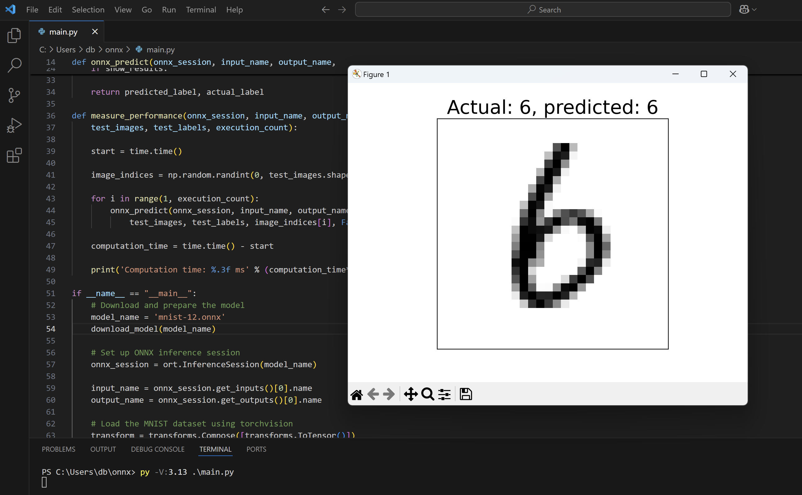

---
# User change
title: "Running Inference"

weight: 4

layout: "learningpathall"
---

## Objective
You will now use the implemented code to run inference.

## Packages
Start by activating the virtual environment and installing Python packages:
```console
venv-x64\Scripts\activate.bat
```

Then, type:
```console
py -V:3.13 -m pip install onnxruntime numpy matplotlib wget torchvision torch
```

## Running Inference
To run the inference type the following
```console
py -V:3.13 .\main.py  
```

The code will display the sample inference result like shown below:

If you close the image, you will see the computation time:
```output
PS C:\Users\db\onnx> py -V:3.13 .\main.py  
Computation time: 95.854 ms
PS C:\Users\db\onnx> py -V:3.13 .\main.py
Computation time: 111.230 ms
```


To compare these with Windows Arm 64, repeat the following for the Arm-64 Python architecture:
```console
venv-arm64\Scripts\activate.bat
py -V:3.13-arm64 -m pip install onnxruntime numpy matplotlib wget torchvision torch
py -V:3.13-arm64 main.py
```

Note the above will work, when the onnx runtime will become available for Windows on Arm 64.

## Summary

