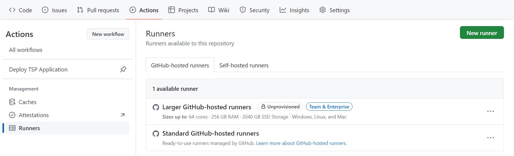
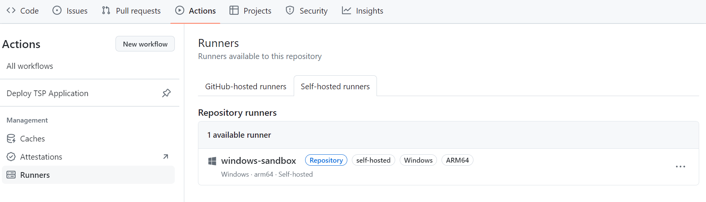

---
# User change
title: "Configure Windows Sandbox as your GitHub Actions self-hosted Arm64 runner"

weight: 2

layout: "learningpathall"
---

## Overview

In this Learning Path, you will deploy a CI/CD GitHub Actions workflow to build and publish a sample Windows Presentation Foundation (WPF) application that solves a well-known algorithmic problem, the *[Traveling Salesman Problem](https://simple.wikipedia.org/wiki/Travelling_salesman_problem)*. 

You will learn how to configure and use Windows Sandbox as a self-hosted Arm64 runner to build this sample .NET WPF application. Runners are machines that execute the jobs in the GitHub Actions workflow. A self-hosted runner is a machine that you deploy and manage to execute jobs from GitHub Actions.

Self-hosted runners offer more control and flexibility of hardware, software tools, and operating systems than GitHub-hosted runners provide.

## Prepare GitHub repository

All the code you will need to follow this learning path is provided in [this repository](https://github.com/pareenaverma/win-sandbox-dotnet-app). The repository includes the source code to build and compile the sample WPF application with .NET 8. Support for WPF on Arm is included in .NET 6 and newer versions. 

Start by preparing your GitHub repository:

* Log in to [GitHub](https://github.com) using your account credentials.
* On the top right corner, click the **+** dropdown and select **Import repository**.
* In the **Import your project to GitHub** section, enter https://github.com/pareenaverma/win-sandbox-dotnet-app in the **The URL for your source repository** field. 


* Set the repository name, for example, **sandbox-ci-cd-net**.
* Click the **Begin import** button.

In a few minutes, the contents of the source repository are imported into the new repository.
 
## Configure Windows Sandbox as the self-hosted runner

You are now ready to register Windows Sandbox as your self-hosted Arm64 runner. 

In your imported GitHub repository, go to the **Actions** tab, and under **Management**, click on **Runners**. If you do not see the **Actions** tab, navigate to **Settings > Actions** and select **Allow all actions** and **reusable workflows**. This will display the following window:



Then, click on the **New runner** button, followed by **New self-hosted runner**. In the **Add new self-hosted runner** section, proceed as follows:

* For **Runner Image**, select **Windows**.
* For **Architecture**, select **ARM64**.


You will see instructions displayed on this page. These are commands you now need to run in Windows Sandbox to configure it as your self-hosted Arm64 Windows runner.

On your host machine, click on the Search bar and enter **Windows Sandbox**.

In your running Windows Sandbox, open up PowerShell. You will now copy and paste all the commands into PowerShell.

The commands are also shown here for your convenience. To download the runner package:

```console
mkdir actions-runner && cd actions-runner

Invoke-WebRequest -Uri https://github.com/actions/runner/releases/download/v2.316.1/actions-runner-win-arm64-2.316.1.zip -OutFile actions-runner-win-arm64-2.316.1.zip

if((Get-FileHash -Path actions-runner-win-arm64-2.316.1.zip -Algorithm SHA256).Hash.ToUpper() -ne '3efe553a881f24eb20e79750033f69c23fcff35d78448aedf539f606cf9b869f'.ToUpper()){ throw 'Computed checksum did not match' }

Add-Type -AssemblyName System.IO.Compression.FileSystem ; [System.IO.Compression.ZipFile]::ExtractToDirectory("$PWD/actions-runner-win-arm64-2.316.1.zip", "$PWD")
``` 

Next, configure it with the following command:
```
./config.sh --url https://github.com/pareenaverma/sandbox-ci-cd-net --token <TYPE_YOUR_TOKEN>
```
You will be prompted to provide the runner group, the name of the runner, and the work folder name. You can accept the defaults by pressing Enter at each step or you can choose to override the Defaults. In this example, the name of the runner is **windows-sandbox**.

Finally, start the runner by executing:

```console
./run.sh
```

You have successfully configured Windows Sandbox as your self-hosted runner and and it is ready to receive jobs. The output should look similar to:

```output
√ Connected to GitHub

Current runner version: '2.314.1'
2024-03-25 16:21:59Z: Listening for Jobs
```

Return to the imported GitHub repository on your host machine. The runner will now be visible in the GitHub actions:



You have successfully prepared your repository to run the CI/CD pipeline on the Windows Sandbox self-hosted runner. In the next step, you will test it.
