---
# User change
title: "Porting Win32 code to Arm64"

weight: 2

layout: "learningpathall"
---

## Introduction
ARMv8-A introduced a significant evolution in the ARM architecture with the addition of Arm64, the 64-bit instruction set. This 64-bit architecture is known for its exceptional power efficiency and performance, which stems from a design philosophy that emphasizes simplicity and energy efficiency without sacrificing computational power. It powers a vast array of computing devices, from smartphones and tablets to laptops and servers.

Arm64 introduces several performance improvements over its predecessors, including a larger number of general-purpose registers, advanced SIMD (Single Instruction, Multiple Data) capabilities for better handling of multimedia tasks and enhanced cryptography features. These improvements contribute to faster data processing and an overall boost in application performance, making Arm64 an attractive option for a wide range of applications, including those demanding high computational power.

In the mobile domain, Arm64 is virtually ubiquitous, powering the majority of modern smartphones and tablets. This widespread adoption is due in part to the architecture's ability to offer the optimal balance between computing power and energy consumption, enabling mobile devices to run complex applications and multitask effectively while maintaining extended battery life.

Beyond mobile, Arm64 is making significant in-roads into the desktop and server markets. On the desktop front, Arm64-based laptops and mini-PCs are emerging as alternatives to traditional x86-based systems, offering a combination of long battery life, instant-on capabilities, and the ability to run full-fledged desktop applications (including those originally designed for x86 architectures through emulation or recompilation). In the server space, Arm64's power efficiency and scalability are driving adoption in data centers, especially for workloads that benefit from high density and energy efficiency, such as web servers, edge computing, and lightweight containers.

Therefore, as developers, we can now leverage Arm64 to accelerate our applications. However, this requires porting our codebase to Arm64. Porting a Win32 application to Arm64, especially for applications originally designed for x86 or x64 architectures, involves several steps and considerations. The process necessitates modifications to your codebase, managing dependencies, and possibly updating your build and deployment processes.

In this learning path, we will demonstrate how to update your Win32 DLL for Arm64 compatibility. Our DLL will perform vector operations, specifically the multiply-add operation, which is commonly used in many modern machine learning architectures.

## Before you begin
To follow this learning path you will need to install [Visual Studio 2022 or higher](/install-guides/vs-woa) with Arm64 build tools and desktop development with C++ workload.

The [complete project code](https://github.com/dawidborycki/Win32.Porting.git) is hosted on GitHub.

## Project Setup
To set up the project, start by creating the Dynamic-Link Library (DLL). Open Visual Studio and click **Create a new project** button. This will open a new screen, in which you type DLL in the search box. This will filter the list of project templates, from which you select Dynamic-Link Library with exports (DLL):

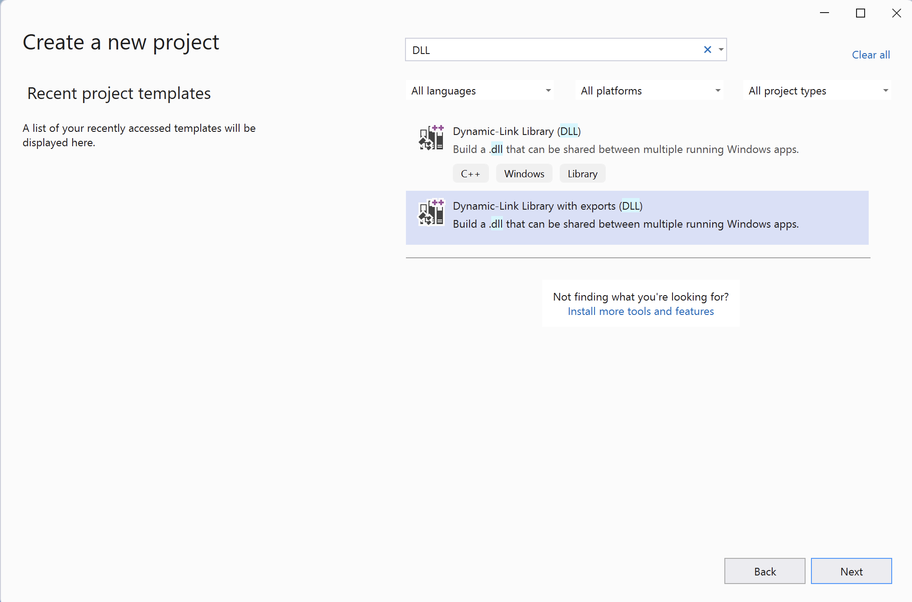

Then, click **Next** and set the following configurations:

1. Project name: VectorOperations
2. Location: Choose any location
3. Solution name: Win32.Porting

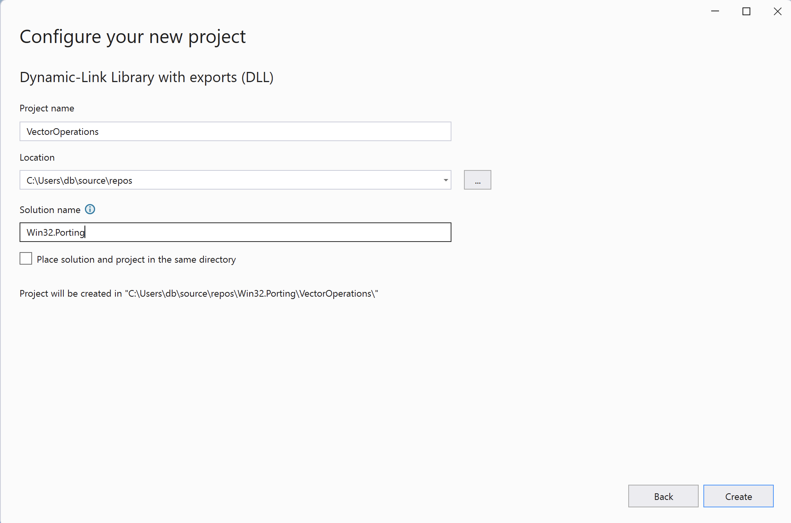

Finally, click **Create**.

## Implementation

Once the project is ready, open the `VectorOperations.h` file and modify it as follows:

```cpp
#ifdef VECTOROPERATIONS_EXPORTS
#define VECTOROPERATIONS_API __declspec(dllexport)
#else
#define VECTOROPERATIONS_API __declspec(dllimport)
#endif

#include <vector>

extern VECTOROPERATIONS_API std::vector<float> generateRandomVector(
    size_t n, float low = 0.0, float high = 1.0);

extern VECTOROPERATIONS_API std::vector<float> additionOfProduct(
    const std::vector<float>& a,
    const std::vector<float>& b,
    const std::vector<float>& c);
```

This file defines the conditional compilation and declaration of a set of functions within a DLL concerning vector operations, specifically those geared towards Windows platforms due to the use of `__declspec`. 

The `#ifdef`, `#else`, and `#endif` directives manage the conditional compilation based on whether the VECTOROPERATIONS_EXPORTS macro is defined. This approach is a common pattern for handling symbols in DLL projects.

If VECTOROPERATIONS_EXPORTS is defined, VECTOROPERATIONS_API is defined as `__declspec(dllexport)`, which marks the specified functions or objects to be exported from the DLL. This is typically defined in the project settings or source code of the DLL being compiled.

If VECTOROPERATIONS_EXPORTS is not defined, VECTOROPERATIONS_API is defined as `__declspec(dllimport)`, indicating that the functions or objects are imported from an external DLL. This is used in the applications or DLLs that use the library.

After the conditional compilation block and including the <vector> header (which is necessary for utilizing `std::vector`), two functions are declared with external linkage (extern), meaning that they are intended to be visible and accessible outside of the file they are declared in. 

We have two functions:
1. The first is `generateRandomVector`, which takes three parameters:
    * size_t n: the size of the vector to be generated.
    * float low: the lower bound of the random values (default is 0.0).
    * float high: the upper bound of the random values (default is 1.0).
This function generates a vector of size n, filled with random floating-point numbers ranging from low to high.

2. The second function, `additionOfProduct` takes three parameters, each of which is a type of `std::vector<float>`, and represents the input vectors: a, b, and c. A function will return another vector which stores the result of operation (a * b) + c element-wise across the vectors a, b, and c.

To implement those functions open the `VectorOperations.cpp` file and modify it as follows:
```cpp
#include "pch.h"
#include "framework.h"
#include "VectorOperations.h"
#include <random>

std::vector<float> generateRandomVector(size_t n, float low, float high) {
    std::vector<float> result(n);
    std::random_device rd;
    std::mt19937 gen(rd());
    std::uniform_real_distribution<> distr(low, high);

    for (size_t i = 0; i < n; ++i) {
        result[i] = distr(gen);
    }

    return result;
}

std::vector<float> additionOfProduct(
    const std::vector<float>& a,
    const std::vector<float>& b,
    const std::vector<float>& c) {

    // Ensure all vectors have the same size
    if (a.size() != b.size() || a.size() != c.size()) {
        throw std::runtime_error("All vectors must be of the same size.");
    }

    // Initialize result vector of the same size as input vectors
    std::vector<float> result(a.size()); 

    for (size_t i = 0; i < a.size(); ++i) {
        result[i] = a[i] * b[i] + c[i];
    }

    return result; 
}
```

## Main Application
You will now create the main application which will use the above DLL. To do so, proceed as follows:

1. Solution Explorer, right-click on Solution 'Win32.Porting'.
2. Select Add -> New Project... This will open the **Add a new project** window.
3. In the **Add a new project** window, select the **Console App project** template and click the **Next** button:

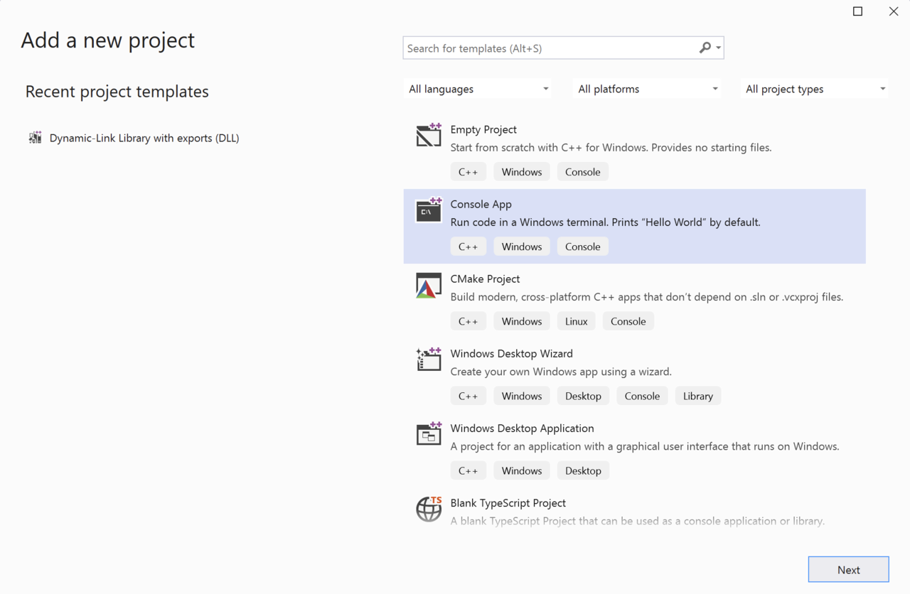

4. In the **Configure your new project window**, set the project name to MainApplication and click the **Create** button

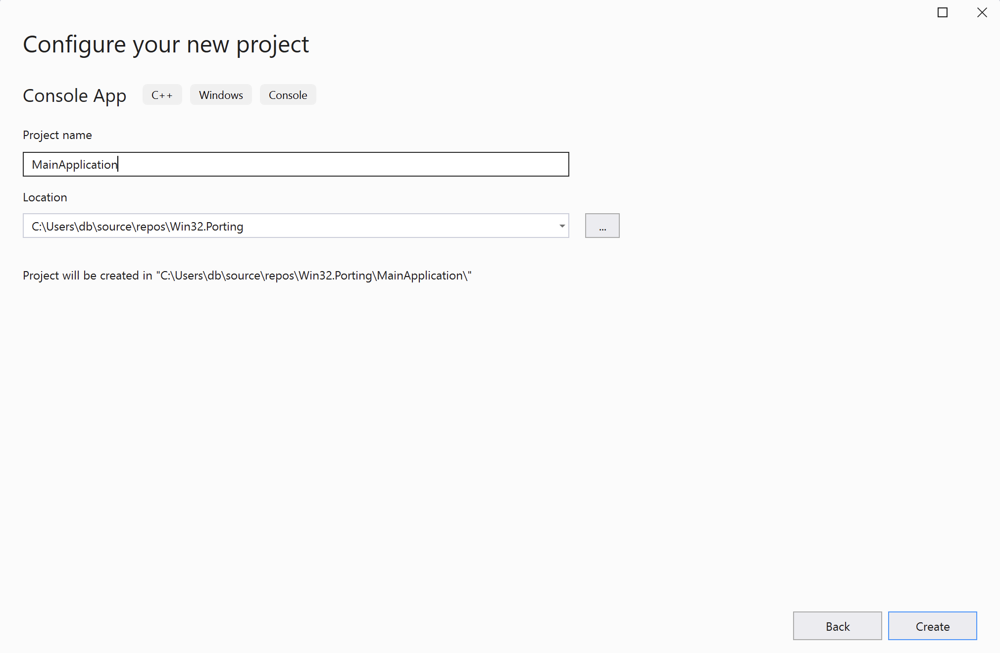

Once the project is ready, open the `MainApplication.cpp` file and modify it as follows:

```cpp
#include <iostream>
#include "../VectorOperations/VectorOperations.h"
#include <chrono>

template<typename Func, typename... Args>
long long measureExecutionTime(Func func, int trialCount, Args... args) {
    auto start = std::chrono::high_resolution_clock::now();

    for (int i = 0; i < trialCount; ++i) {
        func(args...); // Invoke the function with the provided arguments
    }

    auto stop = std::chrono::high_resolution_clock::now();
    auto duration = std::chrono::duration_cast<std::chrono::milliseconds>(stop - start);

    return duration.count(); // Return the execution time in milliseconds
}

int main()
{
    const int trialCount = 5000;
    const int vector_length = 10000;

    std::vector<float> vector1 = generateRandomVector(vector_length);
    std::vector<float> vector2 = generateRandomVector(vector_length);
    std::vector<float> offset = generateRandomVector(vector_length);

    long long executionTime = measureExecutionTime(additionOfProduct,
        trialCount, vector1, vector2, offset);

    std::cout << "Platform: ";
#if defined(_M_ARM64)
    std::cout << "arm64, ";
#elif defined(_M_X64) || defined(__amd64__)
    std::cout << "x64, ";
#else
    std::cout << "x86, ";
#endif

    std::cout << "ExecutionTime: " << executionTime << " ms\n";
}
```

This code measures and displays the execution time of the `additionOfProduct` function in milliseconds across multiple trials. It utilizes C++ templates, the Standard Template Library (STL), and the <chrono> library for timing.

The main function defines a number of trials (trialCount) and the length of vectors (vector_length) to be used in the test. It then creates three vectors of floats (vector1, vector2, offset), filled with random values. The function invokes `measureExecutionTime`, passing it the `additionOfProduct` function along with its required arguments and the trial count, to measure the execution time of performing the addition of product operation on the vectors.

The function outputs the detected platform architecture (Arm64, x86_64, or defaults to x86 if neither is detected) and the measured execution time in milliseconds to the console. This setup enables performance testing and optimization, especially in applications where vector operations are critical for efficiency and where understanding execution time on different hardware architectures (like Arm64 vs x86_64) is important.

## Configuring the project for porting
Before we can run the application, we need to configure it so that the `MainApplication` will be built before the DLL, and that the `MainApplication` can access the DLL. Additionally, the proper project configuration will enable us to switch between various platforms to execute the application on x86_64 and Arm64.

First, configure the project dependencies. In the Solution Explorer, right-click on 'Win32.Porting', and then select **Properties**. This will open the Solution 'Win32.Porting' window, where you should do the following:
1. Under Common Properties, click on **Startup Project**, select **Single startup project**, and choose **MainApplication** from the dropdown list:

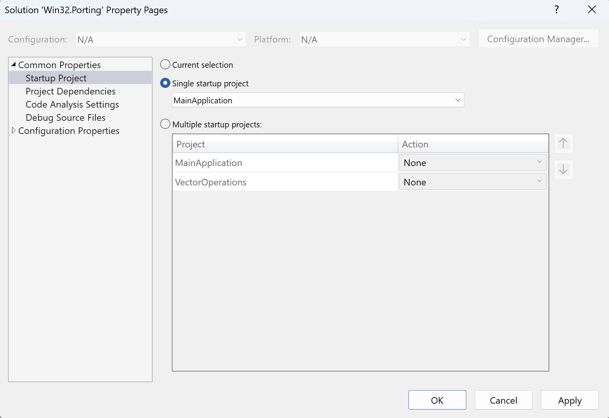

2. Under Common Properties, click on **Project Dependencies**, select **MainApplication** from the Projects dropdown list, and then check **VectorOperations** under the Depends on list: 

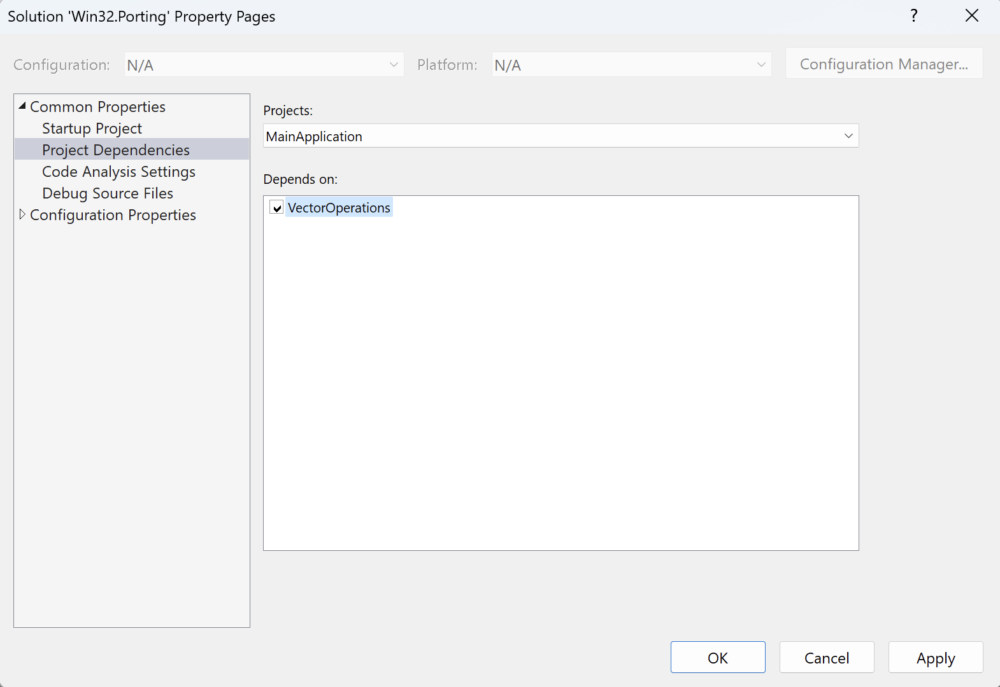

3. Click the **Apply** button.
4. Click the **OK** Button.

Now, you will configure the C/C++ Linker so that it can access external symbols from VectorOperations.dll: 
1. In Solution Explorer, right-click on MainApplication and select **Properties**. This will open the **MainApplication Property Pages**. 
2. In the **MainApplication Property Pages**, select **All Configurations** from the Configuration dropdown, and **All Platforms** from the Platform dropdown.
3. Click on **Linker>General**, and enter $(OutDir) under the Additional Library Directories:

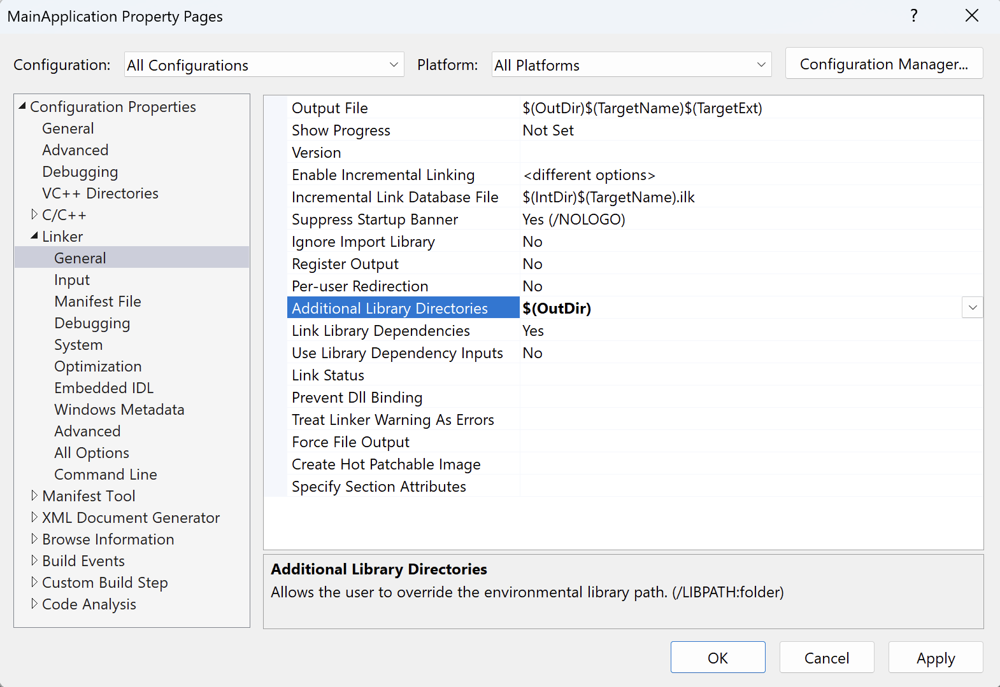

4. Click the **Apply** button.
5. Click on **Linker>Input**, and in the Additional Dependencies field, add 'VectorOperations.lib;' as shown in the figure below:

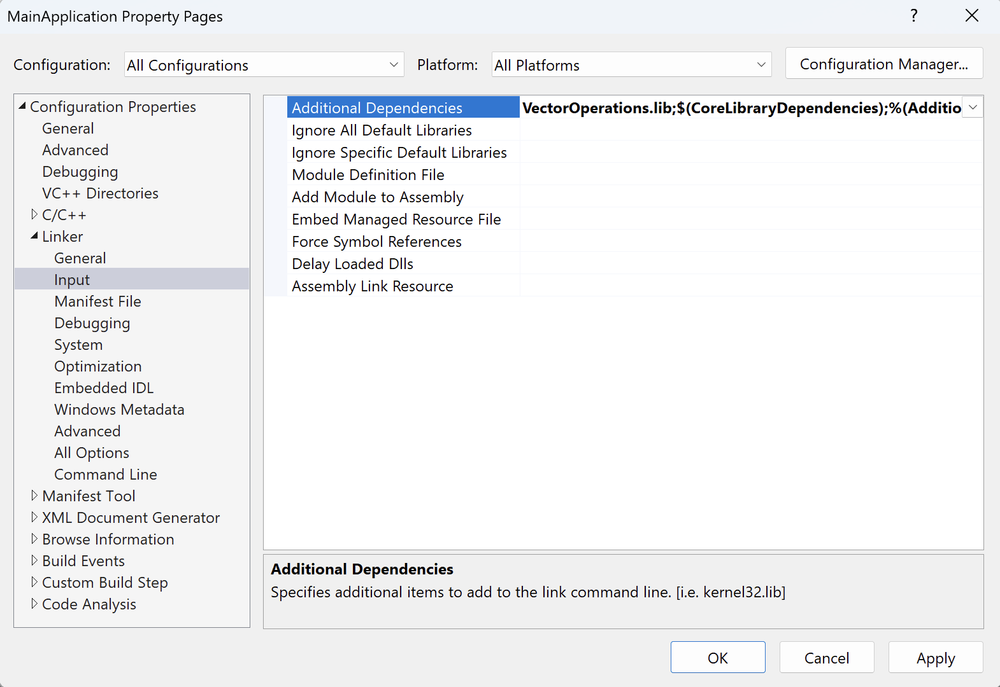

6. Click the **Apply** button, and then the OK button.

The project is now ready and we can launch the application for various platforms.

## Running the application
To launch the application, select **x64** from the platform dropdown, and then click **Local Windows Debugger**:

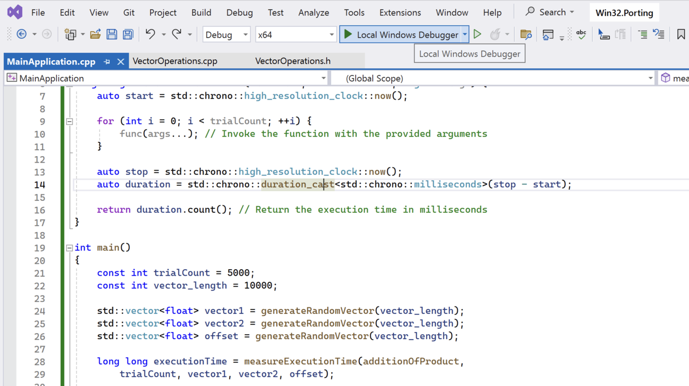

The application will launch and you will observe the execution time for the x86_64 platform:

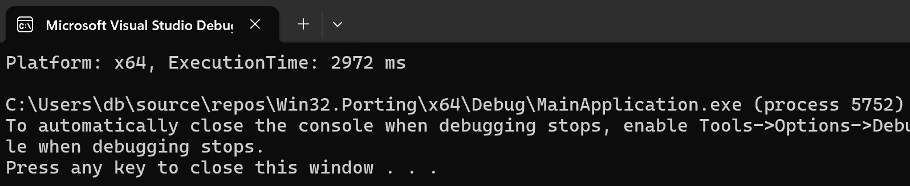

Next, change the platform to ARM64 and click **Local Windows Debugger** again. The application will build and you will observe the execution time:

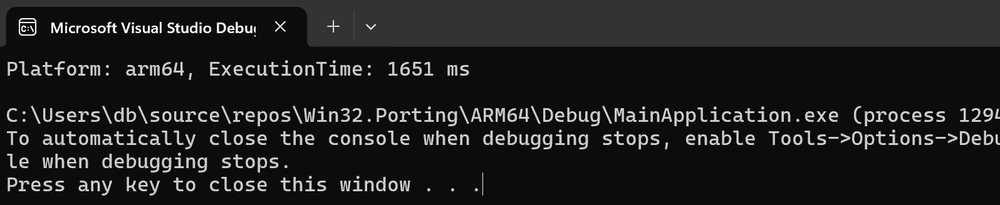

By comparing the results, we see that Arm64 provided nearly a 50% performance improvement by shortening the execution time.

## Summary
This learning path equipped you with the knowledge to configure a Visual Studio project for cross-platform development, emphasizing the performance advantages of using Arm64 over x86_64 architecture and the practical aspects of measuring and comparing execution times.
