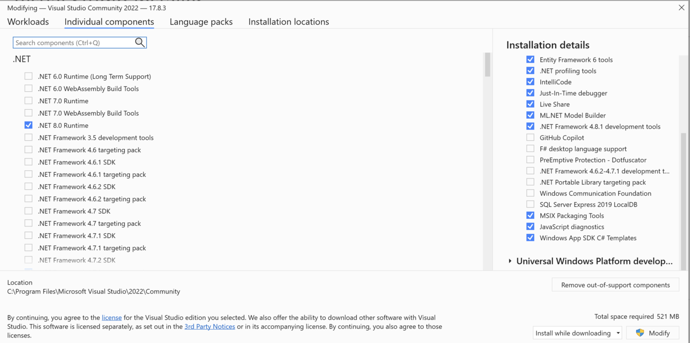
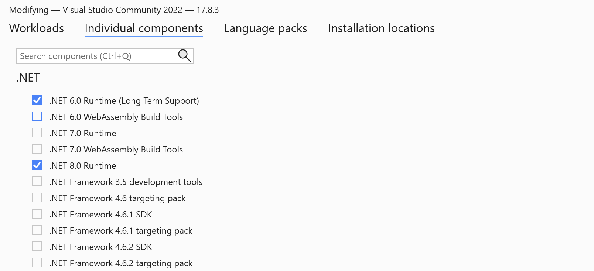
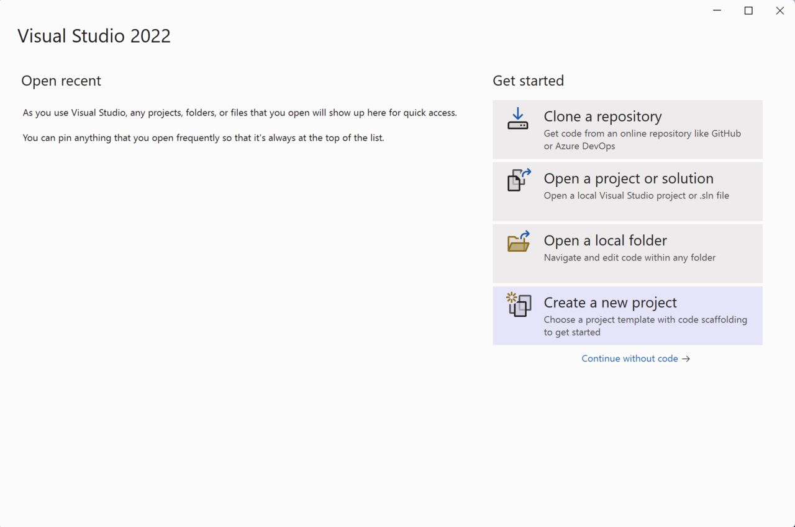
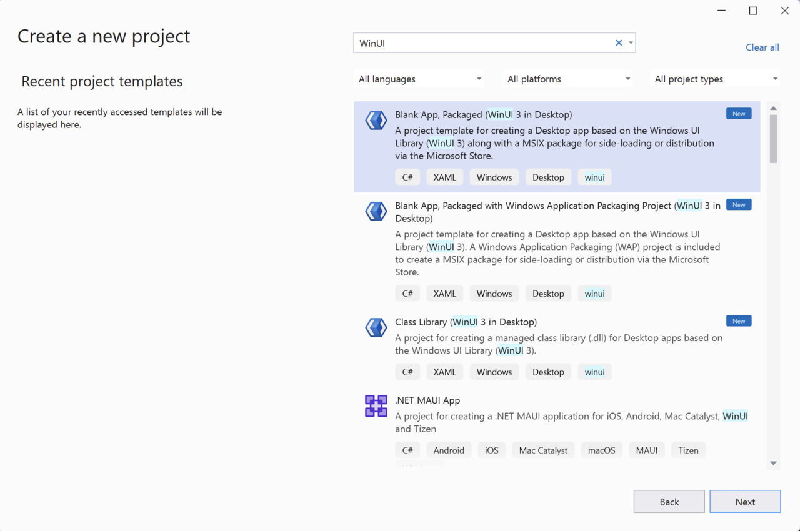
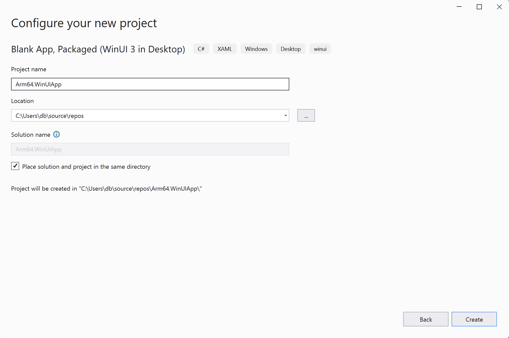
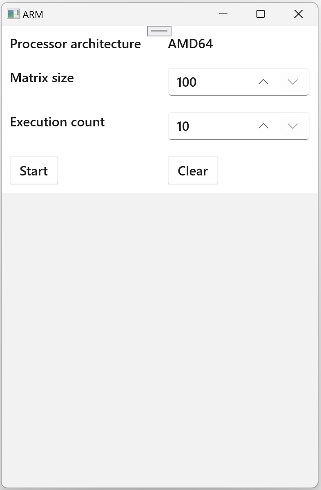

## Introduction
Windows UI Library 3 (WinUI 3) is a modern, native UI platform available as part of the Windows App SDK. It represents the latest evolution in the Windows user interface development, offering a comprehensive set of tools and APIs for building Windows apps.

WinUI 3 incorporates Microsoft's Fluent Design System, which emphasizes intuitive, visually appealing interfaces. It provides a wide range of controls, styles, and input features that enable developers to create both elegant and functional user experiences.

It supports the development of both Desktop and UWP (Universal Windows Platform) applications, enabling developers to create versatile apps that can run across a wide range of Windows devices, from IoT devices to PCs. Built with performance and reliability in mind, WinUI 3 apps are optimized for smooth and efficient operation, ensuring a responsive user experience.

WinUI 3 is an open-source project, offering backwards compatibility with existing UWP and Windows Forms applications and allowing developers to gradually migrate and modernize their applications. Additionally, WinUI 3 is extensible, supporting custom controls and third-party libraries.

In this learning path you will implement a Win UI 3 application, which will perform square matrix multiplication. The idea is to reproduce the same functionality used in [Windows Forms learning path](/learning-paths/laptops-and-desktops/win_forms). You will also be able to measure performance improvements on Arm64 architecture.

You can find the [complete code on GitHub](https://github.com/dawidborycki/Arm64.WinUIApp.git).

## Before you begin
Before you begin the implementation, install Visual Studio 2022 with the following workloads:
1. .NET desktop development
2. Universal Windows Platform development
3. After selecting these workloads, expand the .NET desktop development group under the Installation details and ensure that the 'Windows App SDK C# Templates' option is selected.



Then, click the 'Individual components' tab and check '.NET 6.0 Runtime (Long Term Support)'.



## Create the project
Open Visual Studio and click 'Create a new project'.



In the next window, search for the 'Blank App, Packaged (WinUI 3 in Desktop)' template. Select this template and click the 'Next' button.



This action opens the 'Configure your new project' window. Here, you should:

1. Change the project name to 'Arm64.WinUIApp'
2. Select the location for your project, e.g., 'C:\Users\db\source\repos'
3. Ensure the 'Place solution and project in the same directory' option is checked
4. Click the 'Create' button



Your project should now be ready. Next, you will design the view using XAML declarations and implement the logic using the C# code.

## User Interface
First, you will create four anonymous styles. These styles will control the margins, font size, and font weights of texts displayed in the following controls: TextBlock, NumberBox, Button, and ListBox.

In a WinUI 3 application, you define the styles in the `App.xaml` file. Open this file and modify it as shown in the following code snippet:

```XML
<?xml version="1.0" encoding="utf-8"?>
<Application
    x:Class="Arm64.WinUIApp.App"
    xmlns="http://schemas.microsoft.com/winfx/2006/xaml/presentation"
    xmlns:x="http://schemas.microsoft.com/winfx/2006/xaml"
    xmlns:local="using:Arm64.WinUIApp">
    <Application.Resources>
        <ResourceDictionary>
            <ResourceDictionary.MergedDictionaries>
                <XamlControlsResources xmlns="using:Microsoft.UI.Xaml.Controls" />
                <!-- Other merged dictionaries here -->
            </ResourceDictionary.MergedDictionaries>
            <!-- Other app resources here -->

            <Style TargetType="TextBlock">
                <Setter Property="Margin"
                        Value="10" />
                <Setter Property="FontSize"
                        Value="16" />
                <Setter Property="FontWeight"
                        Value="SemiBold" />
            </Style>

            <Style TargetType="NumberBox">
                <Setter Property="Margin"
                        Value="10" />
                <Setter Property="FontSize"
                        Value="16" />
                <Setter Property="FontWeight"
                        Value="SemiBold" />
            </Style>

            <Style TargetType="Button">
                <Setter Property="Margin"
                        Value="10" />
                <Setter Property="FontSize"
                        Value="16" />
                <Setter Property="FontWeight"
                        Value="SemiBold" />
            </Style>

            <Style TargetType="ListBox">
                <Setter Property="FontSize"
                        Value="14" />
                <Setter Property="FontWeight"
                        Value="SemiBold" />
            </Style>
        </ResourceDictionary>        
    </Application.Resources>
</Application>
```

There are four style declarations, which differ by the 'TargetType' attribute. This attribute indicates the controls to which the style will be applied. For the TextBlock controls, which represents labels, modify three properties:
* Margin: you will use a uniform margin of 10, meaning that the control will have the same margin on all four sides (left, top, right, bottom)
* FontSize: change the font size to 16
* FontWeight: set the fonts displayed in the TextBlock to be semi-bold

Next, you will declare the following user interface:



This view uses a tabular layout, comprising five rows and two columns. To create such a layout using XAML, you can use the Grid control. Open the `MainWindow.xaml` file and modify it as follows:

```XML
<?xml version="1.0" encoding="utf-8"?>
<Window x:Class="Arm64.WinUIApp.MainWindow"
        xmlns="http://schemas.microsoft.com/winfx/2006/xaml/presentation"
        xmlns:x="http://schemas.microsoft.com/winfx/2006/xaml"
        xmlns:d="http://schemas.microsoft.com/expression/blend/2008"
        xmlns:mc="http://schemas.openxmlformats.org/markup-compatibility/2006"
        mc:Ignorable="d">

    <Grid>
        <!--Grid configuration-->
        <Grid.ColumnDefinitions>
            <ColumnDefinition Width="*" />
            <ColumnDefinition Width="*" />
        </Grid.ColumnDefinitions>
        <Grid.RowDefinitions>
            <RowDefinition Height="Auto" />
            <RowDefinition Height="Auto" />
            <RowDefinition Height="Auto" />
            <RowDefinition Height="Auto" />
            <RowDefinition Height="*" />
        </Grid.RowDefinitions>

        <!--Row 1: Processor architecture-->
        <TextBlock Text="Processor architecture" />
        <TextBlock x:Name="TextBlockProcessorArchitecture"
                   Grid.Column="1" />

        <!--Row 2: Matrix size-->
        <TextBlock Grid.Row="1"
                   Text="Matrix size" />

        <NumberBox x:Name="NumberBoxMatrixSize"
                   Grid.Row="1"
                   Grid.Column="1"
                   Minimum="100"
                   Maximum="500"
                   Value="100"
                   SmallChange="100"
                   LargeChange="200"
                   SpinButtonPlacementMode="Inline" />

        <!--Row 3: Execution count-->
        <TextBlock Grid.Row="2"
                   Text="Execution count" />

        <NumberBox x:Name="NumberBoxExecutionCount"
                   Grid.Row="2"
                   Grid.Column="1"
                   Minimum="10"
                   Maximum="100"
                   Value="10"
                   SmallChange="10"
                   LargeChange="20"
                   SpinButtonPlacementMode="Inline" />

        <!--Row 4: Buttons-->
        <Button x:Name="ButtonStart"
                Grid.Row="3"
                Content="Start"
                Click="ButtonStart_Click" />

        <Button x:Name="ButtonClear"
                Grid.Row="3"
                Grid.Column="1"
                Content="Clear"
                Click="ButtonClear_Click" />

        <!--Row 5: ListBox-->
        <ListBox x:Name="ListBoxResults"
                 Grid.Row="4"
                 Grid.ColumnSpan="2" />
    </Grid>
</Window>
```

The declaration above is quite lengthy, so let's break it down. First, you configure the Grid's appearance:

```XML
<Grid.ColumnDefinitions>
    <ColumnDefinition Width="*" />
    <ColumnDefinition Width="*" />
</Grid.ColumnDefinitions>

<Grid.RowDefinitions>
    <RowDefinition Height="Auto" />
    <RowDefinition Height="Auto" />
    <RowDefinition Height="Auto" />
    <RowDefinition Height="Auto" />
    <RowDefinition Height="*" />
</Grid.RowDefinitions>
```

These declarations will create a Grid composed of two columns, each spanning half of the available window's width. Then, you create five rows. The height of the first four rows will be adjusted automatically based on the height of the controls placed in those rows. The last row will occupy the remaining space in the window.

In the first row of the Grid, put two TextBlock controls:

```XML
<TextBlock Text="Processor architecture" />
<TextBlock x:Name="TextBlockProcessorArchitecture"
           Grid.Column="1" />
```

The first control will display the fixed text 'Processor architecture'. The second one will be programmatically modified to display the architecture of the processor, for example, AMD64 or ARM64.

The next two controls define a fixed label ('Matrix size') and a NumberBox. The NumberBox is configured to allow the user to select a matrix size between 100-500 in steps of 100, with a default value of 100.:

```XML
<TextBlock Grid.Row="1"
           Text="Matrix size" />

<NumberBox x:Name="NumberBoxMatrixSize"
           Grid.Row="1"
           Grid.Column="1"
           Minimum="100"
           Maximum="500"
           Value="100"
           SmallChange="100"
           LargeChange="200"
           SpinButtonPlacementMode="Inline" />
```

Next, you have the following declarations:

```XML
<TextBlock Grid.Row="2"
           Text="Execution count" />

<NumberBox x:Name="NumberBoxExecutionCount"
           Grid.Row="2"
           Grid.Column="1"
           Minimum="10"
           Maximum="100"
           Value="10"
           SmallChange="10"
           LargeChange="20"
           SpinButtonPlacementMode="Inline" />
```

The first control is used to display the fixed string 'Execution count'. The second one allows the user to specify the number of executions for the matrix multiplications. Here, you enable the user to select an execution count between 10-100 in steps of 10.

Finally, the view declares two buttons and one ListBox:

```XML
<Button x:Name="ButtonStart"
        Grid.Row="3"
        Content="Start"
        Click="ButtonStart_Click" />

<Button x:Name="ButtonClear"
        Grid.Row="3"
        Grid.Column="1"
        Content="Clear"
        Click="ButtonClear_Click" />

<ListBox x:Name="ListBoxResults"
         Grid.Row="4"
         Grid.ColumnSpan="2" />
```

* the first button will be used to start calculations
* the second button will clear the ListBox
* the ListBox will display the time it takes to perform matrix multiplication

## Application Logic
In this section, you will implement the application's logic. First, create two helper classes:

1. **MatrixHelper**: this class implements matrix multiplication following the mathematical formula detailed in [Wikipedia](https://en.wikipedia.org/wiki/Matrix_multiplication)
2. **PerformanceHelper**: this class provides functionality to measure code execution time

They will serve the same purpose as in the [Windows Forms learning path](/learning-paths/laptops-and-desktops/win_forms).

Next, you will implement event handlers for the two buttons and additional code to programmatically control the window's appearance.

### Helpers
To implement the helper classes, proceed as follows:

1. In the 'Solution Explorer', right-click on 'Arm64.WinUIApp' and select 'Add' -> 'New Folder'
2. Rename the new folder to 'Helpers'
3. Right-click on the 'Helpers' folder and select 'Add' -> 'Class...'
4. In the 'Add New Item' dialog, type 'MatrixHelper.cs' for the file name and click the 'Add' button
5. Modify the 'MatrixHelper.cs' file as shown below:
   
```CS
using System;

namespace Arm64.WinUIApp.Helpers
{

    public static class MatrixHelper
    {
        private static readonly Random random = new();

        private static double[,] GenerateRandomMatrix(int matrixSize)
        {
            var matrix = new double[matrixSize, matrixSize];

            for (int i = 0; i < matrixSize; i++)
            {
                for (int j = 0; j < matrixSize; j++)
                {
                    matrix[i, j] = random.NextDouble();
                }
            }

            return matrix;
        }

        private static double[,] MatrixMultiplication(double[,] matrix1, double[,] matrix2)
        {
            if (matrix1.Length != matrix2.Length)
            {
                throw new ArgumentException("The matrices must be of equal size");
            }

            if (matrix1.GetLength(0) != matrix1.GetLength(1) || matrix2.GetLength(0) != matrix2.GetLength(1))
            {
                throw new ArgumentException("The matrices must be square");
            }

            int matrixSize = matrix2.GetLength(0);

            var result = new double[matrixSize, matrixSize];

            for (int i = 0; i < matrixSize; i++)
            {
                for (int j = 0; j < matrixSize; j++)
                {
                    result[i, j] = 0;

                    for (int k = 0; k < matrixSize; k++)
                    {
                        result[i, j] += matrix1[i, k] * matrix2[k, j];
                    }
                }
            }

            return result;
        }

        public static void SquareMatrixMultiplication(int matrixSize)
        {
            var matrix1 = GenerateRandomMatrix(matrixSize);
            var matrix2 = GenerateRandomMatrix(matrixSize);

            MatrixMultiplication(matrix1, matrix2);
        }
    }
}
```
6. Similarly, create the 'PerformanceHelper.cs' file under the 'Helpers' folder
7. Modify the file as indicated below:
   
```CS
using System;
using System.Diagnostics;

namespace Arm64.WinUIApp.Helpers
{
    public static class PerformanceHelper
    {
        private static readonly Stopwatch stopwatch = new();

        public static double MeasurePerformance(Action method, int executionCount)
        {
            stopwatch.Restart();

            for (int i = 0; i < executionCount; i++)
            {
                method();
            }

            stopwatch.Stop();

            return stopwatch.ElapsedMilliseconds;
        }
    }
}
```

### Event handlers
You will now use the previously implemented classes to create event handlers for the buttons. Additionally, you will modify the constructor of the MainWindow class to dynamically read the processor architecture, which will then be displayed in the associated TextBlock. You will also resize the application window.

Proceed as follows:
1. Open the MainWindow.xaml.cs
2. Modify the MainWindow constructor as shown below:

```CS
public MainWindow()
{
    InitializeComponent();

    // Set the window size
    AppWindow.Resize(new Windows.Graphics.SizeInt32(800, 1200));            

    // Update ProcessorArchitecture Label
    TextBlockProcessorArchitecture.Text = $"{Environment.GetEnvironmentVariable("PROCESSOR_ARCHITECTURE")}";

    // Update Window Title
    Title = "ARM";
}
```

3. Implement the event handler for the Start button as follows:

```CS
private void ButtonStart_Click(object sender, RoutedEventArgs e)
{
    int matrixSize = Convert.ToInt32(NumberBoxMatrixSize.Value);
    int executionCount = Convert.ToInt32(NumberBoxExecutionCount.Value);

    var executionTime = PerformanceHelper.MeasurePerformance(
        () => MatrixHelper.SquareMatrixMultiplication(matrixSize),
        executionCount);

    ListBoxResults.Items.Add($"Size: {matrixSize}, Count: {executionCount}, " +
        $"Time: {executionTime} ms");
}
```

4. Add the following method, which will be invoked whenever the user clicks the Clear button:

```CS
private void ButtonClear_Click(object sender, RoutedEventArgs e)
{
    ListBoxResults.Items.Clear();
}
```

When the application is running and the user clicks the Start button, the application will read the values from the NumberBox controls (NumberBoxMatrixSize and NumberBoxExecutionCount). These values will be used to set the matrix size and the execution count. Using these values, the application will invoke the MeasurePerformance static method of the PerformanceHelper class to measure the time required to perform matrix multiplication for the given matrix size and execution count. The computation time will then be added to the ListBox. At any point, the user can clear the ListBox by clicking the Clear button.
