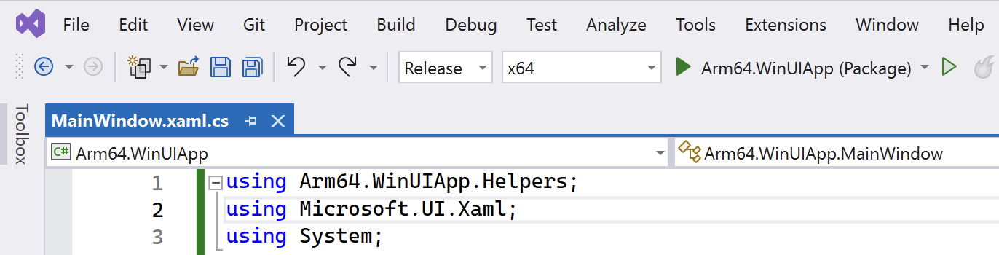
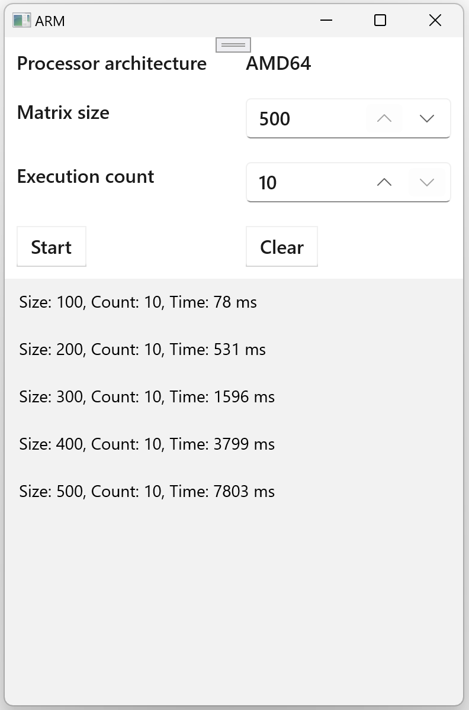
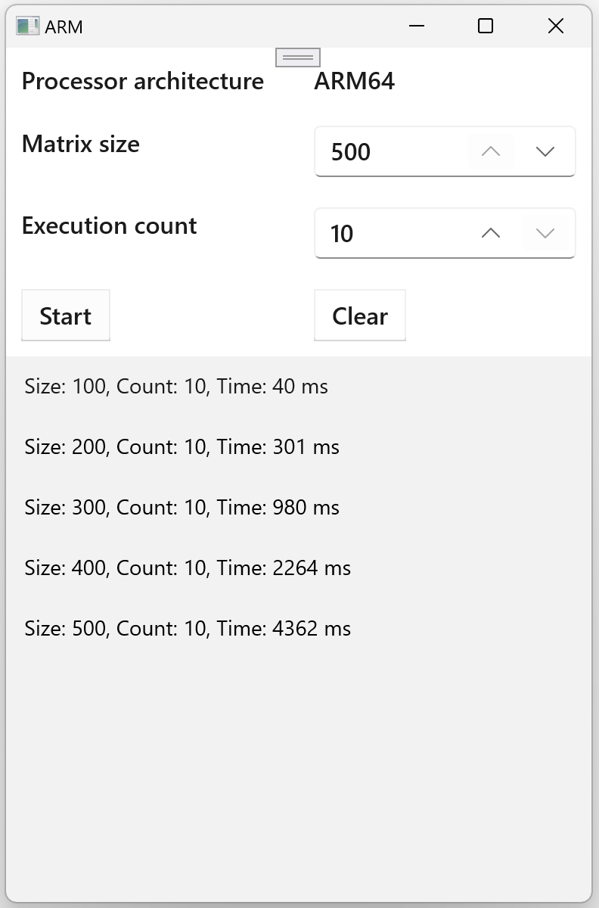

## Objective
In this section, you will launch the application using different settings to compare matrix multiplication computation times.

## Launching the application
To run the application, use the dropdown lists in Visual Studio:

<<<<<<< HEAD

=======

>>>>>>> 5f2151168 (Changed model to Tiny Rock–Paper–Scissors CNN)

Ensure you change the 'Configuration mode' to 'Release'. Then, select the architecture, either 'x64' or 'ARM64', and click on 'Arm64.WinUIApp (Package)'.

## Compare the performance
Now, you will compare the computation performance on x64 and ARM64 platforms. First, launch the application for x64. After it starts, perform calculations for the following matrix sizes: 100, 200, 300, 400, and 500. The results should resemble those in the figure below:

<<<<<<< HEAD

Next, launch the application for the ARM64 platform. Execute matrix multiplication for the same matrix sizes as above and note the computation times:

=======

Next, launch the application for the ARM64 platform. Execute matrix multiplication for the same matrix sizes as above and note the computation times:

>>>>>>> 5f2151168 (Changed model to Tiny Rock–Paper–Scissors CNN)

Upon comparing the execution times, it is seen that ARM64, on average, provides almost a 50% performance improvement over x64.

## Summary
In this learning path, you have learned how to develop a WinUI 3 application and run it in different modes (x64 and Arm64) to compare the performance in matrix multiplication tasks. This comparison was essential to understand the efficiency and speed of execution in different architectural settings. 
