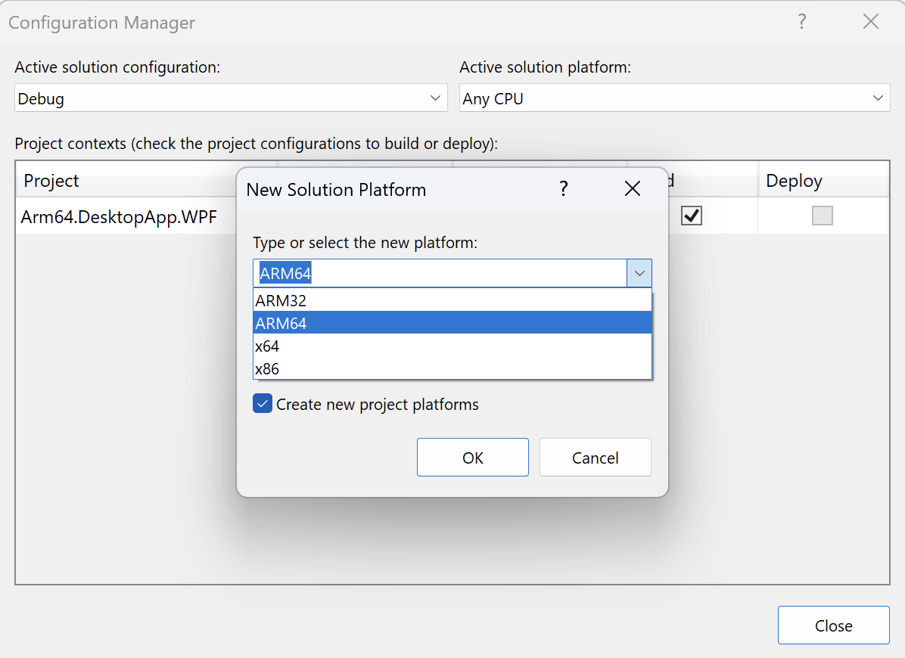

## Objective
In this section, you will change the build configuration of the application and then launch it using various settings to compare the computation times.

## Building and running an application
To prepare an application for ARM64 and x86_64 builds, proceed as follows:

1. Click the **Any CPU** drop-down menu and select Configuration Manager...:

2. In the Configuration Manager, click New... from the **Active Solution Platform** drop-down menu:

3. In the **New Solution Platform** window, select ARM64, and click the OK button, as shown below:

4. Repeat these steps to create the x86_64 solution platform.

To build and run the application, select the **solution platform** (for example, x86_64) and then click the **Arm64.Desktop.WPF button**:

When the application launches, type the execution count value, e.g., 2000 and click the "Run calculations" button. The application will display the column with the label denoting the computation time. Repeat this for other execution counts: 4000, 6000, 8000 and 10000. Your results should look like the following figure:

Now, relaunch the application for the ARM64 solution platform and observe the computation times:

On average, we have achieved about a 30% reduction in computation times.

## Summary
In this learning path, we created the Windows Presentation Foundation (WPF). The application was performing a computationally intensive operation: the multiply-add operation of two vectors. This operation served as a benchmark to measure and compare the performance between the two architectures: x86_64 and Arm64. 

On running the application with various execution counts on both configurations, we systematically recorded the computation times. This exercise showed a 30% reduction in computation times when the application ran on the Arm64 architecture compared to the x86_64 architecture. This significant improvement highlights the benefit of tailoring applications to specific hardware architectures, in this case, demonstrating the enhanced performance capabilities of Arm64 architecture-based devices for demanding computational tasks.
