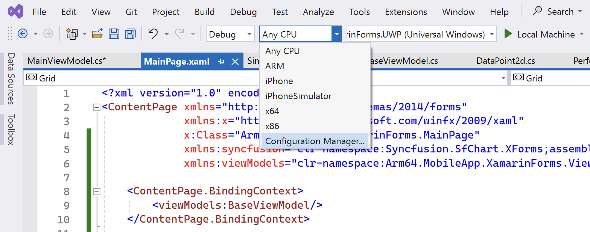
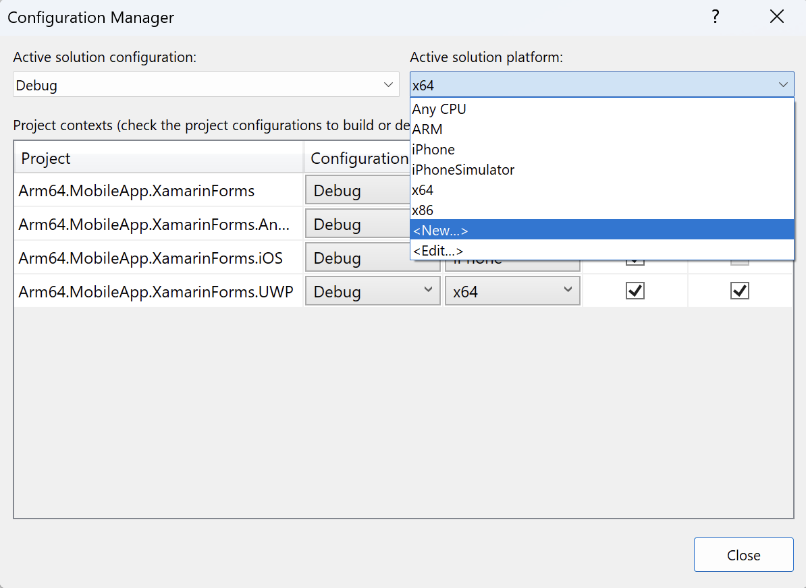
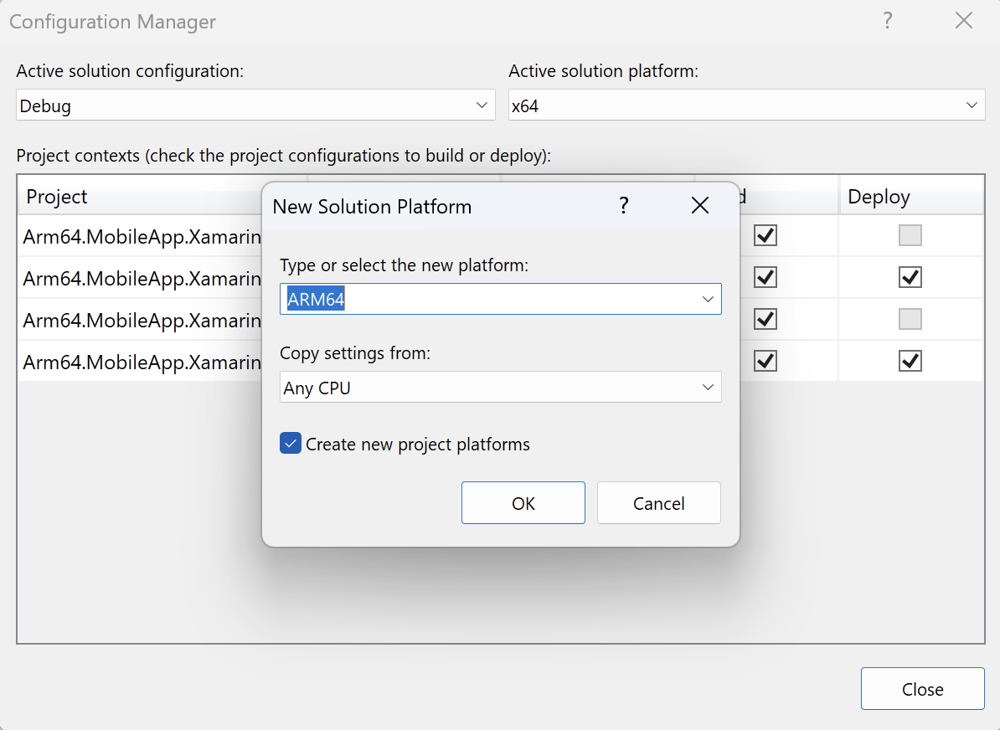
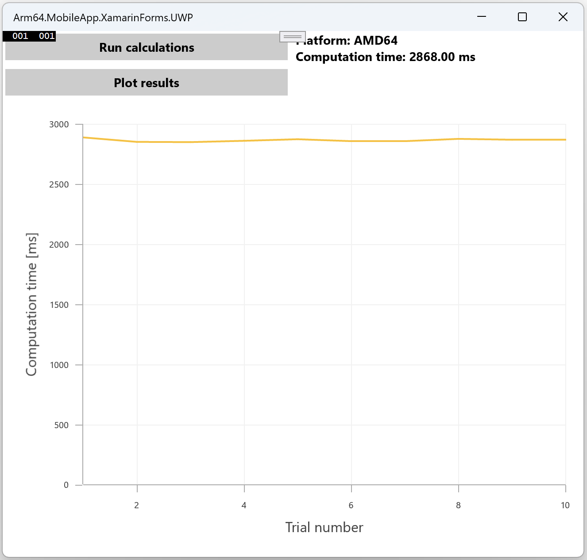
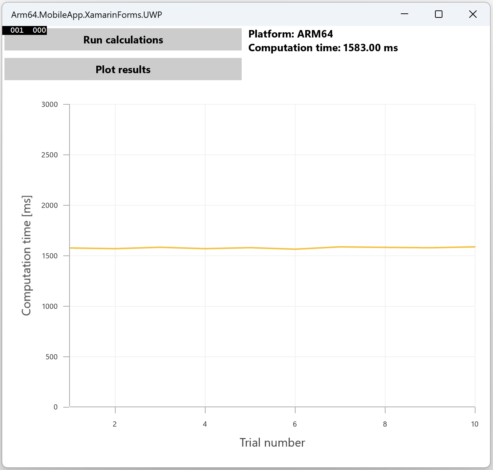

## Objective
In this section, you will learn how to use the Model-View-ViewModel (MVVM) architectural pattern.

## Model
Begin by creating a model class named `DataPoint2d`, which will represent XY points on a plot. Follow these steps to create the model:

1. Open the Solution Explorer in Visual Studio
2. Right-click on the `Arm64.MobileApp.XamarinForms` project and choose Add -> New Folder from the context menu
3. Name the new folder 'Models'
4. Right-click on the 'Models' folder and select Add -> Class. In the dialog that appears, enter 'DataPoint2d.cs' as the file name and click the Add button.

Next, modify the newly created `DataPoint2d.cs` file with the following code:

```CS 
namespace Arm64.MobileApp.XamarinForms.Models
{
    public class DataPoint2d
    {
        public double X { get; set; }

        public double Y { get; set; }
    }
}
```

## View model
In this section you will implement view models for the application. Begin by implementing the BaseViewModel, which will contain the re-usable common functionality for other view models. To implement the BaseViewModel you proceed as follows:
1. Open the Solution Explorer in Visual Studio.
2. Right-click on the `Arm64.MobileApp.XamarinForms` project and choose Add -> New Folder from the context menu.
3. Name the new folder 'ViewModels'.
4. Right-click on the 'ViewModels' folder and select Add -> Class. In the dialog that appears, enter 'BaseViewModel.cs' as the file name and click the Add button.

Next, modify the newly created file as follows:

```CS
using System.ComponentModel;
using System.Runtime.CompilerServices;

namespace Arm64.MobileApp.XamarinForms.ViewModels
{
    public class BaseViewModel : INotifyPropertyChanged
    {
        public event PropertyChangedEventHandler PropertyChanged;

        protected void OnPropertyChanged(string propertyName)
        {
            PropertyChanged?.Invoke(this,
                new PropertyChangedEventArgs(propertyName));
        }

        protected void SetProperty<T>(ref T property,
            T value, [CallerMemberName] string propertyName = "")
        {
            property = value;
            OnPropertyChanged(propertyName);
        }
    }

}
```

The `BaseViewModel` class uses the INotifyPropertyChanged interface for data binding, enabling associated views to be notified of changes in underlying properties. This ensures the views can update the content displayed to the user.

To implement the `INotifyPropertyChanged` interface, the class must define the PropertyChanged event. Views associated with view models automatically subscribe to this event to update their controls accordingly.

Additionally, you have implemented two protected methods accessible in derived classes:
* OnPropertyChanged: this method raises the PropertyChanged event, informing the view which property of the view model has changed.
* SetProperty: a helper method that updates the property value and then invokes OnPropertyChanged to propagate property changes to the view.

The next step involves implementing commands which act as event handlers for controls. Unlike event handlers that are framework-dependent, commands are independent and can be implemented directly in the view model. This allows the same command to be used in WPF, Xamarin, or .NET MAUI apps. To implement a command, create a class that implements the System.Windows.Input.ICommand interface, which comprises:
* Execute: a method called when the command is invoked, such as through a button click.
* CanExecute: a method that specifies whether the command can be invoked, often used to ensure the application state or user input is valid for command execution.
* CanExecuteChanged: an event raised whenever the state affecting CanExecute changes.

Below is a simple implementation of the ICommand interface in a new file, `SimpleCommand.cs`, saved under the ViewModels folder:

```CS
using System;
using System.Windows.Input;

namespace Arm64.MobileApp.XamarinForms.ViewModels
{
    public class SimpleCommand : ICommand
    {
        public event EventHandler CanExecuteChanged;

        private readonly Action<object> action;

        public SimpleCommand(Action<object> action)
        {
            this.action = action;
        }

        public bool CanExecute(object parameter)
        {
            return true;
        }

        public void Execute(object parameter)
        {
            if (CanExecute(parameter))
            {
                action(parameter);
            }
        }
    }
}
```

The SimpleCommand class includes the CanExecuteChanged event and implements the CanExecute and Execute methods from the ICommand interface. The Execute method first calls CanExecute. If it returns true, Execute invokes a method encapsulated in the action field of the SimpleCommand class. The action field, which implements the actual command logic, is set in the class constructor.

To illustrate this in practice, we implement the actual view model. Under the ViewModels folder, create a new file, `MainViewModel.cs`, and implement it as follows:

```CS
using Arm64.MobileApp.XamarinForms.Helpers;
using Arm64.MobileApp.XamarinForms.Models;
using System;
using System.Collections.Generic;
using System.Collections.ObjectModel;
using System.Diagnostics;
using System.Text;
using Xamarin.Forms;

namespace Arm64.MobileApp.XamarinForms.ViewModels
{
    public class MainViewModel : BaseViewModel
    {
        private string computationTime = "";

        public string ComputationTime
        {
            get => computationTime;
            set => SetProperty(ref computationTime, value);
        }

        private readonly List<DataPoint2d> computationTimeHistory = new List<DataPoint2d>();

        public ObservableCollection<DataPoint2d> DataPoints { get; set; } =
            new ObservableCollection<DataPoint2d>();

        private SimpleCommand runCalculationsCommand;        
        public SimpleCommand RunCalculationsCommand
        {
            get
            {
                if (runCalculationsCommand == null)
                {
                    runCalculationsCommand = new SimpleCommand((object parameter) =>
                    {
                        try
                        {
                            var computationTime = PerformanceHelper.MeasurePerformance(
                                MatrixHelper.SquareMatrixMultiplication, executionCount: 10);

                            ComputationTime = $"Platform: {Environment.GetEnvironmentVariable("PROCESSOR_ARCHITECTURE")}" +
                                $"\nComputation time: {computationTime:f2} ms";

                            computationTimeHistory.Add(new DataPoint2d
                            {
                                X = computationTimeHistory.Count + 1,
                                Y = computationTime
                            });
                        }
                        catch (Exception ex)
                        {
                            Debug.WriteLine(ex);
                        }
                    });
                }

                return runCalculationsCommand;
            }
        }


        private SimpleCommand plotResultsCommand;
        public SimpleCommand PlotResultsCommand
        {
            get
            {
                if (plotResultsCommand == null)
                {
                    plotResultsCommand = new SimpleCommand((object parameter) =>
                    {
                        // Clear DataPoints and update with new data on the UI thread
                        Device.BeginInvokeOnMainThread(() =>
                        {
                            DataPoints.Clear();
                            foreach (var point in computationTimeHistory)
                            {
                                DataPoints.Add(point);
                            }
                        });
                    });
                }

                return plotResultsCommand;
            }
        }
    }
}
```

In MainViewModel, which derives from BaseViewModel, you have created a private field computationTime and its associated property ComputationTime. Notice how SetProperty from BaseViewModel is used to raise the PropertyChanged event, notifying the view of changes in the ComputationTime property.

This approach eliminates the need to manually rewrite values from the ComputationTime property to a specific property of a visual control (e.g., Label.Text). Instead, data binding is used, allowing the view to automatically receive notifications about source property changes. The ComputationTime in the view model is set using a command (RunCalculationsCommand), thereby decoupling the logic from the view without any explicit view references.

`RunCalculationsCommand` is created using the constructor of the `SimpleCommand class`, defining the action inline. The action involves calling `PerformanceHelper.MeasurePerformance` to measure the execution time of ten invocations of the `MatrixHelper.SquareMatrixMultiplication` method. The computation time is stored in a local variable and formatted into a string displaying the processor architecture (obtained using the PROCESSOR_ARCHITECTURE environment variable) and the computation time with a “ms” suffix. This string is then assigned to the ComputationTime property of the MainViewModel.

Additionally, `RunCalculationsCommand` stores the computation time in the computationTimeHistory field, a list of DataPoint2d instances. Each instance represents an XY point, with X being the sequential number of the computation and Y being the computation time.

To plot the computation times, `PlotResultsCommand` is used. This command does not involve any direct chart-related logic; instead, it transfers each element from `computationTimeHistory` to the DataPoints property, an `ObservableCollection`. As `ObservableCollection` implements `INotifyPropertyChanged`, it automatically notifies when items are added, updated, or removed, making it unnecessary to use BaseViewModel.SetProperty in this context.

## Attaching the ViewModel to the View
In the final step, you need to connect the MainViewModel to the MainPage view. To do this, open `MainPage.xaml` and add the following declarations:

```XML
<?xml version="1.0" encoding="utf-8" ?>
<ContentPage xmlns="http://xamarin.com/schemas/2014/forms"
             xmlns:x="http://schemas.microsoft.com/winfx/2009/xaml"
             x:Class="Arm64.MobileApp.XamarinForms.MainPage"
             xmlns:syncfusion="clr-namespace:Syncfusion.SfChart.XForms;assembly=Syncfusion.SfChart.XForms"
             xmlns:viewModels="clr-namespace:Arm64.MobileApp.XamarinForms.ViewModels">

    <ContentPage.BindingContext>
        <viewModels:BaseViewModel/>
    </ContentPage.BindingContext>

    <!--Other declarations do not change-->
</ContentPage>
```

The first declaration:

```XML
xmlns:viewModels="clr-namespace:Arm64.MobileApp.XamarinForms.ViewModels"
```

adds the C# namespace to the XAML, enabling the use of C# types as XAML tags. Consequently, the second block:

```XML
<ContentPage.BindingContext>
   <viewModels:MainViewModel />
</ContentPage.BindingContext>
```

creates an instance of the MainViewModel class and assigns it to the ContentPage.BindingContext property, which is utilized by the view for data binding.

Next, modify the Buttons section by adding bindings to `RunCalculationsCommand` and `PlotResultsCommand`:

```XML
 <!--Buttons-->
 <StackLayout Grid.Row="0"
     Grid.Column="0"
     Orientation="Vertical">
     <Button Text="Run calculations" 
             Command="{Binding RunCalculationsCommand}"/>
     <Button Text="Plot results" 
             Command="{Binding PlotResultsCommand}"  />
 </StackLayout>
```

Then, update the Label declaration to bind to the `ComputationTime` property of the MainViewModel:

```XML
<!--Label-->
<Label Grid.Row="0" 
       Grid.Column="1" 
       Text="{Binding ComputationTime, Mode=OneWay}"  />
```

Finally, modify the chart declarations so that the values displayed in the chart are sourced from the DataPoints property of the MainViewModel:

```XML
<syncfusion:LineSeries EnableAnimation="True"
               Label="Computation time"
               ItemsSource="{Binding DataPoints}" 
               XBindingPath="X" 
			   YBindingPath="Y" />
```

With these modifications, the MainPage view will be fully connected to MainViewModel, enabling dynamic updates through data binding.

## Test the application
You can now run the application to demonstrate the performance differences between Arm64 and x64 architectures. First, you need to configure the application for both Arm64 and x64 platforms in Visual Studio. To do this, follow these steps:

1. Click on the platform dropdown in Visual Studio and select 'Configuration Manager...'

<<<<<<< HEAD


2. In the 'Configuration Manager' window, open the 'Active solution platform' dropdown and select <New...>



3. In the 'New Solution Platform' dialog, choose 'ARM64' from the list and click the 'OK' button


=======


2. In the 'Configuration Manager' window, open the 'Active solution platform' dropdown and select <New...>


3. In the 'New Solution Platform' dialog, choose 'ARM64' from the list and click the 'OK' button


>>>>>>> 5f2151168 (Changed model to Tiny Rock–Paper–Scissors CNN)

After setting up both platforms, start by running the application using the x64 platform:

1. Launch the application in x64 mode
2. Click the 'Run calculations' button several times, then click 'Plot results'. Observe the computation times displayed.

Now, launch the application using x64 platform. Click the Run calculations button several times, and then click the Plot results button. You should get the following:

<<<<<<< HEAD

=======

>>>>>>> 5f2151168 (Changed model to Tiny Rock–Paper–Scissors CNN)

Next, switch to the ARM64 platform and repeat the process:

1. Change the platform to ARM64 in Visual Studio
2. Launch the application, perform several calculations again, and plot the results

You should notice shorter computation times on the ARM64 platform, demonstrating its performance advantage:

<<<<<<< HEAD

=======

>>>>>>> 5f2151168 (Changed model to Tiny Rock–Paper–Scissors CNN)

## Summary
In this learning path, you developed an application using Xamarin.Forms, allowing it to run on multiple platforms while sharing the same codebase. The application included functionality to measure and compare computation times, specifically focusing on matrix multiplication performance. By running the application on both x64 and Arm64 platforms, you were able to observe and compare the performance. The results showed a noticeable performance advantage on the Arm64 architecture, highlighting its efficiency in handling computation-intensive tasks.
