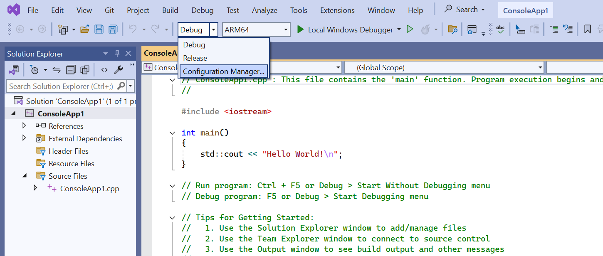

## Install Microsoft Visual Studio 

Visual Studio 2022, Microsoft's Integrated Development Environment (IDE), empowers developers to build high-performance applications across a wide range of platforms. With its robust support for Arm architecture, Visual Studio 2022 opens up exciting possibilities for creating native Arm applications and optimizing existing code for Arm-based devices. 

You can check out this Microsoft [page](https://learn.microsoft.com/en-us/visualstudio/install/visual-studio-on-arm-devices?view=vs-2022) to learn more about Visual Studio on Arm-powered devices.

Visual Studio 2022 offers different editions tailored to various development needs:
 - Community: A free, fully-featured edition ideal for students, open-source contributors, and individual developers.
 - Professional: Offers professional developer tools, services, and subscription benefits for small teams.
 - Enterprise: Provides the most comprehensive set of tools and services for large teams and enterprise-level development.

You can compare the features of each edition on the Visual Studio website to choose the one that best suits your requirements: https://visualstudio.microsoft.com/vs/compare/

{}
This Learning Path documents an example using Visual Studio 2022 Community edition, you can also use advance edition as well.
{}

Visit Viscual Studio [Downloads](https://visualstudio.microsoft.com/downloads/) page and click the download the installer executable.

It usually took few minuate to install depend on your network speed. Double-click the downloaded installer and set the default configuration to finish the installation.

You can learn how to install C/C++ and LLVM support in this [learning path] (https://learn.arm.com/install-guides/vs-woa/).

## Create a sample project

Now, you are ready to create a sample Windows application.

To keep the example clear and concise, we will use the simplest console app here.

On the start window, click "Create a new project." 


In the "Create a new project" window, select "Console App" give a project name and then click "Next".


After the project is created, you will see a line of "Hello, world" code in Program.cs.
```TypeScript
Console.WriteLine("Hello, World!");
```

Microsoft Visual Studio automatically adds the build environment variable for the current hardware's CPU architecture. However, we can still familiarize ourselves with the relevant settings.

## Arm64 Configuration setting

Go the "Debug" -> "Configuration Manager"
 


In the Project contexts platform dropdown, click <New...>. In the New platform dialog box: select `ARM64`.
 


{}
Please reference this [learning path](https://learn.arm.com/learning-paths/laptops-and-desktops/win_wpf/how-to-2/) to find more detail about how to configure the Visual Studio platform setting.
{}


Click "Build" -> "Build Solution", your first Windows will compile succesfully.


## Run your first Windows application

Use the green arrow to run the program you just compiled, and you'll see the  statement from your code correctly executed in the console.

 

You can also use the tools provided by Visual Studio to check the compiled executable.

[dumpbin](https://learn.microsoft.com/en-us/cpp/build/reference/dumpbin-reference?view=msvc-170) is a command-line tool included with Microsoft Visual Studio. It's used to analyze binary files like executable files (.exe), object files (.obj), and dynamic-link libraries (.dll). 
In your Windows search, look for "Arm64 Native Tools Command Prompt for VS 2022" and open this program.

```cmd
dumpbin /headers <your exe path>\ConsoelApp1.exe
```

You can see that the file format is for an AA64 machine.
 
