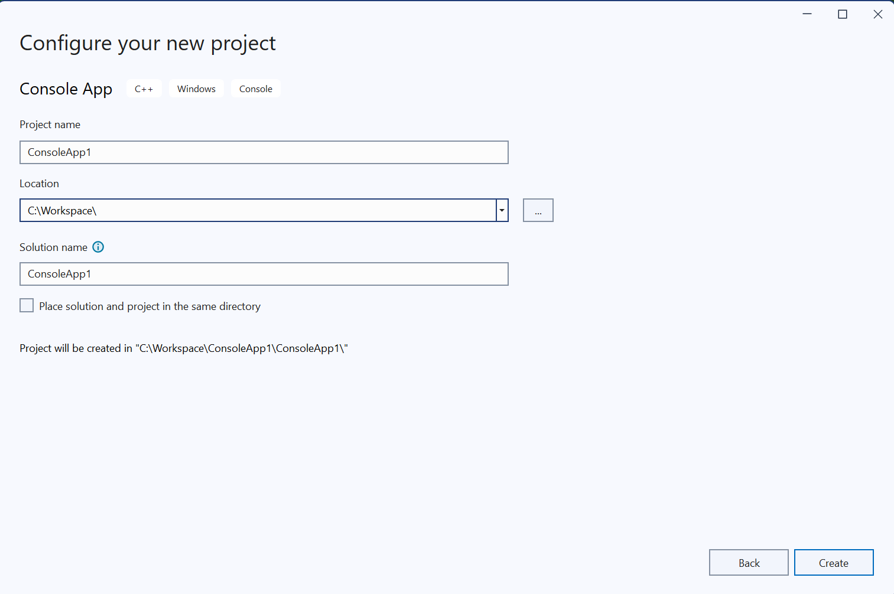

## Create and configure a project

You are now ready to create a Windows on Arm application.

For your first project, you will create a simple console application.

As shown in Figure 1, go to the **Start** window, and select **Create a new project**.  


Then, as shown in Figure 2, in **Configure your new project**, do the following:

* Select **Console App**.
* Provide a project name, such as `ConsoleApp1`.
* Click **Create**.



After you have created the project, you will see a line of code that says `Hello, World!` in the newly-created C++ file. 

```C++
#include <iostream>

int main()
{
    std::cout << "Hello World!\n";
}
```

Whilst Microsoft Visual Studio automatically configures the build environment for the hardware of the CPU architecture, you will still benefit from familiarizing yourself with the relevant configuration settings and learning what to use. Continue to learn more about the configuration settings.

## ARM64 Configuration Settings

Click on the **Debug** drop-down menu, and select **Configuration Manager...**

 


In the **Project contexts** area, you will see the platform set to `ARM64`. 

 

Click **Build**, then **Build Solution**, and your application will compile.

## Run your first Windows on Arm application

Use the green arrow to run the program you compiled, and you will see the print statement from your code correctly executed in the console.

 

You can also use the tools provided by Visual Studio to check the compiled executable.

The [dumpbin](https://learn.microsoft.com/en-us/cpp/build/reference/dumpbin-reference?view=msvc-170) command-line tool is included with Microsoft Visual Studio. You can use it to analyze binary files such as:

* Executable files (.exe).
* Object files (.obj).
* Dynamic-link libraries (.dll). 

To use `dumpbin`, open a command prompt with Visual Studio configured by opening Windows search, and then looking for `Arm64 Native Tools Command Prompt for VS 2022`. Once you have found this application, open it.

A new command prompt opens. It is the same as the regular Windows command prompt, but with the added benefit that you can run Visual Studio tools.

Run the command below, replacing the text with the details of the executable that you created as an argument:

```cmd
dumpbin /headers <your exe path>\ConsoleApp1.exe
```

You can see that the file format shows `AA64 machine (ARM64)` in the file header.

 

Continue to the next page to build and run a more computation-intensive application.