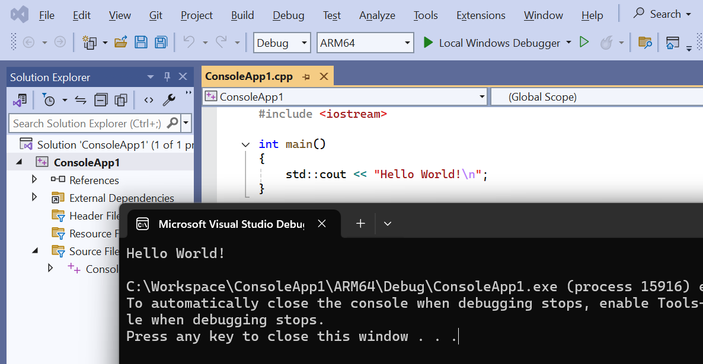

## Create a sample project

You are now ready to create a sample Windows on Arm application.

You will create a simple and straightforward console application as your first project.

On the **Start** window, select **Create a new project**. 


In the **Create a new project** window, do the following:

* Select **Console App**.
* Provide a project name, such as `hello-world-1`.
* Click **Next**.


After the project is created, you will see a line of `Hello, World!` code in the newly-created C++ file. 

```C++
#include <iostream>

int main()
{
    std::cout << "Hello World!\n";
}
```

Microsoft Visual Studio automatically configures the build environment for the hardware of the CPU architecture. However, you will benefit from familiarizing yourself with the relevant configuration settings.

## ARM64 Configuration Settings

Click on the **Debug** drop-down menu, and select **Configuration Manager...**

 


In the **Project contexts** area, you will see the platform set to `ARM64`. 

 

Click **Build**, then **Build Solution**, and your application compiles successfully.

## Run your first Windows on Arm application

Use the green arrow to run the program you compiled, and you will see the print statement from your code correctly executed in the console.

 

You can also use the tools provided by Visual Studio to check the compiled executable.

The [dumpbin](https://learn.microsoft.com/en-us/cpp/build/reference/dumpbin-reference?view=msvc-170) command-line tool is included with Microsoft Visual Studio. You can use it to analyze binary files such as executable files (.exe), object files (.obj), and dynamic-link libraries (.dll). 

To use `dumpbin`, open a command prompt with Visual Studio configured by opening Windows search, and look for `Arm64 Native Tools Command Prompt for VS 2022`. Find this application, and open it.

A new command prompt opens. It is the same as the regular Windows command prompt, but with the added benefit that you can run Visual Studio tools from the prompt.

Run the command below, replacing the text with the details of the executable that you created as an argument:

```cmd
dumpbin /headers <your exe path>\ConsoleApp1.exe
```

You can see that the file format shows `AA64 machine (ARM64)` in the file header.

 

Continue to the next page to build and run a more computation-intensive application.