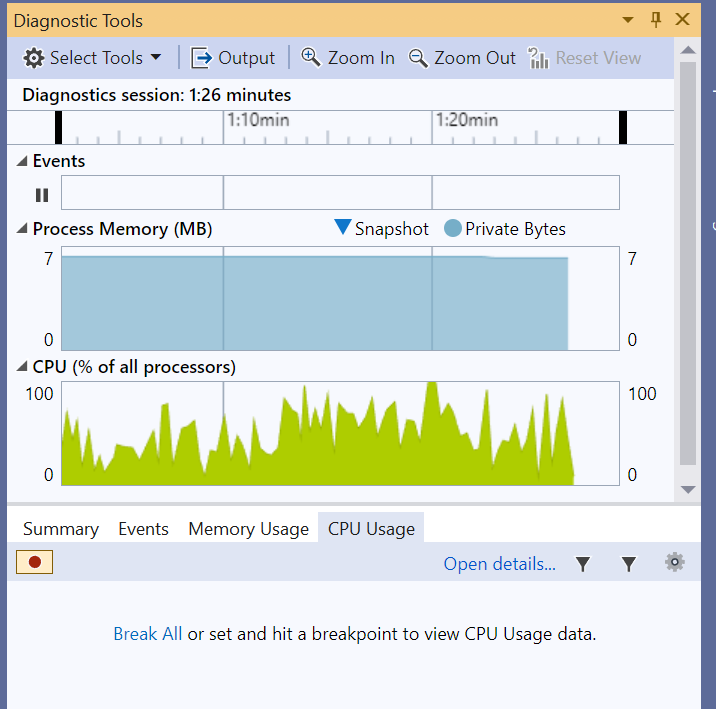

## Get started with Spin the Cube

In Windows File Explorer, double-click **SpinTheCubeInGDI.sln** to open the project in Visual Studio.

The source file **SpinTheCubeInGDI.cpp** will then implement a spinning cube.

The four key components of the application are:
 
 - Shape generation: the application generates the vertices for a sphere using a golden ratio-based algorithm.
 
 - Rotation calculation: the application uses a rotation matrix to rotate the 3D shape around the X, Y, and Z axes. The rotation angle is incremented over time, creating the animation. 
 
 - Drawing: the application draws the transformed vertices of the shapes on the screen, using a Windows API.
 
 - Performance measurement: the code measures and displays the number of transforms per second.

The code has two options to calculate the rotation:

  1. Multithreading: the application utilizes multithreading to improve performance by distributing the rotation calculations across multiple threads.
  2. Arm Performance Libraries: the application utilizes optimized math library functions for the rotation calculations. 

Option 1 is explained below and option 2 is explained on the next page. By trying both methods you can compare and contrast the code and the performance. 

## Option 1: Multithreading

One way that you can speed up the rotation calculations is to use multithreading.

The multithreading implementation option involves two functions:

 - The `CalcThreadProc()` function:
    
    This function is the entry point for each calculation thread.  Each calculation thread waits on its semaphore in `semaphoreList`.
   
    When a thread receives a signal, it calls `applyRotation()` to transform its assigned vertices. The updated vertices are stored in the `drawSphereVertecies` vector. 
    
    The code is shown below:
   
    ```c++
    DWORD WINAPI CalcThreadProc(LPVOID data)
    {
        // need to know where to start and where to end
        int threadNum = LOWORD(data);
        int threadCount = HIWORD(data);
        int pointStride = spherePoints / threadCount;

        while (!closeThreads)
        {
            // wait on a semaphore
            WaitForSingleObject(semaphoreList[threadNum], INFINITE);

            EnterCriticalSection(&cubeDraw[threadNum]);
            // run the calculations for the set of points - need to be global
            applyRotation(UseCube ? cubeVertices : sphereVertices, rotationInX, threadNum * pointStride, pointStride);
            LeaveCriticalSection(&cubeDraw[threadNum]);

            // set a semaphore to say you are done
            ReleaseSemaphore(doneList[threadNum], 1, NULL);
        }

        return 0;
    }
    ```

 - The `applyRotation()` function:

    This function applies the rotation matrix to a subset of the shape's vertices using multiplication. The code is shown below:

    ```c++
    void applyRotation(std::vector<double>& shape, const std::vector<double>& rotMatrix, int startPoint, int stride)
    {
        double refx, refy, refz;

        // Start looking at the reference verticies 
        auto point = shape.begin();
        point += startPoint * 3;

        // Start the output transformed verticies 
        auto outpoint = drawSphereVertecies.begin();
        outpoint += startPoint * 3;

        int counter = 0;
        while (point != shape.end() && counter < stride)
        {
            counter++;

            // take the next three values for a 3D point
            refx = *point; point++;
            refy = *point; point++;
            refz = *point; point++;

            *outpoint = scale * rotMatrix[0] * refx + 
                        scale * rotMatrix[3] * refy + 
                        scale * rotMatrix[6] * refz; outpoint++;

            *outpoint = scale * rotMatrix[1] * refx + 
                        scale * rotMatrix[4] * refy + 
                        scale * rotMatrix[7] * refz; outpoint++;

            *outpoint = scale * rotMatrix[2] * refx + 
                        scale * rotMatrix[5] * refy + 
                        scale * rotMatrix[8] * refz; outpoint++;
        }
    }
    ```


## Build and run the application

After grasping a basic understanding of the project, you can compile and run it. 

Build the project and run `SpinTheCubeInGDI.exe`.

You will see a simulated 3D sphere continuously rotating. 

The number in the application represents the number of Frames Per Second (FPS). 

A higher number indicates more frames per second, which indicates improved performance.

 

Performance varies across different Windows on Arm computers, but on the Lenovo X13s specifically, the performance generally falls between 3K and 6K FPS.


You can use the [Visual Studio profiling tools](https://learn.microsoft.com/en-us/visualstudio/profiling/profiling-feature-tour?view=vs-2022) to observe the dynamic CPU and memory usage while the program is running.

 

Continue learning to find out how you can optimize performance using Arm Performance Libraries.
