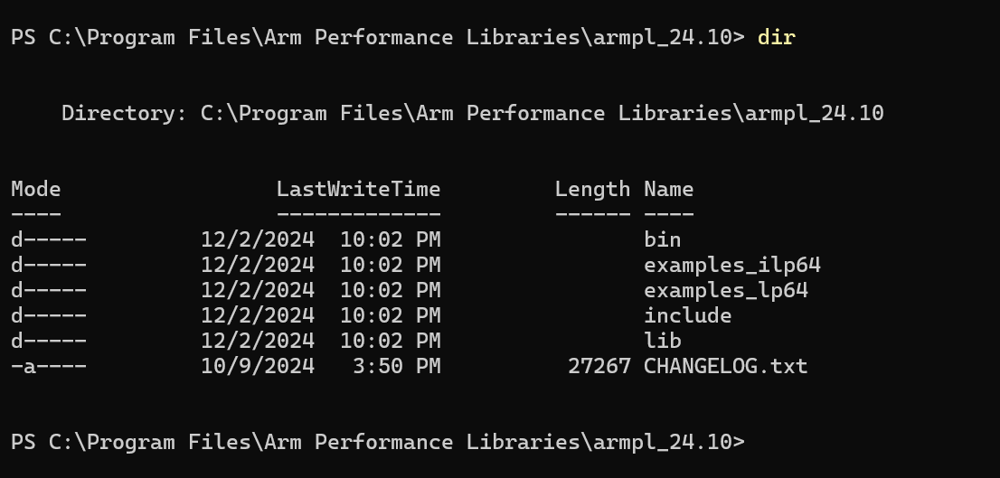
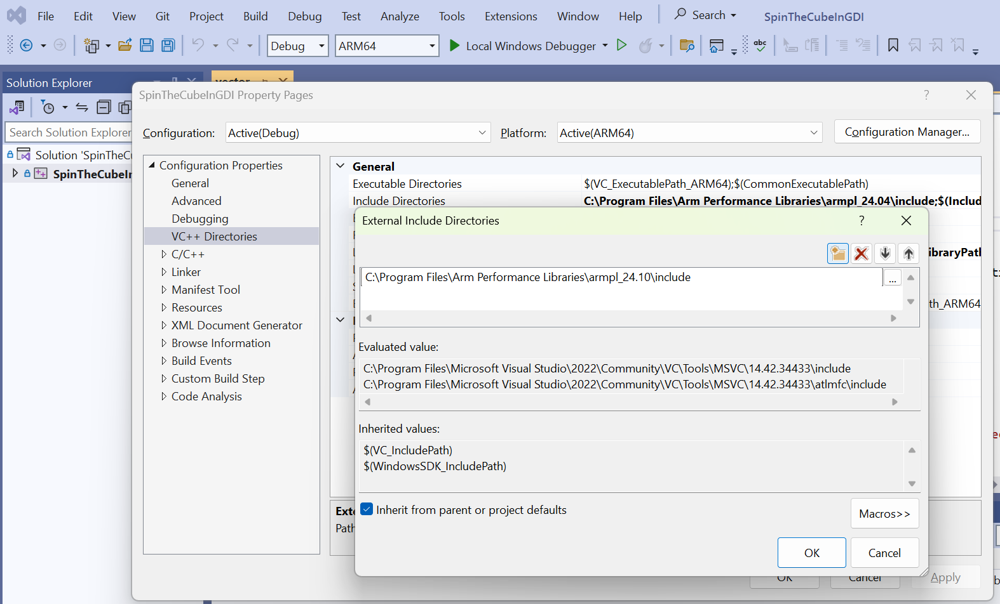
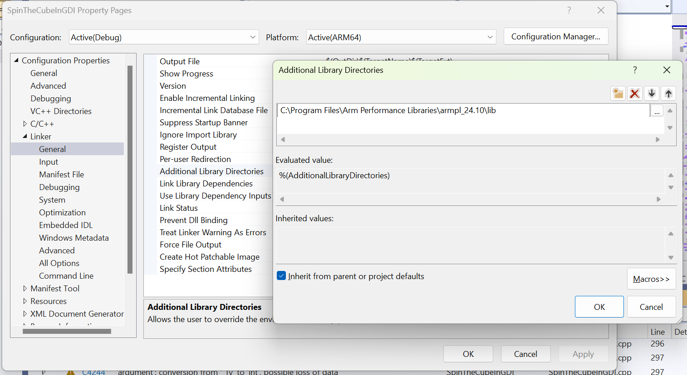
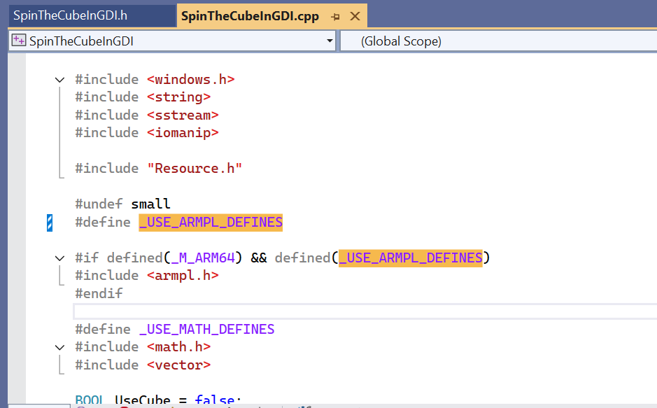
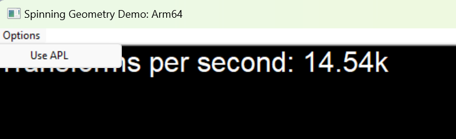
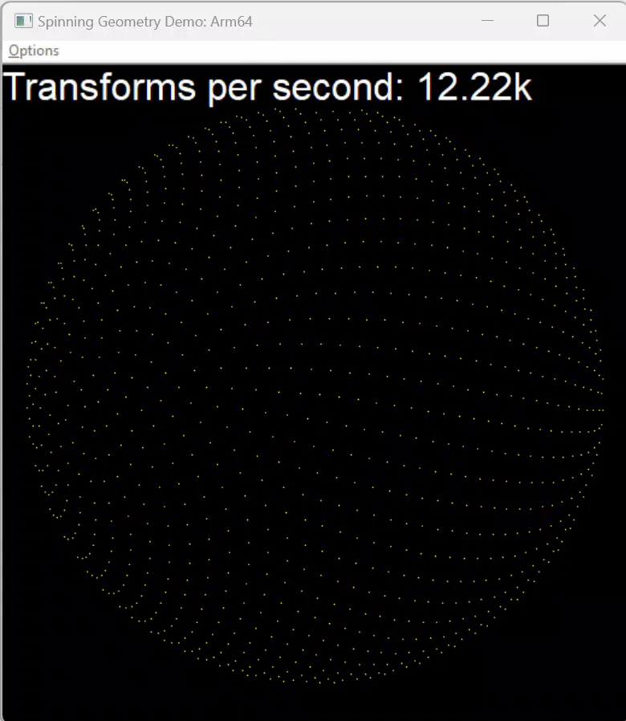
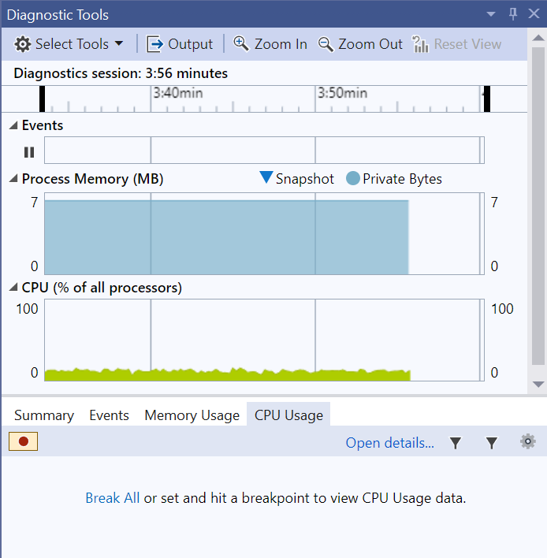

## Introducing Arm Performance Libraries

In the previous section, you gained some understanding of the performance of the first calculation option, multithreading. 

Now, use option 2, Arm Performance Libraries, and explore the differences.

[Arm Performance Libraries](https://developer.arm.com/Tools%20and%20Software/Arm%20Performance%20Libraries) provides optimized standard core math libraries for numerical applications on 64-bit Arm-based processors. The libraries are built with OpenMP across many BLAS, LAPACK, FFT, and sparse routines in order to maximize your performance in multi-processor environments.

Use the [Arm Performance Libraries install guide](/install-guides/armpl/) to install Arm Performance Libraries on Windows 11. 

You can also refer to the [Arm Performance Libraries documentation](https://developer.arm.com/documentation/109361/latest/) for Windows. 

After successful installation, you will find five directories in the installation folder. 

The `include` and `lib` are the directories containing header files and library files, respectively. 

Take note of the location of these two directories, as you will need them for configuring Visual Studio.

 

## Include Arm Performance Libraries into Visual Studio

To use Arm Performance Libraries in the application, you need to manually add the paths into Visual Studio.

You need to configure two places in your Visual Studio project:

### External Include Directories:

1. In the Solution Explorer, right-click on your project and select `Properties`. 
2. In the left pane of the Property Pages, expand `Configuration Properties`. Select `VC++ Directories`
3. In the right pane, find the `Additional Include Directories` setting.
4. Click on the dropdown menu. Select `<Edit...>`
5. In the dialog that opens, click the `New Line` icon to add Arm Performance Libraries `include` path.


 
### Additional Library Directories:

1. In the Solution Explorer, right-click on your project and select `Properties`. 
2. In the left pane of the Property Pages, expand `Configuration Properties`. Select `Linker`
3. In the right pane, find the `Additional Library Directories` setting.
4. Click on the dropdown menu. Select `<Edit...>`
5. In the dialog that opens, click the `New Line` icon to add Arm Performance Libraries `library` path.




{}
Visual Studio allows users to set the above two paths for each individual configuration. To apply the settings to all configurations in your project, select `All Configurations` in the `Configuration` dropdown menu.
{}


## Option 2: Arm Performance Libraries

You are now ready to use Arm Performance Libraries in your project.

Open the source code file `SpinTheCubeInGDI.cpp` and search for the `_USE_ARMPL_DEFINES` definition.

You should see a commented-out definition on line 13 of the program. Removing the comment will enable the Arm Performance Libraries feature when you re-build the application.

 


When variable useAPL is True, the application will call `applyRotationBLAS()` instead of the multithreading code to apply the rotation matrix to the 3D vertices.

The code is below:

```c++
void RotateCube(int numCores)
{
    // 
    //
    //

    if (useAPL)
    {
        applyRotationBLAS(UseCube ? cubeVertices : sphereVertices, rotationInX);
    }
    else
    {
        for (int x = 0; x < numCores; x++)
        {
            ReleaseSemaphore(semaphoreList[x], 1, NULL);
        }
        WaitForMultipleObjects(numCores, doneList.data(), TRUE, INFINITE);
    }

    Calculations++;
}
```

The `applyRotationBLAS()` function adopts a BLAS matrix multiplier instead of multithreading multiplication for calculating rotation.

Basic Linear Algebra Subprograms (BLAS) are a set of well defined basic linear algebra operations in Arm Performance Libraries, check [cblas_dgemm](https://developer.arm.com/documentation/101004/2410/BLAS-Basic-Linear-Algebra-Subprograms/CBLAS-functions/cblas-dgemm?lang=en) to learn more about the function.

Here is the code used to compute rotation with BLAS:

```c++
void applyRotationBLAS(std::vector<double>& shape, const std::vector<double>& rotMatrix)
{

    EnterCriticalSection(&cubeDraw[0]);

#if defined(_M_ARM64) && defined(_USE_ARMPL_DEFINES)
    // Call the BLAS matrix mult for doubles. 
    // Multiplies each of the 3d points in shape 
    // list with rotation matrix, and applies scale
    cblas_dgemm(CblasRowMajor, CblasNoTrans, CblasNoTrans, (int)shape.size() / 3, 3, 3, scale, shape.data(), 3, rotMatrix.data(), 3, 0.0, drawSphereVertecies.data(), 3);
#endif

    LeaveCriticalSection(&cubeDraw[0]);
}
```

## Build and run the application

Rebuild the code and run `SpinTheCubeInGDI.exe` again.

Click on the "Options" menu in the top left corner of the program, then select "Use APL" to utilize Option 2.

 

On the Lenovo X13s, the performance is between 11k and 12k FPS.



Re-run the profiling tools. 

You see that the CPU usage has decreased significantly. There is no difference in memory usage.

 


You have learned how to improve application performance using Arm Performance Libraries.
