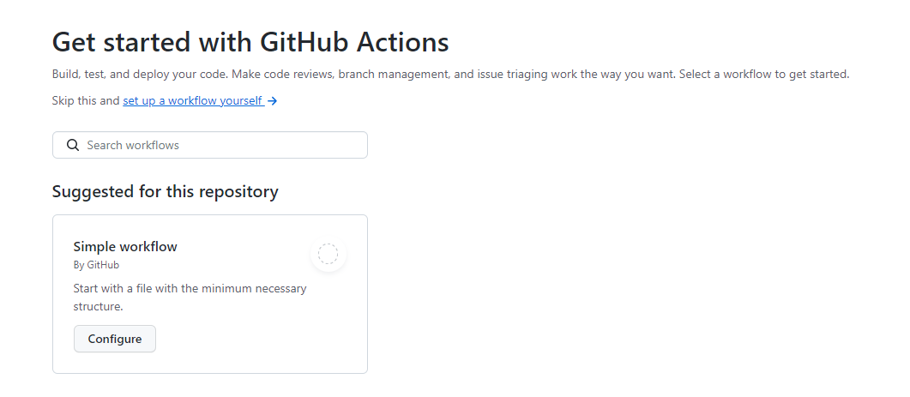
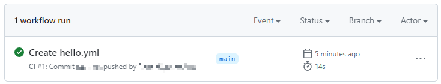

---
# User change
title: Create and run simple workflow

weight: 4 # 1 is first, 2 is second, etc.

# Do not modify these elements
layout: "learningpathall"
---
## Create and run a simple CI/CD GitHub Actions workflow

To test this CI/CD workflow, select `Actions` from the repository menu.

You will be presented with the option to start with a `Simple workflow` that gives you a file with the minimum necessary structure to build, test and deploy your code. Click  `Configure`.



A file named `blank.yml` will be created for you under `<your-repo-name>/.github/workflows/`. Optionally rename this to something more meaningful (`hello.yml`).

This simple workflow file contains the minimal steps that you will need to test and deploy a `hello world` command on a GitHub runner.

In the `blank.yml` file, locate for the following line:

```console
runs-on: ubuntu-latest
```

This specifies the type of runner that will be used to execute the job. The default case is an Ubuntu machine provided by GitHub.

To test the CI workflow on the machine configured as a GitHub Actions runner, change this line to `self-hosted`:

```console
runs-on: self-hosted
```

Select `Start commit`, followed by `Commit new file`.

This commit will trigger the GitHub Actions workflow on the Windows on Arm machine.

In the `PowerShell` window, you will see the progress of the Action:
```output
<timestamp>: Running job: build
<timestamp>: Job build completed with result: Succeeded
```
Similarly in the `Actions` tab of your repository:



 Congratulations, you have successfully run a simple GitHub Actions CI/CD workflow on your Windows on Arm machine.
