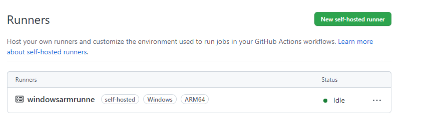

---
# User change
title: Setup GitHub Self-hosted Runner

weight: 2 # 1 is first, 2 is second, etc.

# Do not modify these elements
layout: "learningpathall"
---
You will learn how to setup a GitHub [self-hosted runner](https://docs.github.com/en/actions/hosting-your-own-runners/about-self-hosted-runners) on a [Windows on Arm](/learning-paths/laptops-and-desktops/intro) machine or [cloud instance](/learning-paths/cross-platform/woa_azure/).

You will need a valid [GitHub](https://github.com) account to complete this Learning Path.

## Create a new GitHub repository 

You can create a new repository in GitHub to test a simple `hello world` command running on the Windows Arm VM using GitHub Actions for CI/CD.

In a browser, log in using your GitHub account. Select the [New Button](https://github.com/new) to create a new repository. Give the repository a name. Click `Create Repository`. 

## Prepare GitHub self-hosted runner

Runners are the machines that execute the jobs in the GitHub Actions workflow.

Select the `Settings` tab in your currently empty repository. On the left pane, select `Actions->Runners`.

On the `Runners` page, select the `New self-hosted runner` button. You will be presented with options to choose the Operating system and architecture for your runner. Select `Windows` and `ARM64`. The instructions to download and configure your Windows Arm runner are displayed (the exact commands will be unique to you).

## Enable self-hosted runner

In your Windows on Arm machine, open a `PowerShell` window. Copy and paste each of the above commands. When prompted, it is OK to select default configuration options.

On the execution of the last command (`./run.cmd`) you will see output similar the below:

```output
√ Connected to GitHub

Current runner version: '2.303.0'
<timestamp>: Listening for Jobs
```

Return to the `Actions->Runners` page in your GitHub repository and you should now see your runner displayed similar to the below:



You are now ready to test a simple CI/CD GitHub Actions workflow on your Windows on Arm runner.
