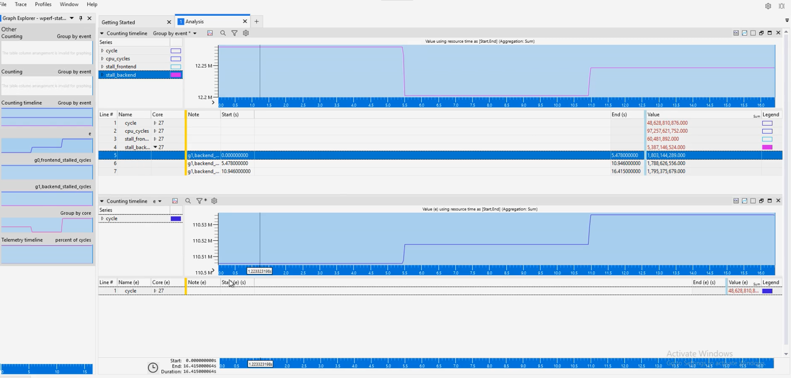

## Introduction

The Counting feature in the WindowsPerf GUI extension is a powerful tool for analyzing and optimizing your code's performance.
This tutorial guides you through the entire process, from setting up your counting preferences to analyzing the results and interfacing with the WindowsPerf Windows
Performance Analyzer (WPA) Plugin.

## How to Open Counting Settings

**Accessing Counting Settings**:

- In Visual Studio 2022, go to the `View` menu.
- Select `Counting Settings` from the dropdown.
- This action will open the Counting Settings Dialog.

## Configuring the Counting Parameters

1. **Filling in Necessary Fields**:

   - The dialog presents multiple fields for configuration. Essential fields to fill in include:
     - CPU core selection
       > Note: if no target is selected, the CPU core selection allows for multiple
       > cores to be selected.
     - Event or Metric choice
       > Note: Events can be grouped by selecting the events to group, then clicking on
       > the `Group events` button.
   - Fill these in according to the specifics of the counting you wish to perform.

2. **Optional Parameters**:

   - You can also set other parameters as per your requirements.

3. **Command Preview**:

   - As you configure the settings, the dialog provides a real-time preview of the
     WindowsPerf command that will be executed.

4. **Timeline Parameters**:

The option to create a timeline is available by toggling the `Timeline` checkbox.
You then have the option to:

- Choose the number of iterations to run the timeline (defaults to 1).
- Choose the interval between each iteration (defaults to 0.5 second).

## Initiating the Counting Process

1. **Starting the Counting Process**:

   - Click on the `Start` button to kickstart the sampling.

     > Note: The `Build and start` button is also available to build the solution
     > before starting the counting process if the current project target is selected.

   - If you’ve set a timeout, the process will run for the specified duration.
     Otherwise, you have the flexibility to end the counting manually using the `Stop` button.

   - The `Stop` button can also be used to interrupt the process even if the timeout
     hasn’t lapsed and the collected counts will be shown in the table below.

_Counting Settings UI_

## Delving into the Counting Results

1. **Analyzing the Results**:

   - Post-counting, you’ll notice the table in the `Counting Output` located at the
     lower section of the Counting Settings dialog displaying the collected counts.

(**Optional**)

- The option to **Open in WPA** is available to open the collected counts in the
  Windows Performance Analyzer (WPA) using the WindowsPerf WPA Plugin for a more
  in-depth visualization and analysis of the results.

_WPA UI_
