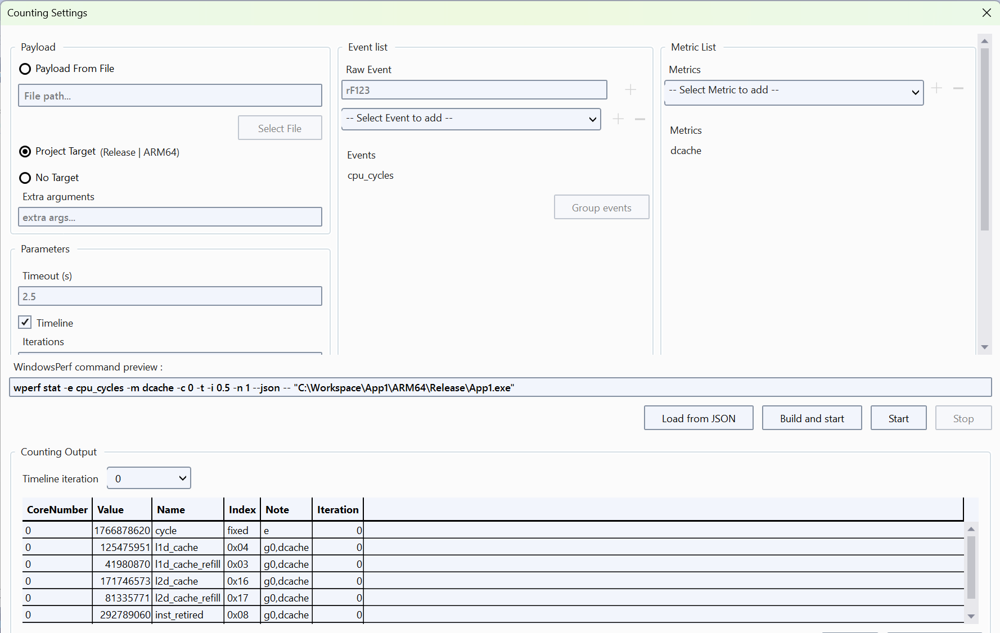

The Counting feature in the Visual Studio extension for WindowsPerf is a powerful tool for analyzing and optimizing your code's performance.

This section guides you through the entire process, from setting up your counting preferences to analyzing the results and interfacing with the WindowsPerf Windows
Performance Analyzer (WPA) Plugin.

## How do I access the counting settings? 

Open the `View` menu in Visual Studio 2022 and select `Counting Settings` from the dropdown. This opens the `Counting Settings` dialog.

## How do I configure the counting parameters?

The counting settings dialog presents multiple fields for configuration. 

Essential fields to fill in include:

- CPU core selection: you can select a subset of the CPU cores or all of them.
- Event List and Metric List: you can select events such as `cpu_cycles` and metrics such as `dcache`.

{}
Events can be grouped by selecting the events to group, then clicking on the `Group events` button.
{}

You can also set other parameters as per your requirements.

As you configure the settings, the dialog provides the `WindowsPerf command preview`. This the command that will be executed.
     
Check the `Timeline` check box create a timeline view.  Choose the number of iterations to run the timeline (defaults to 1) and the interval between each iteration (defaults to 0.5 second).

## How do I initiate counting?

To start the counting process click on the `Start` button. 

If you’ve set a timeout, the process will run for the specified duration. Otherwise, you have the flexibility to end the counting manually using the `Stop` button.

For the current code example, select `cpu_cycles` in the Event List and select `dache` in the Metrics List then you will see the counted events in the `Counting Output` located in the lower section of the dialog. 

## How can I analyze the results? 

You can click the `Open in WPA` button to open the collected counts in the Windows Performance Analyzer (WPA). The WindowsPerf WPA Plugin provides in-depth visualization and analysis of the results.

A screenshot of WPA is below:

