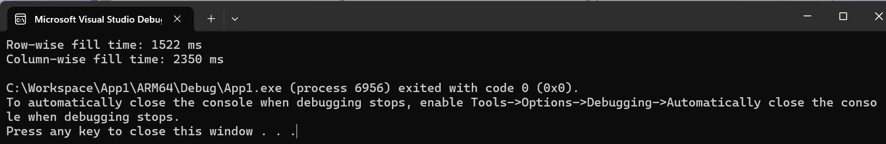
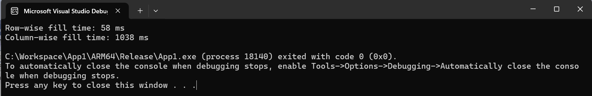

## Which development tools do I need to use WindowsPerf with Visual Studio?

Four development tools are recommended if you want to use WindowsPerf for performance analysis on a Windows on Arm computer. 

Each tool has an install guide explaining how to install and configure it. 

Use the install guides to install and configure each tool before getting started:

- [Visual Studio 2022 Community Edition](/install-guides/vs-woa/)
- [WindowsPerf](/install-guides/wperf/)
- [Visual Studio extension for WindowsPerf](/install-guides/windows-perf-vs-extension/)
- [Windows Performance Analyzer (WPA) plugin](/install-guides/windows-perf-wpa-plugin/)


## How can I try out the WindowsPerf features in Visual Studio?

You can use the code example below to demonstrate WindowsPerf features in Visual Studio.

Create a new C++ Console App named `App1` in Visual Studio.

Remove the provided code and replace it with the code below:

```C++
#include <iostream>
#include <vector>
#include <chrono>

const int N = 10000; // Matrix size

void fillRowWise(std::vector<std::vector<int>>& matrix) {
    for (int i = 0; i < N; ++i) {
        for (int j = 0; j < N; ++j) {
            matrix[i][j] = i + j;
        }
    }
}

void fillColumnWise(std::vector<std::vector<int>>& matrix) {
    for (int j = 0; j < N; ++j) {
        for (int i = 0; i < N; ++i) {
            matrix[i][j] = i + j;
        }
    }
}

int main() {
    std::vector<std::vector<int>> matrix(N, std::vector<int>(N, 0));

    // Measure row-wise traversal
    auto start = std::chrono::high_resolution_clock::now();
    fillRowWise(matrix);
    auto end = std::chrono::high_resolution_clock::now();
    std::cout << "Row-wise fill time: " 
              << std::chrono::duration_cast<std::chrono::milliseconds>(end - start).count() 
              << " ms" << std::endl;

    // Measure column-wise traversal
    start = std::chrono::high_resolution_clock::now();
    fillColumnWise(matrix);
    end = std::chrono::high_resolution_clock::now();
    std::cout << "Column-wise fill time: " 
              << std::chrono::duration_cast<std::chrono::milliseconds>(end - start).count() 
              << " ms" << std::endl;

    return 0;
}
```

The example code shows the difference between filling a matrix in a different order. You will see that column-wise traversal is much slower than row-wise traversal. This happens because:
- Row-wise access follows how memory is stored in contiguous blocks.
- Column-wise access jumps across rows, causing frequent cache misses.

On the `Build` menu select `Build Solution` to generate `App1.exe`. 

Run the program by opening the `Debug` menu and select `Start Without Debugging`.

This will run the debug build for the program. 

The console output is shown below:



Change the Visual Studio target to `Release` instead of `Debug` and build the solution again. 

The console output shows shorter execution time due to compiler optimizations. 

Here is the new output:

