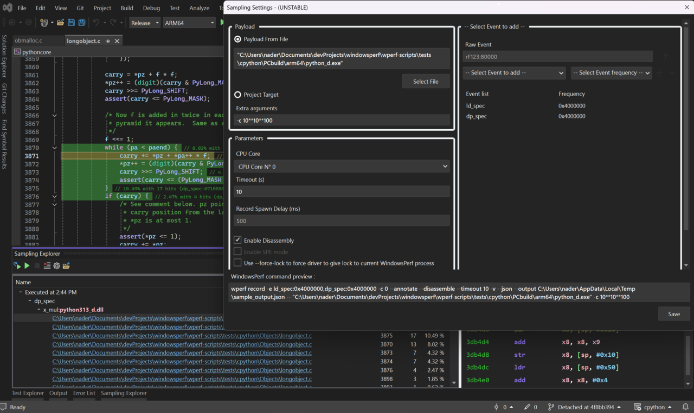
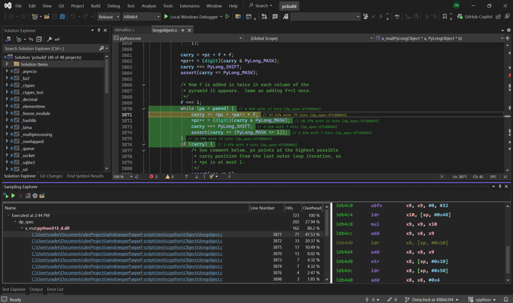

The Sampling feature in the Visual Studio extension for WindowsPerf is a powerful tool for analyzing and optimizing your code's performance. This section guides you through the entire process, from setting up your sampling preferences to analyzing the results and implementing changes.

## How do I open the sampling explorer? 

Open the `View` menu in Visual Studio 2022 and select `Sampling Explorer` from the dropdown. This opens the `Sampling Explorer` dialog.

## How do I configure the sampling preferences?

From the `Sampling Explorer` window, find and click on the `Configure the sampling command` icon, it looks like a gear. This action will open the `Sampling Settings` dialog.

Fill in the required fields listed below:

- File payload: file to profile
- CPU core selection: cores to sample
- Event choice: available events
- Desired frequency: sampling frequency

Fill in these fields with the information you want to sample. 

As you configure the settings, the dialog provides a real-time preview of the WindowsPerf command that will be executed in the `WindowsPerf Command Preview` box. 

When you are satisfied with your configurations, click `Save`.



## How do I initiate sampling?

To start the sampling click on the play button.

If you have set a timeout, the process will run for the specified duration. Otherwise, you have the flexibility to end the sampling manually using the stop button.

The stop button can also be used to interrupt the process even if the timeout hasn’t lapsed and the collected samples will be shown in the next screen.

## How do I view the sampling results?

When the sampling stops, you notice the window divides into two sections: a tree view and a detailed analysis section.

Navigate through the tree view by clicking on the nodes. This reveals functions triggered, selected events, line numbers in the source code, and the responsible source files.

Any accessible source file appears as a clickable hyperlink. Selecting it will directly open the file within the Visual Studio IDE.

## How do I implement code changes?

Based on the insights gathered from the sampling results, proceed to make any required optimizations or edits to your source code.



## How do I evaluate the result after making changes?

After you make code changes run the sampling process again. 

This allows you to instantly compare and contrast the results before and after your code modifications, ensuring optimal performance improvements.

With these steps, you are well-equipped to make use of the sampling feature in the Visual Studio extension for WindowsPerf and improve code performance.

## What does lock and unlock for WindowsPerf and the kernel driver?

When WindowsPerf communicates with the Kernel Driver, the driver acquires a lock and will deny access to other instances of WindowsPerf accessing the driver.

This prevents others from interfering with the current WindowsPerf execution and protects you from interference with your counting.

When another WindowsPerf process has locked access to the driver you will no longer be able to use WindowsPerf, you will instead receive the following error message:

```output
warning: other WindowsPerf process acquired the WindowsPerf-driver.
Operation canceled!
```

In order to force the release of the lock, a new --force-lock command argument is available for both WindowsPerf and the Visual Studio extension that allows you to interrupt the ongoing WindowsPerf process and take over the lock.

However, interrupting a running `wperf` process results in loss of collected data. 

If interrupted, WindowsPerf will show the following error message:

```output
warning: other WindowsPerf process hijacked (forced lock) the wperf-driver, see --force-lock.
Operation terminated, your data was lost!

Received ERROR_BAD_COMMAND, driver status:
STATUS_INVALID_DEVICE_STATE
error: PMU_CTL_LOCK_RELEASE can't be release
```
