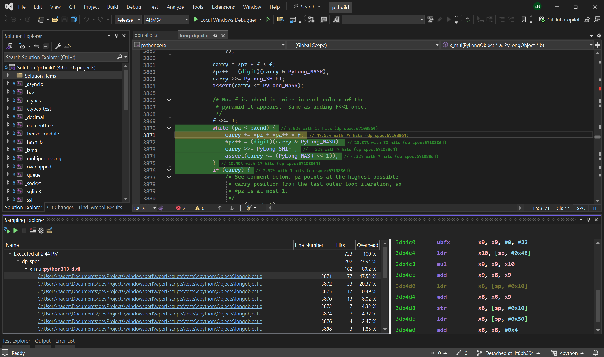

## Introduction

The Sampling feature in the WindowsPerf GUI extension is a powerful tool for analyzing and optimizing your code's performance. This tutorial guides you through the entire process, from setting up your sampling preferences to analyzing the results and implementing changes.

## How to Open Sampling Explorer

1. **Accessing Sampling Explorer**:
   - In Visual Studio 2022, go to the `View` menu.
   - Select `Sampling Explorer` from the dropdown.

## Setting Your Sampling Preferences

1. **Opening Sampling Settings**:
   - Inside the Sampling Explorer window, find and click on the `settings wheel` icon.
   - This action will open the Sampling Settings Dialog.

## Configuring the Sampling Parameters

1. **Filling in Necessary Fields**:

   - The dialog presents multiple fields for configuration. Essential fields to fill in include:
     - File payload
     - CPU core selection
     - Event choice
     - Desired frequency
   - Fill these in according to the specifics of the sampling you wish to perform.

2. **Optional Parameters**:

   - You can also set other parameters as per your requirements.

3. **Command Preview**:

   - As you configure the settings, the dialog provides a real-time preview of the WindowsPerf command that will be executed.

4. **Saving Your Settings**:
   - Once you are satisfied with your configurations, click `save`.


_Sampling overview UI_

## Initiating the Sampling Process

1. **Starting the Sampling**:

   - Click on the play button to kickstart the sampling.

   - If you’ve set a timeout, the process will run for the specified duration. Otherwise, you have the flexibility to end the sampling manually using the stop button.

   - The stop button can also be used to interrupt the process even if the timeout hasn’t lapsed and the collected samples will be shown in the next screen.

## Delving into the Sampling Results

1. **Analyzing the Results**:

   - Post-sampling, you’ll notice the window divides into two sections: a tree view and a detailed analysis section.

   - Navigate through the tree view by clicking on the nodes. This will reveal functions triggered, selected events, line numbers in the source code, and the responsible source files.

   - An added convenience: Any accessible source file appears as a clickable hyperlink. Selecting it will directly open the file within the IDE.

## Implementing Code Adjustments


_Sampling settings UI_

1. **Optimizing Your Code**:
   - Based on the insights gathered from the sampling results, proceed to make any required optimizations or edits to your source code.


_Sampling results shown in the code editor_

## Re-evaluating Post Edits

1. **Comparing Results**:

   - Post editing, run the sampling process again.

   - This allows you to instantly compare and contrast the results before and after your code modifications, ensuring optimal performance improvements.

   - With these steps, you are well-equipped to make the best of the sampling feature in the WindowsPerf GUI extension. Happy coding and optimizing!

## Lock Unlock

When WindowsPerf communicates with its Kernel Driver, the driver acquires lock and will deny access to other instances of WindowsPerf accessing the driver and its resources. This prevents others from interfering with the current WindowsPerf execution and protects you from interference with your count.

When another WindowsPerf process has “locked” access to the driver you will no longer be able to use WindowsPerf, you will instead receive the following error message:

```shell
warning: other WindowsPerf process acquired the WindowsPerf-driver.
Operation canceled!
```

In order to force the release of the lock, a new --force-lock command argument was introduced to both WindowsPerf and the extension that lets you interrupt the ongoing WindowsPerf process and take over the lock.

However, interrupting a running wperf process would result in losing all the collected data. If interrupted, WidowsPerf will show the following error message:

```shell
warning: other WindowsPerf process hijacked (forced lock) the wperf-driver, see --force-lock.
Operation terminated, your data was lost!

Received ERROR_BAD_COMMAND, driver status:
STATUS_INVALID_DEVICE_STATE
error: PMU_CTL_LOCK_RELEASE can't be release
```
