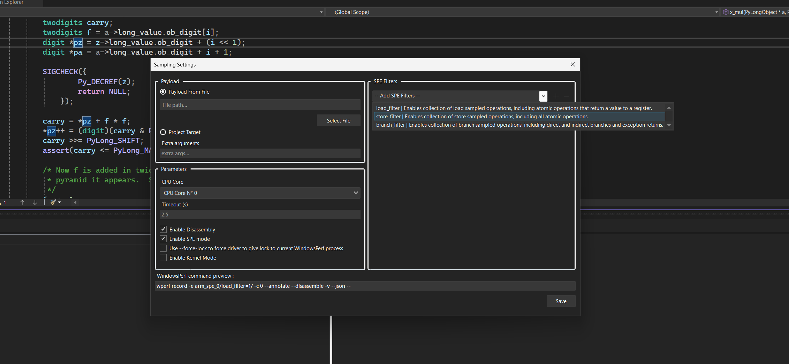

## Introduction

The SPE feature is a subset of the Sampling feature that we just discussed.

## Extra Prerequisites

1. You need to install WindowsPerf and WindowsPerf driver with SPE flag enabled. To do so you can download WindowsPerf from the release page and install the version under the SPE folder.
2. Your arm CPU must have a Statistical Profiling Extension wich has been available since the introduction of the Neoverse N1 CPU platform in 2019.
3. You need to be runing Windows On arm in Test Mode

## What's different from the Sampling Feature

Most of the steps are the same as the Sampling feature, the only difference is in the command configuration:

1. **Switching to SPE mode**:

   - This can be achieved by clicking on the **Enable SPE mode** checkbox in the Sampling Settings Dialog.
   - This will add switch the event list combobox to a list of SPE filters that you can chose from.

2. **Filling in Necessary Fields**:

   - The dialog presents multiple fields for configuration. Essential fields to fill in include:
     - File payload
     - CPU core selection
   - Fill these in according to the specifics of the sampling you wish to perform.

3. **Command Preview**:

   - As you configure the settings, the dialog provides a real-time preview of the WindowsPerf command that will be executed.

4. **Saving Your Settings**:
   - Once you are satisfied with your configurations, click `save`.

_SPE settings UI_
