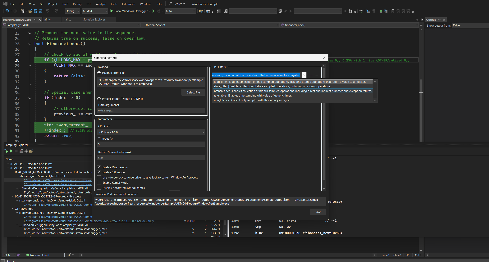

## Introduction

The SPE feature is a subset of the Sampling feature that we just discussed.

{}
This section requires hardware that supports the SPE specification to function properly.
{}

## What is The Arm Statistical Profiling Extension (SPE)

The Arm Statistical Profiling Extension (SPE) is an architectural feature designed for enhanced instruction execution profiling within Arm CPUs. This feature has been available since the introduction of the Neoverse N1 CPU platform in 2019, along with performance monitor units (PMUs) generally available in Arm CPUs.

The SPE is an optional feature in ARMv8.2 hardware that allows CPU instructions to be sampled and associated with the source code location where that instruction occurred.

Some of the key methodologies that can be applied for performance analysis using SPE-profiled data are as follows:

1. Precise sampling for hotspot detection in source code
2. Memory access analysis
3. Data sharing analysis

## SPE filters

SPE provides hardware configuration options to filter the data of interest from an SPE sample record before storing it to memory. This helps with targeted profiling for specific operation types, events, and threshold latency values. For example, a user might choose to profile the following:

- Only record load operations. (load_filter)
- Only record store operations. (store_filter)
- Only record branches. (branch_filter)

## Before you begin

1. You need to install WindowsPerf and WindowsPerf driver with SPE flag enabled. To do so you can download WindowsPerf from the release page and install the version under the SPE folder.
2. Your arm CPU must have a Statistical Profiling Extension wich has been available since the introduction of the Neoverse N1 CPU platform in 2019.
3. You need to be running Windows On arm in Test Mode

## How to check if you have SPE enabled on your machine

First step is to go to the extension's settings page, available at `Tools -> Options -> Windows Perf -> WindowsPerf Path` and make sure that your WindowsPerf and WindowsPerf driver versions have SPE under their feature string:

This step will let you know whether or not you have installed the version of `WindowsPerf` that supports the SPE feature.

The second step is to verify if your CPU supports ARM SPE.

To do so you need to go to go to `Tools -> WindowsPerf Host Data` scroll to the bottom of the list until you find **`spe_device.version_name** if the test result is saying anything but **not implemented** then your CPU supports ARM SPE.

## Configuring the SPE command

1. **Accessing Sampling Explorer**:

   - In Visual Studio 2022, go to the `View` menu.
   - Select `Sampling Explorer` from the dropdown.

2. **Opening Sampling Settings**:

   - Inside the Sampling Explorer window, find and click on the `settings wheel` icon.
   - This action will open the Sampling Settings Dialog.

3. **Switching to SPE mode**:

   - This can be achieved by clicking on the **Enable SPE mode** checkbox in the Sampling Settings Dialog.
   - This will add switch the event list combobox to a list of **SPE filters that you can chose from**.

4. **Filling in Necessary Fields**:

   - The dialog presents multiple fields for configuration. Essential fields to fill in include:
     - File payload
     - CPU core selection
   - Fill these in according to the specifics of the sampling you wish to perform.

5. **Command Preview**:

   - As you configure the settings, the dialog provides a real-time preview of the WindowsPerf command that will be executed.

6. **Saving Your Settings**:
   - Once you are satisfied with your configurations, click `save`.

## Initiating the Sampling Process

- Click on the play button to kickstart the sampling.

- If you’ve set a timeout, the process will run for the specified duration. Otherwise, you have the flexibility to end the sampling manually using the stop button.

- The stop button can also be used to interrupt the process even if the timeout hasn’t lapsed and the collected samples will be shown in the next screen.

## Exploring the results

- At the end of the run you’ll notice the window divides into two sections: a tree view and a detailed analysis section.

- Navigate through the tree view by clicking on the nodes. This will reveal functions triggered, selected events, line numbers in the source code, and the responsible source files.

{}
All the SPE results will be prefixed by your SPE device version name (e.g. `FEAT_SPEv1p1`)
{}

