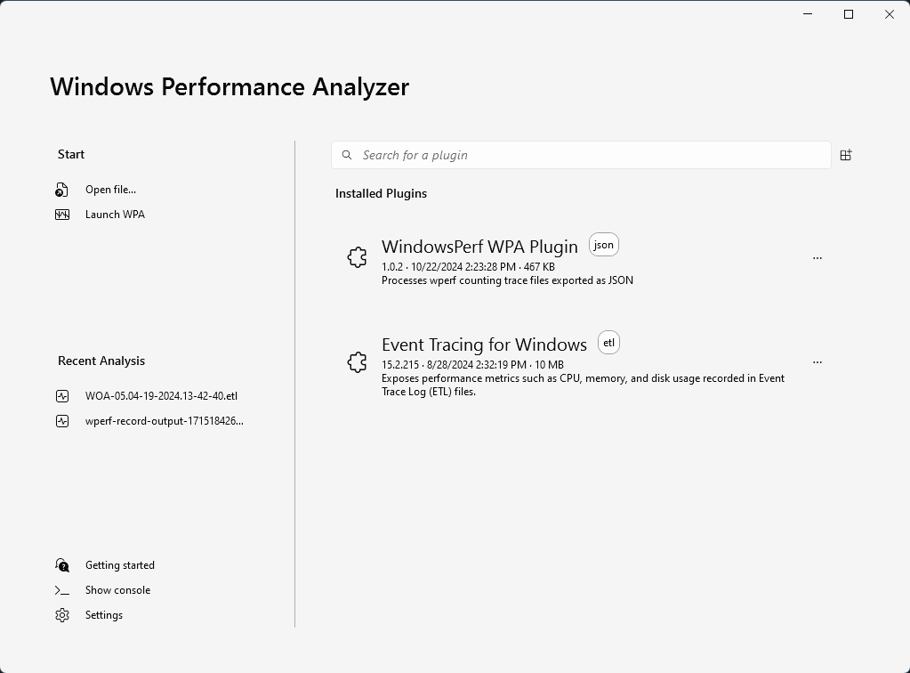
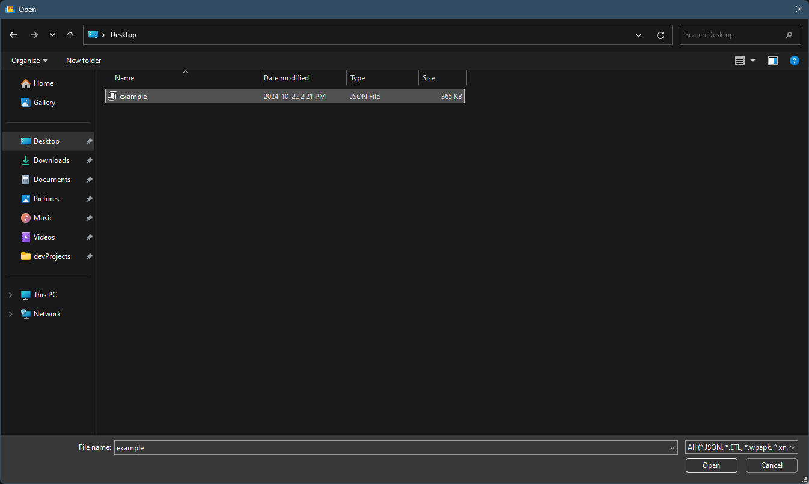
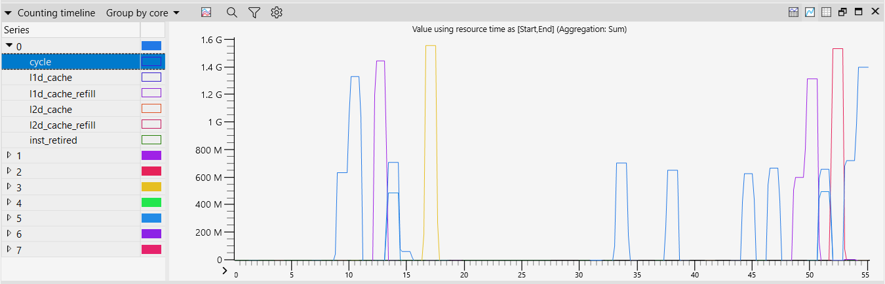
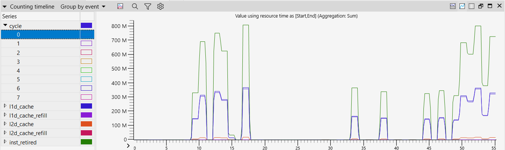
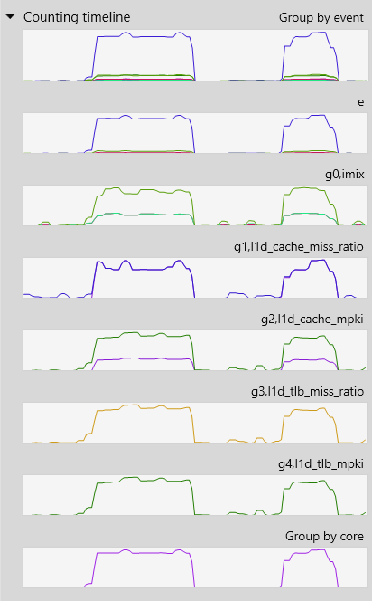
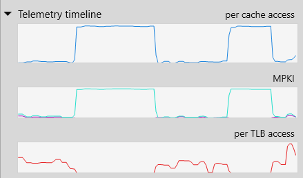
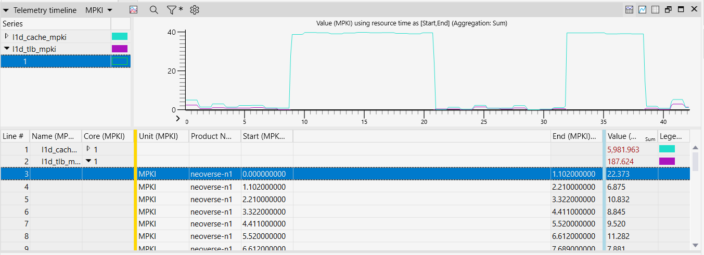

## Before you begin

The Windows Performance Analyzer (WPA) plugin connects WindowsPerf to the Windows Performance Analyzer. 

Before trying WPA with the WPA plugin, you need to install the following software on your Windows on Arm computer:

- [WindowsPerf](/install-guides/wperf/)
- [WPA plugin](/install-guides/windows-perf-wpa-plugin/)

The WPA plugin install guide includes the installation of WPA.

## Using WindowsPerf data in WPA 

In order to use WPA with WindowsPerf, you need to create a `.json` file which is created from a WindowsPerf `wperf stat` command running on a Windows on Arm machine.

You can save a `.json` output from WindowsPerf by using the `--output` command followed by the filename.

1. Create a `.json` file

    To create a file named `example.json`, run the following command:

    ```console
    wperf stat -e ld_spec --timeout 5 --json --output example.json
    ```
    Note: This command won't finish automatically. You can use Ctrl+C to terminate it after it has run for 5-10 seconds.

2. Open Windows Performance Analyzer, and see the following window:

    

    Confirm the `WindowsPerf WPA Plugin` appears under the Installed Plugins section. 

3. Open the `.json` file

    Click "Open file..." from the start menu on the left side and select the `example.json` file.

    

    When you click `Open`, the output file is checked for compatibility with the WPA plugin, and the main WPA window opens up.

### Timeline

The WindowsPerf timeline feature (command line option -t) enables continuous counting of Performance Monitoring Unit (PMU) events.

You can specify sleep intervals (with -i) between counts and set the number of repetitions (with -n), allowing for detailed and flexible data collection.

You can use WPA to visualize PMU events in the recorded data. 

To try the timeline feature, run the command:

```command 
wperf stat -m dcache -c 0,1,2,3,4,5,6,7 -t -i 0 -n 10 --timeout 2 --json --output example2.json
```

Note: above command will run for ~20 seconds.

Open the generated output (`.json` file) in WPA to see the graph:



You can change the default grouping from `Group by core` to `Group by event` and see the following graph:



The WPA plugin also generates a graph per event note in order to provide a more in-depth grouping of events. 

To see all the generated graphs you can expand the `Counting timeline` section in the graph explorer section of WPA.

Before you run another `wperf` command with different options, you use use `wperf -list` to find out supported metrics in your machine.

```console 
wperf stat -t -i 0 -n 10 -m imix,l1d_cache_miss_ratio,l1d_cache_mpki,l1d_tlb_miss_ratio,l1d_tlb_mpki -e inst_spec,vfp_spec,ld_spec,st_spec -c 1 --timeout 2 --json --output example3.json
```

Note: above command will run for ~20 seconds.

The graph after opening the `.json` file is shown below:



You can double click on any graph to expand it under the Analysis tab for further data visualization. 

### Telemetry

The WPA Plugin also provides visualization of [Arm telemetry metrics](https://developer.arm.com/documentation/109542/0100/About-Arm-CPU-Telemetry-Solution).

To visualize telemetry, run the following command:

```console 
wperf stat -t -i 0 -n 10 -m imix,l1d_cache_miss_ratio,l1d_cache_mpki,l1d_tlb_miss_ratio,l1d_tlb_mpki -e inst_spec,vfp_spec,ld_spec,st_spec -c 1 --timeout 2 --json --output example4.json
```

Note: above command will run for ~20 seconds.

You can also see the telemetry timeline graphs under the graph explorer level in WPA. 

These graphs are generated dynamically so only the relevant metrics for the given `.json` output file are visible.



Once expanded, a more in-depth view is visible under the Analysis tab of WPA.



You now have a basic understanding of how to use `wperf` generated data in the Windows Performance Analyzer.
