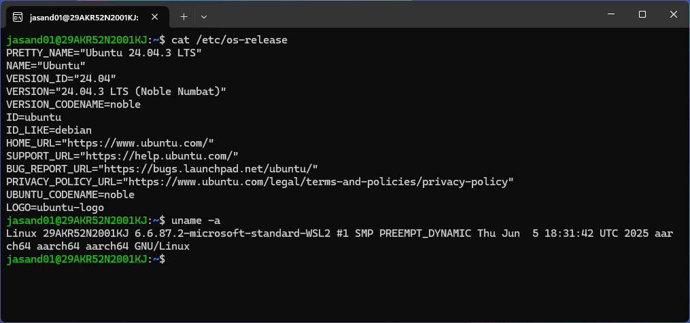

---
# User change
title: "Configure and run WSL with various Linux distributions"

weight: 2

layout: "learningpathall"
---

## Before you begin

This Learning Path assumes you have a  Windows on Arm computer such as [Windows Dev Kit 2023](https://learn.microsoft.com/en-us/windows/arm/dev-kit) or a Lenovo Thinkpad X13s laptop running Windows 11. 

WSL is useful if you are developing on Arm virtual machine instances in the cloud. It is also useful if you are developing with embedded Linux on Arm on single board computers. 

Using the same Arm architecture on your local development machine and on the cloud or your embedded board provides interoperability, consistency, and saves time. 


## Introduction to WSL 2

Software developers often use Linux for creating applications and containers. Windows on Arm includes the [Windows Subsystem for Linux 2](https://docs.microsoft.com/en-us/windows/wsl/about) (WSL 2). 

WSL 2 replaces the system call translation layer provided in WSL 1 with the latest virtualization technology to run a complete Linux kernel. WSL 2 running on a Windows on Arm computer provides a complete Linux kernel and supports many Arm Linux distributions. 

WSL 2 can run containers for application development. WSL 2 provides much faster file I/O compared to WSL 1.

## Install WSL 2

Installing WSL 2 requires Windows 11. It is also possible to install WSL 2 on certain Windows 10 versions, but these instructions were tested on Windows 11. Windows 11 is recommended to complete all of the examples in this Learning Path. All of the examples have been tested using WSL 2. If only WSL is specified it means WSL 2.

Here is the short version on how to install WSL 2. Microsoft documentation provides a [quickstart](https://docs.microsoft.com/en-us/windows/wsl/install-win10) with full details on how to install WSL 2. There are also numerous tutorials available (for non-Arm architectures).

There are three steps to setup WSL 2.

1. Enable Windows features

Open “Turn Windows features on or off” in the Windows control panel and make sure “Virtual Machine Platform” and “Windows Subsystem for Linux” are checked. 


2. Download WSL

Download and install WSL 2 from the [Microsoft Store](https://apps.microsoft.com/store/detail/windows-subsystem-for-linux-preview/9P9TQF7MRM4R).

3. Set the default version to WSL 2

Open a Windows PowerShell or Command Prompt and run the command:

```console
wsl --set-default-version 2
```

The output from this command will look like:

```output
For information on key differences with WSL 2 please visit https://aka.ms/wsl2
The operation completed successfully.
```

## Install a Linux distribution

Once WSL 2 is installed, the Microsoft store is the easiest place to find a Linux distribution. [Installing Ubuntu 22.04](https://apps.microsoft.com/store/detail/ubuntu-22041-lts/9PN20MSR04DW) is quick and easy from the store. 

There are other Linux distributions available in the Microsoft Store. Make sure to select the ones that work on Arm. Some do not work and it may be some trial-and-error to identify those that work on Arm.

Another way to install Linux distributions is using the WSL command. 

Open a Windows PowerShell or Command Prompt and list the distributions available:

```cmd 
wsl --list --online
```

The output will list the available distributions:

```output
NAME                   FRIENDLY NAME
Ubuntu                 Ubuntu
Debian                 Debian GNU/Linux
kali-linux             Kali Linux Rolling
Ubuntu-18.04           Ubuntu 18.04 LTS
Ubuntu-20.04           Ubuntu 20.04 LTS
Ubuntu-22.04           Ubuntu 22.04 LTS
Ubuntu-24.04           Ubuntu 24.04 LTS
openSUSE-Tumbleweed    openSUSE Tumbleweed
```

Install a distribution from this list:

```cmd
wsl --install Ubuntu
```

Be patient, the progress may stay on 0 for a bit.

After installation, each Linux distribution will have an icon on the Windows application menu. Use this icon to start WSL with the Linux distribution. 

A new window should open with a Linux shell. 



## Use Windows terminal

Windows Terminal is a great way to use WSL. It can be installed from the [Microsoft Store](https://apps.microsoft.com/store/detail/windows-terminal/9N0DX20HK701). The [repository is on GitHub](https://github.com/microsoft/terminal). 

Windows Terminal supports multiple command lines: PowerShell, Command Prompt, and WSL Linux. It is very configurable.

## Run bash.exe

From Windows, Bash can be used to run commands in WSL.

You can enter the default WSL distribution by running bash from a Windows Command Prompt:

```cmd
bash.exe
```

You can exit Bash and return back to the Windows Command Prompt with:

```cmd
exit
```

Use the `-c` option to `bash.exe` to run a command in WSL and collect the result. 

For example, to list the contents of /usr/bin in WSL from a Windows Command Prompt run:

```cmd
bash.exe -c "ls /usr/bin"
```

## WSL command line options

Here is a quick review the  WSL command line options.

Print the usage information and see the command line arguments:

```console
wsl --help
```

List the installed distributions: 

```console
wsl --list
```

List only the running distributions:

```console
wsl --list --running
```

Terminate a running distribution:

```console
wsl --terminate Ubuntu-22.04
```

Shutdown all running distributions:

```console
wsl --shutdown
```

Unregister the Linux distribution and delete the filesystem:

```console
wsl --unregister Ubuntu-22.04
```

Update WSL to the latest version:

```console
wsl --update
```

Start the default distribution:

```console
wsl
```
