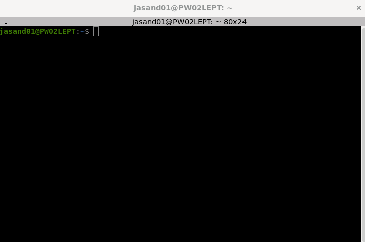

## Run graphical Linux applications

On Windows 11, you can run graphical Linux applications by installing and running them from the Linux command line.

For example, install the Linux terminator application on Ubuntu 22.04:

```bash
sudo apt-get update
sudo apt install terminator -y
```

Run the application:

```bash
terminator &
```

A new terminal window will appear on your Windows desktop. 



Linux applications will appear on the Windows taskbar with a small penguin. You can pin them to the taskbar and add icons to the applications menu.

Windows runs a containerized Linux with XServer, Wayland, and Pulse Audio. 

To inspect the Linux environment variables:

```console
echo $WAYLAND_DISPLAY
echo $PULSE_SERVER
echo $DISPLAY
```
Graphical Linux applications have seamless copy/paste with Windows making them easier to use.
