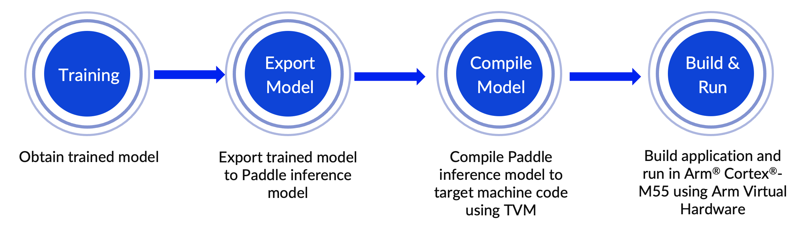
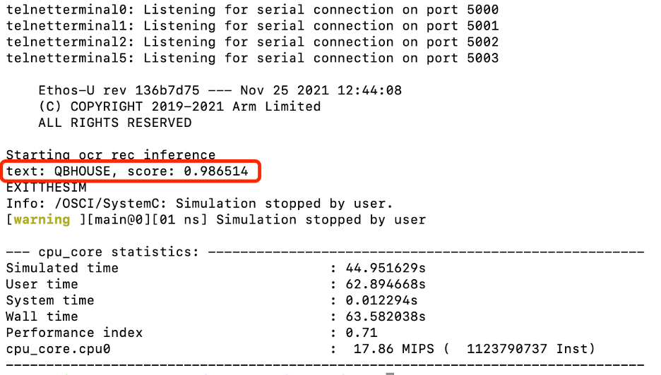

---
# User change
title: "End-to-end workflow"

weight: 5 # 1 is first, 2 is second, etc.

# Do not modify these elements
layout: "learningpathall"
---

# End-to-end workflow



## 1. Train an English text recognition model with PaddleOCR
PaddleOCR provides many practical OCR tools that help users train models and apply them into practice. PaddleOCR uses configuration files(.yml) to control network training and evaluation parameters. In the configuration file, you can set the parameters for building the model, optimizer, loss function, and model pre- and post-processing. PaddleOCR reads these parameters from the configuration file, and then forms a complete training process to complete the model training. Fine-tuning can also be completed by modifying the parameters in the configuration file, which is simple and convenient. Refer to the [Configuration file](https://github.com/PaddlePaddle/PaddleOCR/blob/release/2.5/doc/doc_en/config_en.md) for a more verbose description. 

In order to obtain the trained model adapted for Cortex-M, we need to modify the [configuration file](https://github.com/PaddlePaddle/PaddleOCR/blob/dygraph/configs/rec/PP-OCRv3/en_PP-OCRv3_rec.yml) used for model training. Unsupported operators, for example LSTM, are removed. Meanwhile, to optimize the model, we use BDA (Base Data Augmentation) in the model tuning phase, which includes multiple basic data enhancement methods such as random cropping, random blurring, random noise, and image inversion. Before you start, you need to install the PaddleOCR tool first. You can refer to PaddleOCR [Quick Start guide](https://github.com/PaddlePaddle/PaddleOCR/blob/release/2.5/doc/doc_en/quickstart_en.md) for more details.

```console
# Architecture part modification of en_PP-OCRv3_rec.yml file
Architecture:
  model_type: rec
  algorithm: SVTR
  Transform:
  Backbone:
    name: MobileNetV1Enhance
    scale: 0.5
    last_conv_stride: [1, 2]
    last_pool_type: avg
  Neck:
    name: SequenceEncoder
    encoder_type: reshape
  Head:
    name: CTCHead
    mid_channels: 96
fc_decay: 0.00002
```

```console
# Train part modification of en_PP-OCRv3_rec.yml file
Train:
  dataset:
    name: LMDBDataset
    data_dir: MJ_ST
    ext_op_transform_idx: 1
    transforms:
    - DecodeImage:
        img_mode: BGR
        channel_first: false
    - RecAug:
    - CTCLabelEncode:
    - RecResizeImg:
        image_shape: [3, 32, 320]
    - KeepKeys:
        keep_keys:
        - image
        - label
        - length
...
```
In this example, we use the open-source datasets [MJSynth](http://www.robots.ox.ac.uk/~vgg/data/text/) and [SynthText](http://www.robots.ox.ac.uk/~vgg/data/scenetext/) (MJ+ST) and train the model with the following command. The model training period is closely related to the training environment and the size of the dataset. Configure it according to your own situation.

```console
python3 tools/train.py -c configs/rec/PP-OCRv3/en_PP-OCRv3_rec.yml -o \ 
Global. save_model_dir=output/rec/ \
Train.dataset.name=LMDBDataSet \
Train.dataset.data_dir=MJ_ST \
Eval.dataset.name=LMDBDataSet \
Eval.dataset.data_dir=EN_eval
```

## 2. Export Paddle inference model
We must export the trained text recognition model to a Paddle inference model that we can compile to generate code which is suitable to run on a Cortex-M processor. Use the following command to export the Paddle inference model:

```console
python3 tools/export_model.py \
-c configs/rec/PP-OCRv3/en_PP-OCRv3_rec.yml -o \ 
Global.pretrained_model=output/rec/best_accuracy.pdparams \
Global.save_inference_dir=output/rec/infer
```
You can use PaddleOCR toolkit to verify the inference model with the following command. It usually takes some time to train the model. So for your convenience to experience the complete workflow, you can download an English text recognition model trained and exported by us directly at [https://paddleocr.bj.bcebos.com/tvm/ocr_en.tar](https://paddleocr.bj.bcebos.com/tvm/ocr_en.tar)(named as ocr_en.tar).

```console
python3 tools/infer/predict_rec.py --image_dir="path_to_image/word_116.png" \
--rec_model_dir="path_to_infer_model/ocr_en" \ 
--rec_char_dict_path="ppocr/utils/en_dict.txt" \
--rec_image_shape="3,32,320"
```

")

We use Figure 4 as a single example of the kind of image you can use to verify the inference results. The recognition results can be seen as follows. It is consistent with the picture text content ‘QBHOUSE’ and has a high confidence score around 0.9867. This indicates that our inference model is ready for the next step.

```console
Predicts of path_to_word_116.png:('QBHOUSE', 0.9867456555366516)
```

## 3. Compile Paddle inference model with TVMC
We use the deep learning complier [TVM](https://tvm.apache.org/) for model conversion and adaptation. TVM is an open-source deep learning compiler, which is mainly used to solve the adaptability problem of deploying various Deep Learning frameworks on a wide range of hardware targets. Seen in Figure 5, the TVM compiler accepts models written by classic deep learning training frameworks such as PaddlePaddle and converts them into code that can run inference tasks on the target device.


We use the TVM Python application TVMC to compile the model. You can use the following command to compile the Paddle inference model. By specifying `--target=cmsis-nn,c`, the operators supported by Arm’s [CMSIS-NN](https://github.com/ARM-software/CMSIS_5/tree/develop/CMSIS/NN) library will be offloaded to a CMSIS-NN kernel. It can make the best use of underlying Arm hardware acceleration. Otherwise, it falls back to standard C library implementations. By specifying `--target-cmsis-nn-mcpu=cortex-m55` and `--target-c-mcpu=cortex-m55`, it compiles the code that is suitable for running on [Cortex-M55](https://www.arm.com/products/silicon-ip-cpu/cortex-m/cortex-m55) processor. For more specific descriptions of each parameter, you can use the command `tvmc compile --help` after you install the TVM Python package.

```console
python3 -m tvm.driver.tvmc compile \
path_to_infer_model/ocr_en/inference.pdmodel \
--target=cmsis-nn,c \
--target-cmsis-nn-mcpu=cortex-m55 \
--target-c-mcpu=cortex-m55 \
--runtime=crt \
--executor=aot \
--executor-aot-interface-api=c \
--executor-aot-unpacked-api=1 \
--pass-config tir.usmp.enable=1 \
--pass-config tir.usmp.algorithm=hill_climb \
--pass-config tir.disable_storage_rewrite=1 \
--pass-config tir.disable_vectorize=1 \
--output-format=mlf \
--model-format=paddle \
--module-name=rec \
--input-shapes x:[1,3,32,320] \
--output=rec.tar
```

After compilation, the model file can be found at the directory specified by parameter `--output`. In this example, it ends up in a file called `rec.tar` in the current directory. 

## 4. Deploy on the AVH Corstone-300 platform with Arm Cortex-M55
Use the ssh command to connect to the AVH AMI instance you launched beforehand, and you can see the terminal interface below. It shows that you have logged in successfully.


The steps of model training, exporting, and compiling described in 1-3 can be completed on the local machine or in the AVH AMI environment. Determine it according to your own needs. The complete [sample code](https://github.com/ArmDeveloperEcosystem/Paddle-examples-for-AVH/tree/main/OCR-example), that you can run from the command line, is available to download from [ArmDeveloperEcosystem](https://github.com/ArmDeveloperEcosystem/Paddle-examples-for-AVH) GitHub repository as well as [PaddleOCR](https://github.com/PaddlePaddle/PaddleOCR/tree/dygraph/deploy/avh)’s GitHub repository (under the dygraph branch). This makes it easier for developers to experience the whole workflow, especially the deployment.

After you connect to the AVH AMI instance successfully, you can complete model deployment and view application execution results with the following command.

```console
git clone https://github.com/ArmDeveloperEcosystem/Paddle-examples-for-AVH.git
cd Paddle-examples-for-AVH/OCR-example
./run_demo.sh
```
The [run_demo.sh](https://github.com/ArmDeveloperEcosystem/Paddle-examples-for-AVH/blob/main/OCR-example/run_demo.sh) script automates the entire process we have just described. It takes the following 6 steps to help you automatically build and execute the English text recognition application on Corstone-300 platform with Arm Virtual Hardware.

- Step 1. Set up running environment
- Step 2. Download PaddlePaddle inference model
- Step 3. Use TVMC to compile the model and generate code for the Arm Cortex-M processor
- Step 4. Process resources for building the application image
- Step 5. Use the Makefile to build the target application
- Step 6. Run application binary on Corstone-300 platform integrated in AVH

We can use the image in Figure 4 above (QBHOUSE) as an example to verify the inference results on the AVH Corstone-300 platform with Arm Cortex-M55. The results can be seen as Figure 7 which is highly consistent with the inference results of direct inference on server host. It shows we have successfully deployed PP-OCRv3 English recognition model directly on Arm Cortex-M.

