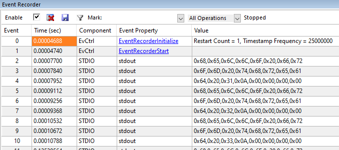
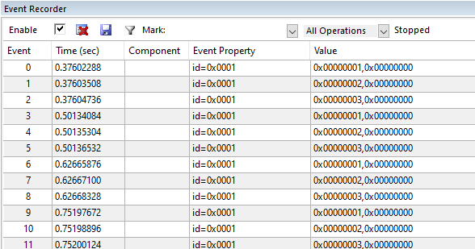
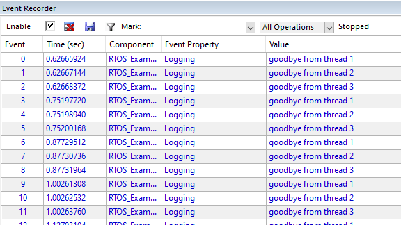
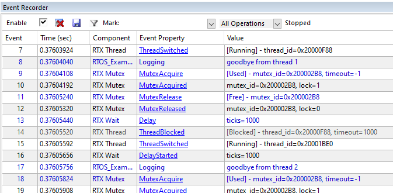

---
# User change
title: "Using Event Recorder"

weight: 6 # 1 is first, 2 is second, etc.

# Do not modify these elements
layout: "learningpathall"
---
We saw in the last section that Keil MDK does not support semihosting.

[Event Recorder](https://www.keil.com/pack/doc/compiler/EventRecorder/html/index.html) can be used instead for the printf functionality. It is supported for both FVPs and real hardware.

Event recorder functionality can be further extended by the Keil MDK [Component Viewer](https://www.keil.com/pack/doc/compiler/EventRecorder/html/cv_use.html). Annotations can be made in the application code or software component libraries. These annotations are stored in an `event buffer`.

{}
Event Recorder and Component Viewer are not supported. This section can be ignored.
{}

## Manage run-time environment

Open the `Manage run-time environment` dialog, and enable `Compiler` > `Event Recorder` (`DAP` variant).

Enable `Compiler` > `I/O` > `STDOUT`, and set to `EVR` (Event recorder) mode.

Click `OK` to save.

## Add Event Recorder to main

Add a function call to initialize the `event recorder`. Open `main.c` in the editor.

Include the header file:
```C
#include "EventRecorder.h"
```
Add this function call to `main()`, before `osKernelInitialize()`:
```C
	EventRecorderInitialize (EventRecordAll, 1);	// initialize and start Event Recorder
```
## Set the event buffer

The event buffer must be located in an uninitialized region of writable memory.

Edit the scatter file, creating a new execution region (after `ARM_LIB_STACK`):
```text
	EVENT_BUFFER 0x20060000 UNINIT 0x10000 {EventRecorder.o (+ZI)}
```
If you get a link-time warning:
```text
Warning: L6314W: No section matches pattern EventRecorder.o(ZI).
```
Verify that `Link-time optimization` was disabled in `C/C++ (AC6)` tab in the `Target Options` dialog.

## Build and run the example

Save all files, and `build` (`F7`) the example.

Click `Debug` (`Ctrl+F5`), then `Run` (`F5`) to start the application.

The thread output is now displayed in the `printf viewer`:
```
hello from thread 1
hello from thread 2
hello from thread 3
hello from thread 1
hello from thread 2
...
```
## Event recorder view

Use the menu (`View` > `Analysis Windows` > `Event Recorder`) to open the viewer.

Observe that printf output is in the form of the ASCII codes of the text output.



For this view it is better to use [EventRecorder Data](https://www.keil.com/pack/doc/compiler/EventRecorder/html/group__EventRecorder__Data.html) rather than printf statements.

## EventRecorder Data

Edit the `threads.c` file, and include the header file:
```C
#include "EventRecorder.h"
```
Add call in each thread to `EventRecord2()` with the thread number as the second parameter, for example:
```C
void __attribute__((noreturn)) thread2(void *argument){
	for(;;){
		printf("hello from thread2\n");
		osDelay(1000);
		EventRecord2 (1+EventLevelAPI, 2, 0);
	}
}
```
Save all files, and `rebuild` (`F7`) the example.

Click `Debug` (`Ctrl+F5`), then `Run` (`F5`) to start the application.

Observe the events in the Event Recorder viewer. Use the filter to hide `STDIO` events, which shall remove the printf strings.

The thread number is output as the first `Value`:



## Component Viewer

To make these events more meaningful in the Event Recorder viewer, use the Component Viewer functionality.

Create a [Component Viewer Description File](https://www.keil.com/pack/doc/compiler/EventRecorder/html/SCVD_Format.html) (e.g. `rtos.scvd`) with the following:
```xml
<?xml version="1.0" encoding="utf-8"?>
 
<component_viewer schemaVersion="0.1" xmlns:xs="http://www.w3.org/2001/XMLSchema-instance" xs:noNamespaceSchemaLocation="Component_Viewer.xsd">
  <component name="MyExample" version="1.0.0"/>    <!-- name and version of the component  -->
 
    <events>
      <group name="My Events Group">
         <component name="EVR_Demo" brief="RTOS_Example" no="0x00" prefix="EvrNetMM_" info="Demo"/>
      </group>  
 
      <event id="1" level="API" property="Logging" value="goodbye from thread %d[val1]" info="Example output"  />
	  </events>
 
</component_viewer>
```
Exit the debugger, and return to `Target Options` > `Debug`, and click `Manage Component Viewer Description Files`.

Click `Add Component Viewer Description File`, and browse for the above. Save the settings.

Click `Debug` (`Ctrl+F5`), then `Run` (`F5`) to start the application.

Observe these events in the Event Recorder viewer, optionally filtering out `STDIO`.



## Observe RTX events in the Event Viewer

The RTX source contains many Event Recorder annotations. To see these events in the viewer, return to the IDE, and open the `Manage run-time environment` dialog.

Enable `CMSIS` > `RTOS2 (API)` > `Keil RTX5`, but now select `Source` variant. Click `OK` to save. Rebuild the application.

Click `Debug` (`Ctrl+F5`), then `Run` (`F5`) to start the application.

Observe the events in the viewer, filtering as appropriate.

If no RTOS events are visible, verify that they are enabled in `Target Options` > `Debug` > `Manage Component Viewer Description Files`.


