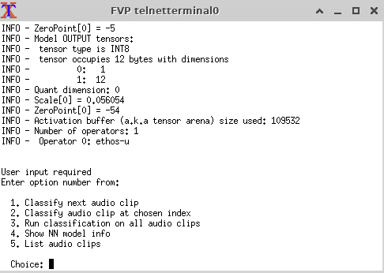

---
# User change
title: "Using the ML Evaluation Kit"

weight: 2 # 1 is first, 2 is second, etc.

# Do not modify these elements
layout: "learningpathall"
---

The [Arm ML Evaluation Kit (MLEK)](https://review.mlplatform.org/plugins/gitiles/ml/ethos-u/ml-embedded-evaluation-kit) provides a number of ready-to-use ML applications. These allow you to investigate the embedded software stack and evaluate performance on the Cortex-M55 and Ethos-U55 processors.

You can use the MLEK source code to build sample applications and run them on the [Corstone-300](https://developer.arm.com/Processors/Corstone-300) Fixed Virtual Platform (FVP).

## Before you begin 

You can use your own Ubuntu Linux host machine or use [Arm Virtual Hardware (AVH)](https://www.arm.com/products/development-tools/simulation/virtual-hardware) for this Learning Path.

The Ubuntu version should be 20.04 or 22.04. The `x86_64` architecture must be used because the Corstone-300 FVP is not currently available for the Arm architecture. You will need a Linux desktop to run the FVP because it opens graphical windows for input and output from the software applications. 

If you want to use Arm Virtual Hardware the [Arm Virtual Hardware install guide](/install-guides/avh#corstone) provides setup instructions.

### Compilers 

The examples can be built with [Arm Compiler for Embedded](https://developer.arm.com/Tools%20and%20Software/Arm%20Compiler%20for%20Embedded) or [Arm GNU Toolchain](https://developer.arm.com/Tools%20and%20Software/GNU%20Toolchain). 

Use the install guides to install the compilers on your computer:
- [Arm Compiler for Embedded](/install-guides/armclang/)
- [Arm GNU Toolchain](/install-guides/gcc/#Arm-GNU)

Both compilers are pre-installed in Arm Virtual Hardware. 

### Corstone-300 FVP {#fvp}

To install the Corstone-300 FVP on your computer refer to the [install guide for Arm Ecosystem FVPs](/install-guides/ecosystem_fvp/). 

The Corstone-300 FVP is pre-installed in Arm Virtual Hardware. 

## Clone the repository

1. Install `virtualenv` to create Python virtual environments:

```console
sudo apt update
sudo apt install python3-venv -y
```

2. Clone the ML Evaluation Kit repository, and navigate into the new directory:

```console
git clone "https://review.mlplatform.org/ml/ethos-u/ml-embedded-evaluation-kit"
cd ml-embedded-evaluation-kit
git submodule update --init
```

## Build the example applications

The default compiler is `gcc`, but `armclang` can also be used. 

You can select either compiler to build applications. You can also try them both and compare the results. 

- Build with Arm GNU Toolchain (`gcc`)

```
./build_default.py
```

- Build with Arm Compiler for Embedded (`armclang`)

```console
./build_default.py --toolchain arm
```

The build will take a few minutes. 

When the build is complete, you will find the example images (`.axf` files) in the `cmake-build-*/bin` directory. The `cmake-build` directory names are specific to the compiler used and Ethos-U55 configuration.

## Run an example

To run an example on the Corstone-300 FVP target, run the FVP executable and use `-a` to specify the software application.

To run the key word spotting example `ethos-u-kws.axf` compiled with `gcc` use:

- on your computer with the FVP installed

```console
FVP_Corstone_SSE-300_Ethos-U55 -a cmake-build-mps3-sse-300-ethos-u55-128-gnu/bin/ethos-u-kws.axf
```

- on Arm Virtual Hardware

```console
VHT_Corstone_SSE-300_Ethos-U55 -a cmake-build-mps3-sse-300-ethos-u55-128-gnu/bin/ethos-u-kws.axf
```

{}
It may take some time to initialize the model, please be patient. 

If you see warnings regarding loading the image, these can likely be ignored.
{}

When the example is running, a telnet instance will open allowing you to interact with the example.

Use the menu to control the application. For the key word spotting application enter 1 to classify the next audio clip.



The results of the classification will appear in the visualization window of the FVP. 

The display shows a 98% chance of the audio clips sound was down.


End the simulation by pressing Control-C in the terminal where to started the FVP.

## Setting model parameters 

You can specify additional parameters to configure certain aspects of the simulated Corstone-300.

### List parameters

List the available parameters by running the FVP executable with the `--list-params` option, for example:

```console
FVP_Corstone_SSE-300_Ethos-U55 --list-params > parameters.txt
```

{}
If you are running with Arm Virtual Hardware substitute `VHT_Corstone_SSE-300_Ethos-U55` as the executable name.
{}

Open the file `parameters.txt` to see all of the possible parameters and the default values. 

### Set parameters

Individual parameters can be set with the `-C` command option. 

For example, to put the Ethos-U component into fast execution mode:

```console
FVP_Corstone_SSE-300_Ethos-U55 -a ethos-u-kws.axf -C cmake-build-mps3-sse-300-ethos-u55-128-gnu/bin/ethosu.extra_args="--fast"
```

To set multiple parameters it is easier to list them in a text file (without `-C`) and use `-f` to specify the file.

For example, use a text editor to create a file named `options.txt` with the contents:

```console
mps3_board.visualisation.disable-visualisation=1
ethosu.extra_args="--fast"
```

Run the FVP with the `-f` option and the `options.txt` file:

```console
FVP_Corstone_SSE-300_Ethos-U55 -a cmake-build-mps3-sse-300-ethos-u55-128-gnu/bin/ethos-u-kws.axf -f options.txt
```

Full instructions are provided in the evaluation kit [documentation](https://review.mlplatform.org/plugins/gitiles/ml/ethos-u/ml-embedded-evaluation-kit/+/HEAD/docs/quick_start.md).

## Next steps

The ML Evaluation Kit provides some stand alone examples. These building blocks have been integrated into complete software stacks in the [Open-IoT-SDK](https://github.com/ARM-software/open-iot-sdk).
