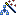
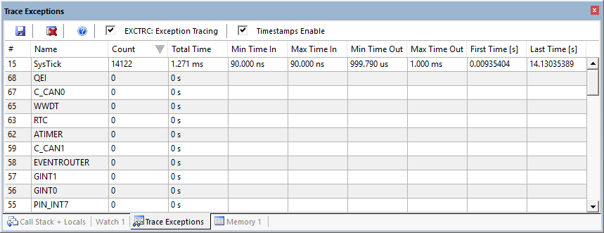
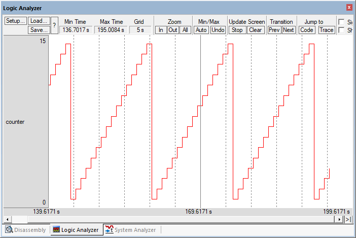
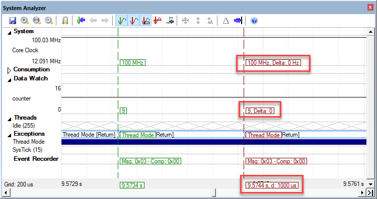

---
# User change
title: "Debug using Serial Wire Viewer"

weight: 4 # 1 is first, 2 is second, etc.

# Do not modify these elements
layout: "learningpathall"
---

## Debug using Serial Wire Viewer (SWV)

**Serial Wire Viewer (SWV)** provides program information in real-time and is extremely useful in debugging applications. SWV is used to display data reads and writes and exceptions which include interrupts and more.

{}
- SWV is not supported in simulation mode.
- Connect a debug adapter to real target hardware.
{}

#### What types of data can the Serial Wire Viewer display?

1. Global variables.
2. Static variables.
3. Structures.
4. Can see Peripheral registers – just read or write to them. The same is true for memory locations.
5. Can see executed instructions. SWV only samples them. Use ETM to capture all instructions executed.
6. CPU counters. Folded instructions, extra cycles and interrupt overhead.

#### What types of data can the Serial Wire Viewer not display?

1. Can’t see local variables (just make them global or static).
2. Can’t see register operations. PC Samples records some of the instructions but not the data values.
3. SWV can’t see DMA transfers. This is because by definition these transfers bypass the CPU. SWV and ETM can only see CPU actions.

#### Configure the Target Driver Setup to use Serial Wire Viewer

μVision must be running in edit mode and the project must be loaded. The hardware must be connected to the PC.

1. Go to  **Project - Options for Target... (Alt+F7)** and switch to the **Debug** tab.
2. On the right-hand side, select your debug adapter and click on **Settings**. The **Target Driver Setup** window opens.
3. Select the **Trace** tab:  
   
4. In **Core Clock:** enter the correct core clock of your target device. This value will be used for calculating timing values.
5. If your device runs a different trace clock, you might need to unselect **Use Core Clock** and enter the correct trace clock speed. The SWO clock speed will be calculated from this. This value is crucial for a ULINK2/ULINKplus or J-Link as a UART is used. ULINKpro does not use this for the connection.
4. Select Trace Enable. 
7. Confirm that **EXCTRC: Exception Tracing** is selected. The enables exceptions (including interrupts) to be output to the μVision debugger for display.
8. SWV is now configured and ready to use.
10. Click **OK** twice to return to the main μVision menu.

{}
- For details determining the core clock speed, refer to [App Note 297](https://developer.arm.com/documentation/kan297/latest/).
- μVision uses the core clock value to calculate various timing displays even if SWV is not used. If the times displayed in various windows are incorrect, check these settings.
{}

#### Display Exceptions and Interrupts in the Trace Exceptions Window

The [**Trace Exceptions**](https://developer.arm.com/documentation/101407/latest/Debugging/Debug-Windows-and-Dialogs/Trace-Exceptions) window displays statistical data about the traced exceptions and interrupts.

1.  **Start a Debug Session (Ctrl+F5)** to enter the µVision debugger.
5. Go to **View - Trace** and select **Trace Exceptions**.
1.  **Run (F5)** the application.  
3. In this window, click on the Count column name to bring 15 SysTick into view:  
   
4. The values are updating while the application runs. Unselect EXCTRC: box to stop the updates.
5. Various statistics are displayed. Any other active exceptions will automatically be displayed (not in this example).
6. *Period*=14.13/14122 = 1 ms. Thus, the SysTick is generating an interrupt every millisecond.

#### Display Exceptions and Interrupts in the Trace Data Window

The [**Trace Data**](https://developer.arm.com/documentation/101407/latest/Debugging/Debug-Windows-and-Dialogs/Trace-Data-Window) window shows the history of executed instructions for Cortex-M devices.

1. Go to **View - Trace** and select **Trace Data**.
1.  **Run (F5)** the application and stop is after a little while.
3. The **SysTick** exception is shown in Trace Data:  
   
5. It is displayed with Entry, Exit and Return points:  
   **Entry**: when the exception or interrupt is entered.  
   **Exit**: when the exception or interrupt exits.  
   **Return**: when all exceptions or interrupts exit. This indicates that no Cortex tail chaining is occurring. 

### Logic Analyzer

μVision has a graphical [**Logic Analyzer (LA)**](https://developer.arm.com/documentation/101407/latest/Debugging/Debug-Windows-and-Dialogs/Logic-Analyzer) window. Up to four variables can be displayed in real-time using Serial Wire Viewer. Logic Analyzer data points occur when the events happen with each data write and not periodically like the **Watch** or **Memory** windows. If an SWV overload occurs, turn off unnecessary SWV features. You could sample the data writes with another variable and then display it. The idea is to reduce SWO traffic to prevent overflows and data loss.

LA shares the comparators in CoreSight with the **Watchpoints**. They are mutually exclusive.

1. In the µVision debugger, right-click on any occurrence of the `counter` variable in blinky.c and select **Add ‘counter’ to …** and select **Analyzer**. The LA will open.
3. In the LA, click on **Setup**. In **Display Range** set **Max:** to 0x0F. Click on **Close**. The LA is now configured. You can also configure LA while the program is running.
4.  **Run (F5)** the application. 
5. `counter` will still be visible in Watch 1 but also shown in LA:  
   
6. Adjust the Zoom using **Out** or the **All** icon in the LA to provide a suitable scale. If no waveform is displayed in the LA, exit and re-enter debug mode to refresh the comparators.
7. Enable **Amplitude**, **Signal Info** and **Cursor** in the LA window.
8. Select  **Stop** in the Update Screen to stop the LA from collecting data. The program keeps running.
9. Click on a spot in the LA and position the mouse to demonstrate the method used to measure
timing values:  
   

{}
- When you enter a variable in the Logic Analyzer window, it is also displayed in the Trace Records (or Trace Data for ULINKpro). A ULINK2, ULINKplus or ULINKpro displays the data writes. J-Link does not. ULINKplus and ULINKpro also display any LA waveforms in  **System Analyzer** window.
- If no waveform is displayed in the LA, exit and reenter Debug mode to refresh the comparators.
- If a waveform jagged, this can be from overloads in the SWO pin. Solutions are getting a faster debug adapter such as ULINKplus or ULINKpro. Turning off various SWV signals such as EXCTRC that are not needed can help. A Keil ULINKpro has the ability to receive SWV frames out the 4 bit + clock Trace Port instead of the 1 bit SWO pin like the other adapters which has significantly greater data throughput.
- The Logic Analyzer can display static and global variables, structures and arrays. It can’t see locals: make them static or global. To see peripheral registers, enter their physical addresses into the Logic Analyzer and read or write to them. Physical addresses can be entered as:  
`*((unsigned long *)0x20000000)`.
- An error message saying `counter` cannot be added usually means SWV is not configured or `counter` is not in focus.
{}

### Full System Analysis with System Analyzer

[**System Analyzer**](https://developer.arm.com/documentation/101407/latest/Debugging/Debug-Windows-and-Dialogs/System-Analyzer) can display much information depending on which Cortex-M processor and debug adapter you are using. Use a ULINKplus to get the most out of System Analyzer. Data reads and writes, exception/interrupt events and more are displayed. ULINKplus and ULINKpro provide this information as well as a measured core clock value with ULINKplus. In this example, Event Recorder frames, Logic Analyzer `counter` and SysTick interrupts are displayed.

1. Go to **View - Analysis Windows** and select  **System Analyzer**.
1.  **Run (F5)** the application for a little while. The values are updating while the application runs. User the lock icon to stop the updates.
3. In the window, use the scroll wheel of your mouse to zoom in on **SysTick(15)** in the **Exceptions** section.
4. Use the green and red markers to verify that the SysTick interrupts are one millisecond apart and that the `counter` variable value is shown in the **Data Watch** section:  
   
4. Depending on the debug adapter you are using, you can also verify the correct **Core Clock** setting under **System**. ULINKplus is capable of measuring this value while the application is running.

#### Where are the other Events and printf?

These events are there. In this simple program these events are occurring very close together. If you expand the X axis further, the events will be displayed as shown here:  
     
You can activate the cursors and make various timing measurements.

{}
- You can measure the period between the interrupts and how long the handler took to execute. This is very useful to confirm interrupts are executing as designed.
- Use the column icon to align the waveforms.
{}
