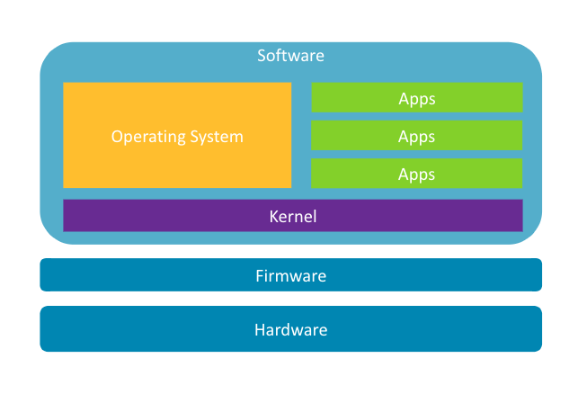

---
# User change
title: "Application Programming"

weight: 3 # 1 is first, 2 is second, etc.

# Do not modify these elements
layout: "learningpathall"
---

# The application stack

Application developers will be familiar with this traditional computing stack, whether their target devices are desktops, mobile phones, or the cloud, it would be the same. 

## Hardware

At the bottom of the stack you have the physical hardware. As an application developer, the extent that you typically care about this layer is "how much and how fast". You know your application will need some amount of CPU, RAM, and storage but beyond that you don't need to know or care about the specifics, because you'll never actually talk to the hardware directly.

## Firmware

One thing that made the PC revolution possible was the use of firmware, or BIOS, that could sit between the hardware layer and the software layer and provide a set of interfaces for communication between them. This allows a single operating system image, like Windows or Ubuntu, to be installed on any PC, without the image having to be customized for that specific PC's hardware. It's the firmware that allows the OS to boot, discover what hardware is available, and provide an interface to talk to them.

If you've ever wondered why there's not a generic Android install image that you can use for any mobile phone, this is why - mobile phones don't have this firmware layer.

## Software

The software is everything that lives on the hard drive or flash storage, and gets loaded up onto the hardware to run. Most of us don't think of it as all being the same, the kernel and your application are very different in *kind* after all. In reality, that distinction is just there to make our lives simpler and the computing stack easier to understand, the underlying hardware and firmware see it as all the same thing.

### Kernel

Every modern operating system, whether it's Windows, Mac OS, or Linux, has at its core a kernel (hence the name). The kernel is what gets loaded first by the firmware and is responsible for running all other processes, including applications and interactions between processes and the hardware. It's the kernel that will load your application's code into memory and start executing it on the CPU. It provides interfaces to access the storage (hard drive or flash) via a filesystem, interfaces to peripherals like a monitor, mouse and keyboard, and even handles memory management for you.

### Operating System

Most people think of the kernel and the operating system as the same thing but, as any long-time Linux user will know the kernel is only part of it, you also need a large collection of code, libraries and programs to make up a complete operating system. All the standard command-line tools, system services, and the like, combined with a kernel, is what you typically think of as a complete operating system.

### Application

And only now do you get to an application. An application is a collection of code, sometimes a single binary file but more often a package of files, that can be executed by the operating system. This is the space that most of us work in. It means you can largely ignore the operating system and kernel layers, and completely ignore the firmware and hardware layers.

But if you want to transition to the embedded space, things are going to look a little bit different.
