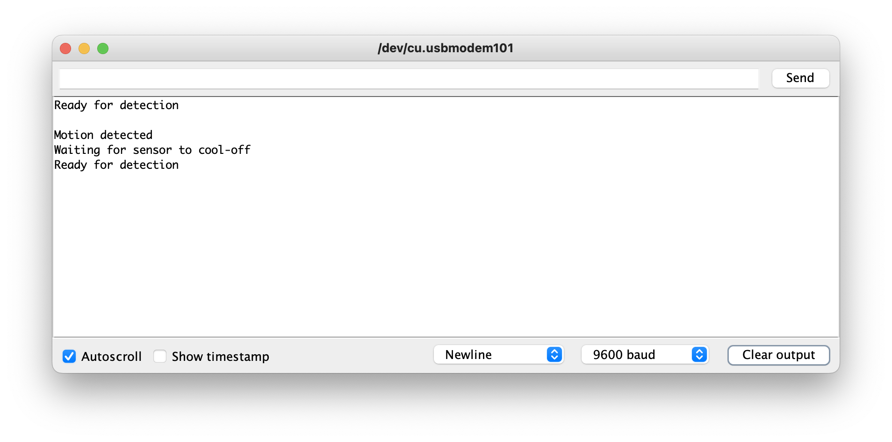

---
# User change
title: "Programming Your Smart Device Prototype"

weight: 6 # 1 is first, 2 is second, etc.

# Do not modify these elements
layout: "learningpathall"
---

## Arduino IDE

To program your device we're going to use the Arduino IDE. In addition to being a nice simple code editor, the Arduino IDE will also handle device communication for you, and will build a compatible binary executable to power your device.

Follow [this Install Guide](/content/install-guides/arduino-pico.md) to get the Arduino IDE and device packages installed on your workstation and the Arduino embedded OS installed on your Raspberry Pi Pico.

## Load the PIR Sensor sketch

This Learning Path provides a complete sketch you can upload onto your Raspberry Pi Pico. We will walk through what it does step-by-step, but first let's open it in the Arduino IDE.

1. Download the [pir_sensor.ino](./pir_sensor_1.ino) sketch to your computer
2. In the Arduino IDE, go to File -> Open
3. Find and select the `pir_sensor.ino` file you downloaded to your computer and click "Open"

## Code Walkthrough

Now, let's take a look at the code in this Sketch and see what it does.

### Define which pins your components are connected to

The first few lines define new variables that will store the number of the pins that are connected to your physical components.


```arduino {linenos=table,linenostart=2}
// This is the pin that the motion sensor is connected to
int motionPin = 28;

// This is the pin that the buzzer is connected to
int buzzerPin = 19;

// This is the pin that connects to the build-in LED
int ledPin = 25;
```

The first variable, `motionPin`, will hold the number for the data connection on your PIR sensor, which we connected to pin #28.

The second variable, `buzzerPin`, will hold the number for the peizo electric buzzer's input voltage pin, which we connected to pin #19

The last variable, `ledPin`, will hold the pin number for the LED that is built into the Raspberry Pi Pico, which is pin #25

### Define runtime variables

The next few lines defind the variables that our program will use to store its internal state.

```arduino {linenos=table,linenostart=12}
// This variable will hold the current value of the motion detection pin's charge
// LOW means no motion is detected, HIGH means motion is detected
int motionState = LOW;

// This variable will hold the read value on each iteration of the loop
int val = 0;

// This variable will keep track of how many times motion has been detected
int counter = 0;
```

The `motionState` variable will hold the value from the `motionPin` between checks, so we know what the previous value was. We default this variable to a `LOW` state, which corresponds to no motion having been detected in our program.

The `val` variable will hold the current value from the `motionPin` after each check.

Finally, the `counter` variable will hold the number of times motion was detected since the device was turned on.

### Helper functions

To make our code easier to read and maintain we've created a few helper functions we can call from our main code.

```arduino {linenos=table,linenostart=23}
// Beep the buzzer twice in quick succession
void doBeep() {
      digitalWrite(buzzerPin, HIGH); // On for 0.1 seconds
      delay(100);
      digitalWrite(buzzerPin, LOW); // Off
      delay(100);
      digitalWrite(buzzerPin, HIGH); // On for 0.2 seconds
      delay(200);
      digitalWrite(buzzerPin, LOW); // Off
}

// Turn on the built-in LED
void ledOn() {
  digitalWrite(ledPin, HIGH);
}

// Turn off the built-in LED
void ledOff() {
  digitalWrite(ledPin, LOW);
}
```

The first is `doBeep()` which will turn on and off power to our buzzer in a way that makes it play two short beeps.

The next two, `ledOn()` and `ledOff()` will set the LED pin's voltage to either `HIGH` or `LOW`, respectively, turning it either on or off.

Note that these functions use the pin variables defined at the start of the Sketch.

### Setup

Now it's time to get into the actual program. The Arduino Core software expects your Sketch to provide two functions, `setup()` and `loop()`.  The first of these, `setup()`, will be called once and only once when your device is powered on. This is where you will put code to initialize your environment and hardware. For our Sketch we will be doing both. 

```arduino {linenos=table,linenostart=45}
void setup() {
  // Here we tell the board whether a pin will be used for reading (INPUT) or writing (OUTPUT)
  
  // This lets us write text over the USB connection to the Arduino IDE
  Serial.begin(9600);

  // We will read values from the motion sensor
  pinMode(motionPin, INPUT);
  
  // We will write values to the buzzer
  pinMode(buzzerPin, OUTPUT);

  // We will write values to the built-in LED
  pinMode(ledPin, OUTPUT);
  // We default to having the LED on, indicating a ready state
  ledOn();

  Serial.println("Beginning motion detection");
}
```
First initializing the `Serial` interface so that we can write output over our USB connection. `Serial.begin(9600)` turns on the device's onboard serial interface with a baud rate of 9600 (which is low, but more than enough for writing output messages).

Next our Sketch has to tell the Arduino Core how each of our pins will be used, either as `INPUT` for reading voltage, or `OUTPUT` for setting voltage. Our motion sensor is the only pin we will be getting input from, the others we will be setting it.

Once that setup is done, we call our `ledOn()` helper function to turn on the board's LED, letting us know it's setup and ready to start detecting motion. Additionally we write a message to our USB serial connection with `Serial.println()` to say the same.

### Loop

Once your `setup()` function finishes, the Arduino Core softare will call your `loop()` function, and it will keep calling it over and over again, as fast as it can, which means many times per second. Not only is this unnecessary most of the time, it'll also result in a much higher energy use which will drain a battery very quickly.

```arduino {linenos=table,linenostart=66}
void loop() {
  // put your main code here, to run repeatedly:

  // Every iteration of the loop has a half-second delay, this reduces the processing load on the device
  delay(500);
```

To avoid that, we've added a half-second delay into each call of the `loop()` function. The `delay(ms)` function will pause execution for the defined number of milliseconds (`ms`), and then continue with the execution of your code.

#### Motion Detected

Now we can get into the real logic of our motion detector. The first thing to do is read the state of the motion detector. We do this with the `digitalRead()` function provided by Arduino Core. If the value (`val`) we read is a high voltage, that means the detector has registered motion. 

```arduino {linenos=table,linenostart=72}
  // In every iteration of the loop we start by checking the current value from the PIR sensor
  val = digitalRead(motionPin);

  // A HIGH value means the sensor is detecting motion, so we do our motion-handling
  if (val == HIGH) {
```

Now, because of the nature of the passive infrared sensor, and also because we're running this code twice a second, it's possible that we will read a `HIGH` value here multiple times for the same motion event, but we really only want to respond once per event.

So, in order to determine if this is a new motion event or not, we need to check the `motionState` variable that we use to store detection value between calls to `loop()`.

##### No Previous Motion

```arduino {linenos=table,linenostart=78}
    // If we had previously been in a LOW state (no motion) then this is a new detection!
    if (motionState == LOW) { 
      // First we write to the USB console that motion was detected
      Serial.println("Motion detected");
      // Next we turn the LED off, indicating that we're not longer in the waiting state
      ledOff();
      // Then we trigger the beep
      doBeep();
      // And increment our counter
      counter++;
      Serial.print("Counter is now at ");
      Serial.println(counter);
      // Finally we save the fact that we're in a motion detecting state
      motionState = HIGH;
```

If the value of `motionState` is `LOW`, that means there wasn't motion detected on the previous iteration of our loop, so this is a new motion event, so we want to respond to it.

The first thing our code does print a message to our USB output, using the same `Serial.println()` we used in `setup()`, to indicate that a new motion event has happened.

Then we call our `ledOff()` and `doBeep()` helper functions for visual and audible indication of motion being detected. We also increase the number in our `counter` variable, and print the new value to our USB output.

Lastly we set `motionState` to `HIGH`, so that on the next iteration of `loop()` we know that we've already responded to the current motion event.

##### Previous Motion

If, however, `motionState` was not `LOW`, then the `HIGH` value from the sensor isn't a new event, and we don't need to respond to it. 

```arduino {linenos=table,linenostart=93}
    // If we had previously been in a HIGH state (motion detected) then we're seeing the same motion event we've already handled
    } else {
      // PIR sensors can retain a HIGH state for several seconds after motion has stopped
      // So we're adding in a 10 second cooling off period to let it return to a LOW state
      Serial.println("Waiting for sensor to cool-off");
      delay(5000);
    }
```
Instead we will simply print a message to our USB output indicating that we are waiting, and add a further 5 second delay to our `loop()` so that the sensor has a chance to revert back to it's no-motion state (this takes 3-5 seconds for these sensors).

#### No Motion Detected

If our sensor returns a `LOW` value, that means it's not currently detecting motion. When this happens, we only need to respond if the previous call to `loop()` was detecting motion, indicating a change in state. 

```arduino {linenos=table,linenostart=101}
  // A LOW value means the sensor isn't detecting motion, so we enter a waiting state
  } else {

    // If we had previously been in a HIGH state, that means the PIR sensor has stopped registing motion
    if (motionState == HIGH) {

      // We save the fact that we're not in a non-motion detecting state
      motionState = LOW;
      // Next we turn on the LED to indicate that we've entered the motion detecting state
      ledOn();
      // Finally we write to the USB console that we're ready to detect motion
      Serial.println("Ready for detection");
      Serial.println();
    }
  }
```
All we have to do here, then, is to set `motionState` back to `LOW` so that a future motion detection will trigger a response, and turn the board's LED back on to give a physical indication that it's in a ready state.

Finally we write a message to our USB output indicating that our device is once again ready to detect a motion event.

## Run your code

Now that you know what the code is going to do, let's run it on your device. With your Raspberry Pi Pico board plugged in to your computer, and the [correct board and port selected in the Arduino IDE](/content/install-guides/arduino-pico.md), click the `Upload` button on the IDE to build and install it on your device.

If successful, you should see the LED on your board light up. If you wave your hand in front of the sensor, you should also hear a double beep and see the LED turn off for a few seconds.

You can further check that your code is running properly by opening the `Serial Monitor` from the `Tools` menu of the Arduino IDE. There you should see all of the output message, including count of detected motion events, coming from your Sketch code.




## Conclusion

Congratulations! You have successfully programmed your microcontroller and build a working, if simple, smart device. In this Learning Path you have learned the basics of embedded programming, the Arduino software stack, and some basic electronics as well as how to connect them together using a breadboard.

We've only just scratched the surface of embedded programming, however. There is still much more to learn, like how the Arduino Core stack gets called in the first place, how it calls your `setup()` and `loop()` functions, how the `delay()` function can pause execution, and so much more.