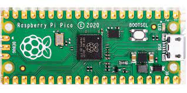
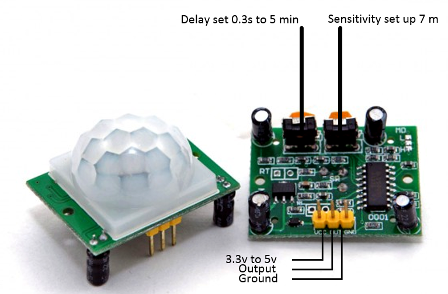
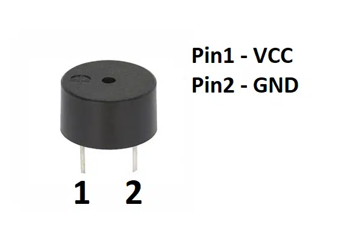
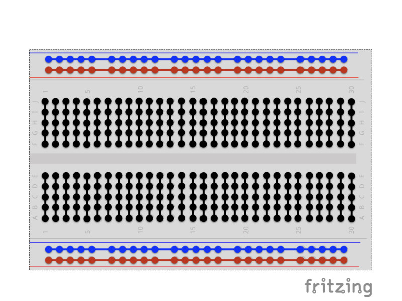
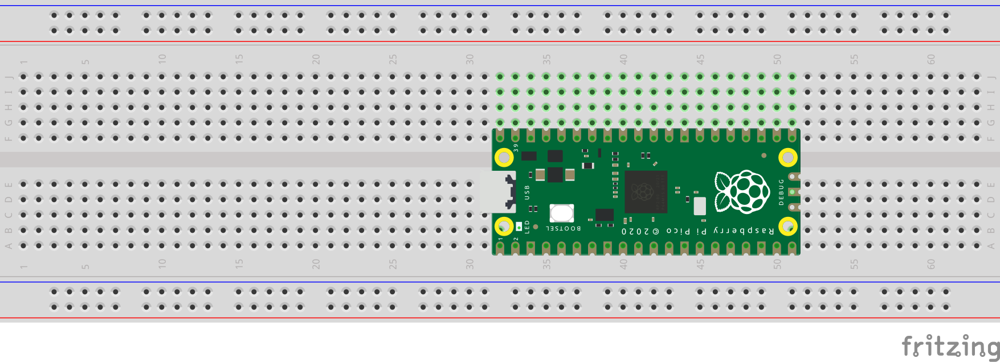
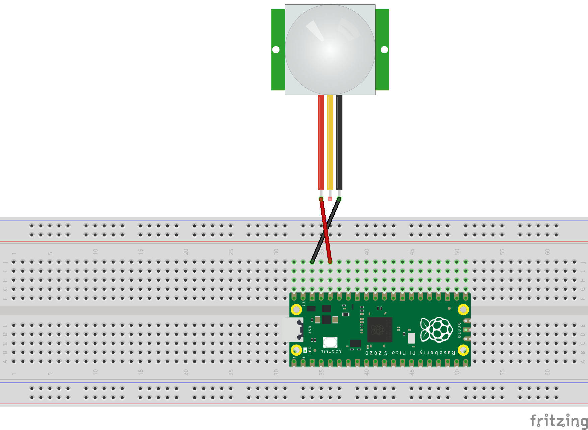
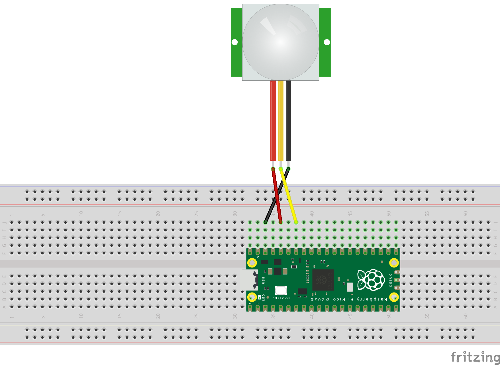
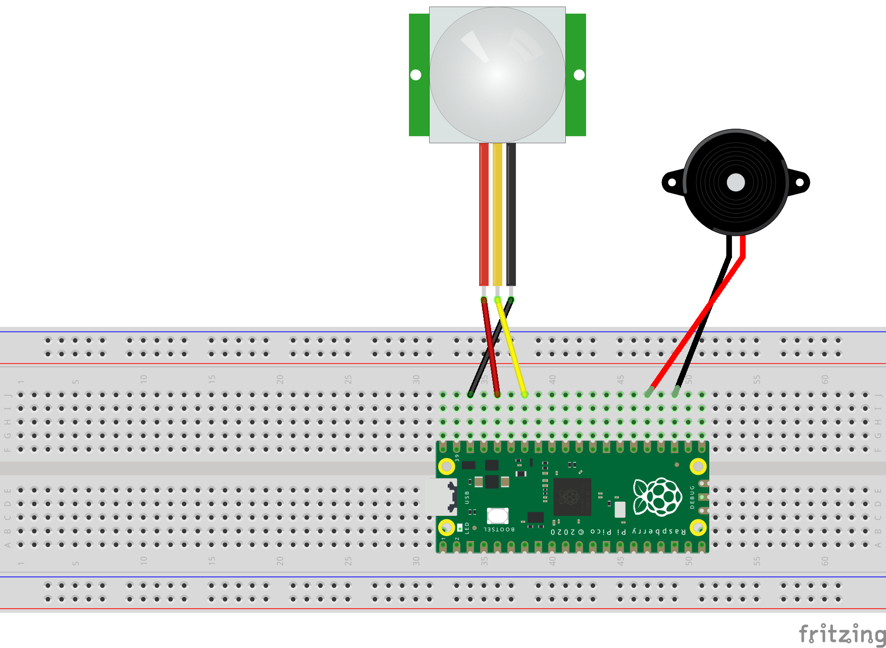

---
# User change
title: "Build a smart device prototype"

weight: 6 # 1 is first, 2 is second, etc.

# Do not modify these elements
layout: "learningpathall"
---

## Build your first device

To get started on your first embedded project, you can use a cheap and widely available device: the [Raspberry Pi Pico](https://www.raspberrypi.com/products/raspberry-pi-pico/).

You were probably expecting an Arduino board, rather than a Raspberry Pi board but it turns out that the Arduino core package that supports the Arduino Nano RP2040 will also support the Raspberry Pi Pico, because they use the exact same RP2040 microprocessor. Plus the Pico is less expensive, currently retailing for less than $5 USD (you can also use the Raspberry Pi Pico with other programming environments, such as MicroPython).

## Accessories

For interacting with the physical world you can use two cheap commodity components. 

First a PIR motion sensor. This sensor reacts to infrared photons emitted by a warm moving object, like a person or animal. The interface is simple, it has one pin for input voltage, one pin for ground to complete the circuit, and a third pin that will have the same voltage as the input pin when motion is detected, and the same voltage as the ground pin when it isn't.

Second, a very simple electric buzzer. You could get fancy with one of these and make it play different sounds with something called Pulse Width Modulation (PWM) but, for simplicity, you can give it a constant voltage which will result in a high-pitched beeping noise.

Finally, you can use a breadboard to connect the components together without having to do any soldering.

If you're not familiar with a breadboard, the image above shows you how all of the little holes are connected together. When you plug a wire into a hole, it connects it to every other hole on the same connected line. This configuration lets you connect multiple components to the same pin on your development board.

## Assemble your system

### Step 1: Seat your Raspberry Pi

Seat your Raspberry Pi Pico on the breadboard so that its rows of pins sit on either side of the center divider. Make sure that it's firmly pressed all the way down but be careful not to bend any of the pins.

### Step 2: PIR ground

Using a black jumper wire, connect the ground pin of your PIR sensor to pin #38 on your Pico. This pin is a ground voltage pin on the Pico.

### Step 3: PIR input voltage

Using a red wire, connect the input voltage pin of your PIR sensor to pin #36 on your Pico. This pin is a 3.3 volt pin on the Pico and will supply power to your PIR sensor.

### Step 4: PIR data

The last step to connecting the PIR sensor is to connect the middle data pin to pin #34 on your Pico. This is a GPIO pin that you can use to either read or write data. 

Note that this is GPIO #28, even though it's physical pin #34. Physical pin number and GPIO numbers are not the same.

### Step 5: Buzzer ground

Next, it's time to connect the buzzer. Start by connecting the buzzer's ground pin to pin #23 on your Pico. This is another ground pin that is build into your board.

### Step 6: Buzzer input

Then, connect the buzzer's input pin to pin #25 on your Pico. This is another GPIO pin, this time GPIO #19.

### Review

Your physical device is now assembled and ready. 

Here is a review:

The motion sensor is connected to power, ground, and GPIO #28, which is where you will read the motion state from.

The buzzer is connected to ground and GPIO #24, which is what you will use to turn it on and off.

Now it's time to start programming!
