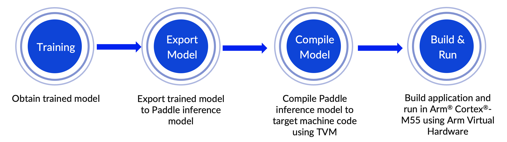

---
# User change
title: "Try the end-to-end workflow"

weight: 3 # 1 is first, 2 is second, etc.

# Do not modify these elements
layout: "learningpathall"
---

## Try the end-to-end workflow

This section provides hands-on instructions for you to try the workflow and run on the Corstone-300 Fixed Virtual Platform (FVP).

The steps are shown in Figure 3.



## 1. Train an English text recognition model with PaddleOCR

PaddleOCR provides many practical OCR tools that help train models and apply them into practice. PaddleOCR uses a configuration file, in YAML, to control network training and evaluation parameters. 

The configuration file holds the parameters for building the model, the optimizer, the loss function, and the model pre- and post-processing. 

PaddleOCR reads the parameters from the configuration file, and then forms a complete training process to complete the model training. Fine-tuning can also be completed by modifying the parameters in the configuration file, which is simple and convenient. Refer to the [Configuration file](https://github.com/PaddlePaddle/PaddleOCR/blob/release/2.5/doc/doc_en/config_en.md) for a more verbose description. 

In order to obtain the trained model adapted for Cortex-M, you will need to modify the [configuration file](https://github.com/PaddlePaddle/PaddleOCR/blob/dygraph/configs/rec/PP-OCRv3/en_PP-OCRv3_rec.yml) used for model training. Unsupported operators, for example LSTM, are removed. 

To optimize the model, you can use Base Data Augmentation (BDA) in the model tuning phase, which includes multiple basic data enhancement methods such as random cropping, random blurring, random noise, and image inversion. 

Before you start, install the PaddleOCR tool. Refer to the PaddleOCR [Quick Start guide](https://github.com/PaddlePaddle/PaddleOCR/blob/release/2.5/doc/doc_en/quickstart_en.md) for more details.

Below are the quick-start instructions for Linux. PaddleOCR requires x86_64 architecture. 

Download Anaconda

```console
wget -O - https://www.anaconda.com/distribution/ 2>/dev/null | sed -ne 's@.*\(https:\/\/repo\.anaconda\.com\/archive\/Anaconda3-.*-Linux-x86_64\.sh\)\">64-Bit (x86) Installer.*@\1@p' | xargs wget
```

Install Anaconda.

```console
sh ./Anaconda3-2022.10-Linux-x86_64.sh  -b
```

Enter conda environment.

```console
eval "$($HOME/anaconda3/bin/conda shell.bash hook)"
```

Install PaddlePaddle and PaddleOCR.

```console
python -m pip install paddlepaddle -i https://pypi.tuna.tsinghua.edu.cn/simple
pip install "paddleocr>=2.0.1" 
```

Clone the project from GitHub.

```console
git clone https://github.com/PaddlePaddle/PaddleOCR.git
```

Change to the new directory and change the GitHub Branch.

```console
cd PaddleOCR
git checkout dygraph
```

Test OCR.

```console
cd doc
paddleocr --image_dir ./imgs_en/img_12.jpg --use_angle_cls true --lang en --use_gpu false
```

The output should be:

```output
[2023/02/24 19:47:32] ppocr INFO: [[[441.0, 174.0], [1166.0, 176.0], [1165.0, 222.0], [441.0, 221.0]], ('ACKNOWLEDGEMENTS', 0.9971132874488831)]
[2023/02/24 19:47:32] ppocr INFO: [[[403.0, 346.0], [1204.0, 348.0], [1204.0, 384.0], [402.0, 383.0]], ('We would like to thank all the designers and', 0.976140022277832)]
[2023/02/24 19:47:32] ppocr INFO: [[[403.0, 396.0], [1204.0, 398.0], [1204.0, 434.0], [402.0, 433.0]], ('contributors who have been involved in the', 0.9791956543922424)]
[2023/02/24 19:47:32] ppocr INFO: [[[399.0, 446.0], [1207.0, 443.0], [1208.0, 484.0], [399.0, 488.0]], ('production of this book; their contributions', 0.9889591336250305)]
[2023/02/24 19:47:32] ppocr INFO: [[[401.0, 500.0], [1208.0, 500.0], [1208.0, 534.0], [401.0, 534.0]], ('have been indispensable to its creation. We', 0.9555091857910156)]
[2023/02/24 19:47:32] ppocr INFO: [[[399.0, 550.0], [1209.0, 548.0], [1209.0, 583.0], [399.0, 584.0]], ('would also like to express our gratitude to all', 0.9905334115028381)]
[2023/02/24 19:47:32] ppocr INFO: [[[399.0, 600.0], [1207.0, 598.0], [1208.0, 634.0], [399.0, 636.0]], ('the producers for their invaluable opinions', 0.9781713485717773)]
[2023/02/24 19:47:32] ppocr INFO: [[[399.0, 648.0], [1207.0, 646.0], [1208.0, 686.0], [399.0, 688.0]], ('and assistance throughout this project. And to', 0.9883643984794617)]
[2023/02/24 19:47:32] ppocr INFO: [[[399.0, 702.0], [1209.0, 698.0], [1209.0, 734.0], [399.0, 738.0]], ('the many others whose names are not credited', 0.9579493999481201)]
[2023/02/24 19:47:32] ppocr INFO: [[[399.0, 750.0], [1211.0, 750.0], [1211.0, 789.0], [399.0, 789.0]], ('but have made specific input in this book, we', 0.9702867865562439)]
[2023/02/24 19:47:32] ppocr INFO: [[[397.0, 802.0], [1090.0, 800.0], [1090.0, 839.0], [397.0, 841.0]], ('thank you for your continuous support.', 0.9978144764900208)]
```

Navigate back to the top directory.

```console
cd ..
```

Using a text editor, replace the file `configs/rec/PP-OCRv3/en_PP-OCRv3_rec.yml` with the contents below:

```console
Global:
  debug: false
  use_gpu: true
  epoch_num: 500
  log_smooth_window: 20
  print_batch_step: 10
  save_model_dir: ./output/v3_en_mobile
  save_epoch_step: 3
  eval_batch_step: [0, 2000]
  cal_metric_during_train: true
  pretrained_model:
  checkpoints:
  save_inference_dir:
  use_visualdl: false
  infer_img: doc/imgs_words/ch/word_1.jpg
  character_dict_path: ppocr/utils/en_dict.txt
  max_text_length: &max_text_length 25
  infer_mode: false
  use_space_char: true
  distributed: true
  save_res_path: ./output/rec/predicts_ppocrv3_en.txt

Optimizer:
  name: Adam
  beta1: 0.9
  beta2: 0.999
  lr:
    name: Cosine
    learning_rate: 0.001
    warmup_epoch: 5
  regularizer:
    name: L2
    factor: 3.0e-05

# Architecture part modification of en_PP-OCRv3_rec.yml file
Architecture:
  model_type: rec
  algorithm: SVTR
  Transform:
  Backbone:
    name: MobileNetV1Enhance
    scale: 0.5
    last_conv_stride: [1, 2]
    last_pool_type: avg
  Neck:
    name: SequenceEncoder
    encoder_type: reshape
  Head:
    name: CTCHead
    mid_channels: 96
    fc_decay: 0.00002

Loss:
  name: MultiLoss
  loss_config_list:
    - CTCLoss:
    - SARLoss:

PostProcess:
  name: CTCLabelDecode

Metric:
  name: RecMetric
  main_indicator: acc
  ignore_space: False

Train:
  dataset:
    name: LMDBDataset
    data_dir: MJ_ST
    ext_op_transform_idx: 1
    transforms:
    - DecodeImage:
        img_mode: BGR
        channel_first: false
    - RecAug:
    - CTCLabelEncode:
    - RecResizeImg:
        image_shape: [3, 32, 320]
    - KeepKeys:
        keep_keys:
        - image
        - label
        - length
  loader:
    shuffle: true
    batch_size_per_card: 128
    drop_last: true
    num_workers: 4
Eval:
  dataset:
    name: SimpleDataSet
    data_dir: ./train_data
    label_file_list:
    - ./train_data/val_list.txt
    transforms:
    - DecodeImage:
        img_mode: BGR
        channel_first: false
    - MultiLabelEncode:
    - RecResizeImg:
        image_shape: [3, 48, 320]
    - KeepKeys:
        keep_keys:
        - image
        - label_ctc
        - label_sar
        - length
        - valid_ratio
  loader:
    shuffle: false
    drop_last: false
    batch_size_per_card: 128
    num_workers: 4
```

Use the open-source datasets [MJSynth](http://www.robots.ox.ac.uk/~vgg/data/text/) and [SynthText](http://www.robots.ox.ac.uk/~vgg/data/scenetext/) (MJ+ST) to train the model with the following command. 

The instructions about where to put the training data are missing.

The model training time depends on the training environment and the size of the dataset. 

```console
python3 tools/train.py -c configs/rec/PP-OCRv3/en_PP-OCRv3_rec.yml -o \ 
Global.save_model_dir=output/rec/ \
Global.use_gpu=False \
Train.dataset.name=LMDBDataSet \
Train.dataset.data_dir=MJ_ST \
Eval.dataset.name=LMDBDataSet \
Eval.dataset.data_dir=EN_eval
```

## 2. Export Paddle inference model

Export the trained text recognition model to a Paddle inference model that you can compile to generate code which is suitable to run on a Cortex-M processor. 

Use the following command to export the Paddle inference model:

```console
python3 tools/export_model.py \
-c configs/rec/PP-OCRv3/en_PP-OCRv3_rec.yml -o \ 
Global.pretrained_model=output/rec/best_accuracy.pdparams \
Global.save_inference_dir=output/rec/infer
```

Use the PaddleOCR toolkit to verify the inference model with the following command. It usually takes some time to train the model. So for your convenience to experience the complete workflow, you can download an English text recognition model trained and exported by us directly at [https://paddleocr.bj.bcebos.com/tvm/ocr_en.tar](https://paddleocr.bj.bcebos.com/tvm/ocr_en.tar)(named as ocr_en.tar).

```console
python3 tools/infer/predict_rec.py --image_dir="path_to_image/word_116.png" \
--rec_model_dir="path_to_infer_model/ocr_en" \ 
--rec_char_dict_path="ppocr/utils/en_dict.txt" \
--rec_image_shape="3,32,320"
```

Figure 4 shows an example of the kind of image you can use to verify the inference results. 

")

The recognition results can be seen as follows. It is consistent with the picture text content ‘QBHOUSE’ and has a high confidence score around 0.9867. This indicates that our inference model is ready for the next step.

```console
Predicts of path_to_word_116.png:('QBHOUSE', 0.9867456555366516)
```

## 3. Compile Paddle inference model with TVMC
Use the deep learning complier [TVM](https://tvm.apache.org/) for model conversion and adaptation. TVM is an open-source deep learning compiler, which is mainly used to solve the adaptability problem of deploying various Deep Learning frameworks on a wide range of hardware targets. Seen in Figure 5, the TVM compiler accepts models written by classic deep learning training frameworks such as PaddlePaddle and converts them into code that can run inference tasks on the target device.


Use TVM's Python application TVMC to compile the model. 

Install TVM using conda.

```console
conda install -c conda-forge tvm-py
```

You can use the following command to compile the Paddle inference model. By specifying `--target=cmsis-nn,c`, the operators supported by Arm’s [CMSIS-NN](https://github.com/ARM-software/CMSIS_5/tree/develop/CMSIS/NN) library will be offloaded to a CMSIS-NN kernel. It can make the best use of underlying Arm hardware acceleration. Otherwise, it falls back to standard C library implementations. By specifying `--target-cmsis-nn-mcpu=cortex-m55` and `--target-c-mcpu=cortex-m55`, it compiles the code that is suitable for running on [Cortex-M55](https://www.arm.com/products/silicon-ip-cpu/cortex-m/cortex-m55) processor. 

For more specific descriptions of each parameter, you can use the command `tvmc compile --help` after you install the TVM Python package.

```console
python3 -m tvm.driver.tvmc compile \
path_to_infer_model/ocr_en/inference.pdmodel \
--target=cmsis-nn,c \
--target-cmsis-nn-mcpu=cortex-m55 \
--target-c-mcpu=cortex-m55 \
--runtime=crt \
--executor=aot \
--executor-aot-interface-api=c \
--executor-aot-unpacked-api=1 \
--pass-config tir.usmp.enable=1 \
--pass-config tir.usmp.algorithm=hill_climb \
--pass-config tir.disable_storage_rewrite=1 \
--pass-config tir.disable_vectorize=1 \
--output-format=mlf \
--model-format=paddle \
--module-name=rec \
--input-shapes x:[1,3,32,320] \
--output=rec.tar
```

After compilation, the model file can be found in the directory specified by parameter `--output`. 

In this example, it ends up in a file called `rec.tar` in the current directory. 

## 4. Deploy on the Corstone-300 FVP with Arm Cortex-M55

The Corstone-300 FVP is available from the [Arm Ecosystem FVP](https://developer.arm.com/downloads/-/arm-ecosystem-fvps) page. For installation instructions see [Arm Ecosystem FVPs](/install-guides/ecosystem_fvp/).

Alternatively, you can access the FVP using [Arm Virtual Hardware](/install-guides/avh/).

The complete [sample code](https://github.com/ArmDeveloperEcosystem/Paddle-examples-for-AVH/tree/main/OCR-example), that you can run from the command line, is available to download from [ArmDeveloperEcosystem](https://github.com/ArmDeveloperEcosystem/Paddle-examples-for-AVH) GitHub repository as well as [PaddleOCR](https://github.com/PaddlePaddle/PaddleOCR/tree/dygraph/deploy/avh)’s GitHub repository (under the dygraph branch). This makes it easier for developers to experience the whole workflow, especially the deployment.

After you have downloaded the FVP on your local machine, you will also need to clone the Arm CMSIS and CMSIS-NN repositories from https://github.com/ARM-software/CMSIS_5/ and https://github.com/ARM-software/CMSIS-NN respectively.

You can then complete model deployment and view application execution results with the following command.

Note: Replace `<Enter path to CMSIS repo>` and `<Enter path to Corstone-300 FVP>` with the path to these dependencies on your computer.

```console
git clone https://github.com/ArmDeveloperEcosystem/Paddle-examples-for-AVH.git
cd Paddle-examples-for-AVH/OCR-example
./run_demo.sh --cmsis_path <Enter path CMSIS repo> --fvp_path >Enter path to Corstone-300 FVP> --enable_FVP=1
```

The [run_demo.sh](https://github.com/ArmDeveloperEcosystem/Paddle-examples-for-AVH/blob/main/OCR-example/run_demo.sh) script automates the entire process we have just described. 

It takes the following 6 steps to help you automatically build and execute the English text recognition application on Corstone-300 platform with Arm Virtual Hardware.

- Step 1. Set up running environment
- Step 2. Download PaddlePaddle inference model
- Step 3. Use TVMC to compile the model and generate code for the Arm Cortex-M processor
- Step 4. Process resources for building the application image
- Step 5. Use the Makefile to build the target application
- Step 6. Run application binary on Corstone-300 platform integrated in AVH

We can use the image in Figure 4 above (QBHOUSE) as an example to verify the inference results on the Corstone-300 FVP with Arm Cortex-M55. The results can be seen as Figure 7 which is highly consistent with the inference results of direct inference on server host. It shows we have successfully deployed PP-OCRv3 English recognition model directly on Arm Cortex-M.


## Conclusion

You have successfully deployed the English text recognition model released in PP-OCRv3 on the Corstone-300 FVP with Cortex-M55. Hopefully, these steps have given you an idea of how fast and easy the entire workflow is.


