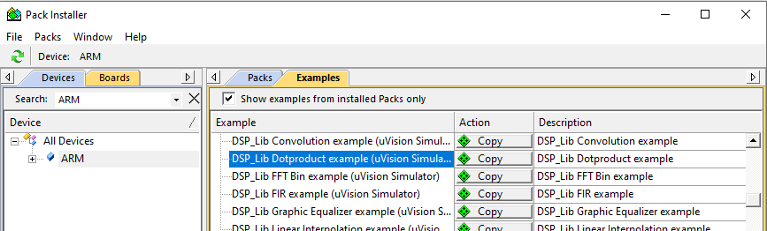
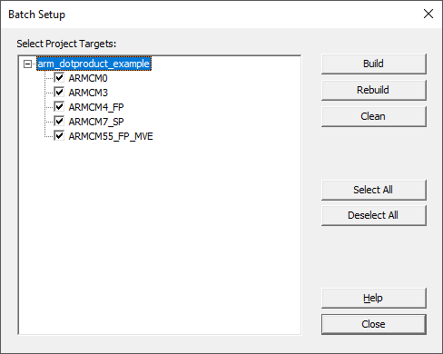
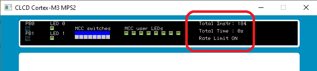
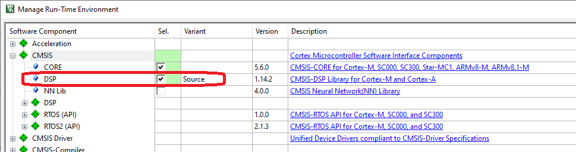

---
# User change
title: Build an example application using CMSIS-DSP

weight: 2 # 1 is first, 2 is second, etc.

# Do not modify these elements
layout: "learningpathall"
---
The [CMSIS-DSP](https://arm-software.github.io/CMSIS-DSP/latest/) software library is an open-source suite of common compute processing functions optimized for Arm Cortex-A and Cortex-M processors.

The source code is available in [this GitHub repository](https://github.com/ARM-software/CMSIS-DSP).

The library is easiest to use with Development tool IDEs such as `Keil MDK` and `Arm Development Studio`. The library is installed as a [CMSIS-Pack](https://open-cmsis-pack.github.io/Open-CMSIS-Pack-Spec/main/html/index.html). A number of example projects are also provided.

Keil MDK will be used for this learning path.

## Build example with Keil MDK

Install and launch [Keil MDK](/install-guides/mdk/).

Open the `Pack Installer`, select `ARM` as the device, and locate `DSP_Lib DotProduct example` from the `Examples` tab.

Click `Copy`, and save the project to an appropriate location on your host.



The project contains build targets for different Cortex-M processors.

Open the `Project` > `Batch Setup` pane from the menu bar, and select all targets. Click `Rebuild` to build all.



## Run example on Cortex-M3 FVP

From the `Select Target` pulldown, highlight the `ARMCM3` target (build for Cortex-M3).

The project is already configured for the supplied Fixed Virtual Platforms (`FVPs`). See the `Options` > `Debug` pane.

Start a debug session (`Ctrl+F5`) to load the image to the Cortex-M3 FVP, and run to `main`.

Note the number of instructions executed to this point, as shown in the FVP display (`184` in the example below):



If not already set, place a breakpoint at the `while(1);` statement at the end of the `main` function.

Click `Run` (or press `F5`) to run the example to this breakpoint, and stop.

Note the number of instructions executed, and subtract the initialization cycle count.

Terminate the debug session.

## Run example on Cortex-M55 FVP

From the `Select Target` pulldown, highlight the `ARMCM55_FP_MVE` target (build for Cortex-M55). This build makes use of the [Helium](https://www.arm.com/technologies/helium) vectorizing extensions that Cortex-M55 supports.

Repeat the steps above to run on the Cortex-M55 FVP, and note the number of instructions executed, which should be a dramatic improvement over Cortex-M3.

{}
The FVPs are instruction accurate but not cycle accurate.

The instruction count is used here to illustrate relative performance to a high granularity.
{}

## Understand the example

To make any function from the `CMSIS-DAP` library available to your code, simply include the `arm_math.h` header file in any relevant source:
```C
#include "arm_math.h"
```
This file resides in the `Include` folder of the library installation, and so you should add this to the Include path for your compiler.

For Keil MDK, this is done by selecting `CMSIS` > `DSP` in the `Manage Run-Time Environment` pane.



The [example project](https://www.keil.com/pack/doc/CMSIS/DSP/html/group__DotproductExample.html) makes use of two functions from the library:

  * arm_mult_f32()
  * arm_add_f32()

The appropriate implementation is selected at build time, based on the processor. Hence the Helium optimized implementations can greatly accelerate the algorithm.
