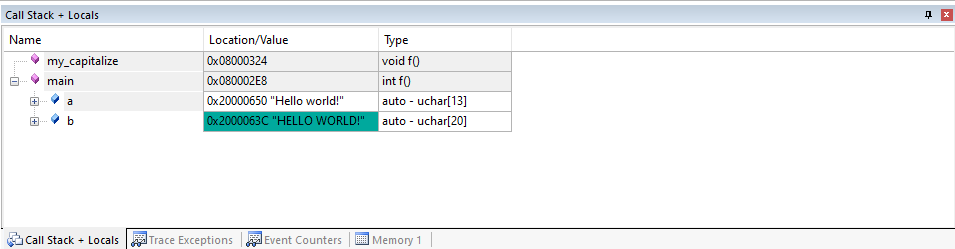

---
# User change
title: "Running the code on the board" 

weight: 5 # 1 is first, 2 is second, etc.

# Do not modify these elements
layout: "learningpathall"
---

1. Compile the code

2. Ensure your board is plugged in and load it onto your board.

3. Once flashed onto the board, you can start a debug session.

4. Keep an eye on the Call Stack + Locals tab in the bottom right of the IDE. This will show the value of the variables 'a' and 'b'.

5.	Step through the program and notice how the values of 'a' and 'b' change. You should see the string "Hello world!" copy across and then eventually turn into capitals.

