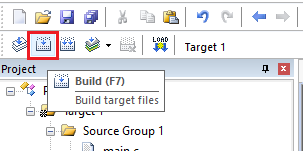
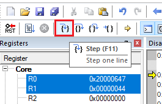

---
# User change
title: "Running the code on the board" 

weight: 5 # 1 is first, 2 is second, etc.

# Do not modify these elements
layout: "learningpathall"
---

You are now ready to build the code and run it on the target hardware.

## Compile the code

Click the `Build` button to compile source code, and link together.

 ## Run and debug the code on the target

Ensure your board is connected to your host machine. Click `Download` to load it onto the Flash memory on the board.

Once flashed onto the board, you can start a debug session.

Open the `Call Stack + Locals` tab in the IDE. This will show the value of the variables `a` and `b`.

Step through the program and notice how the values of `a` and `b` change.

You will see the string "Hello world!" copy across and then eventually turn into capitals.

